# Business Data Analytics
Kamran Mammadzada  
`r Sys.Date()`  

__Solutions for Homework 2__

The notebook contains solutions for Homework 2 in Business Data Analytics (BDA) Course taught by Rajesh Sharma - University of Tartu.
Original Author of the homework questions - Anna Leontjeva.

__Task:__ Using housing data housing_data.csv predict the price of the house based on other features.

***

First let's load all the necessary data and libraries

```r
# load libraries
library(tidyverse)
library(data.table) # helps with data import
library(lubridate) # helps with date manipulation
library(gridExtra) # helps visualize many graphs at once
library(modelr) # provides easy pipeline modeling functions
library(broom) # helps to tidy up model outputs
set.seed(456) # seed to ensure consistency

# my working directory
setwd("C:\\Users\\kamra\\Dropbox\\UT\\2nd\\Business Data Analytics\\Homeworks\\HW2")

# load housing data
df <- read.csv("housing_data.csv")
```

Let's investigate and get to know our dataset

```r
str(df)
```

```
## 'data.frame':	21613 obs. of  21 variables:
##  $ id           : num  7.13e+09 6.41e+09 5.63e+09 2.49e+09 1.95e+09 ...
##  $ date         : Factor w/ 372 levels "20140502T000000",..: 165 221 291 221 284 11 57 252 340 306 ...
##  $ price        : num  221900 538000 180000 604000 510000 ...
##  $ bedrooms     : int  3 3 2 4 3 4 3 3 3 3 ...
##  $ bathrooms    : num  1 2.25 1 3 2 4.5 2.25 1.5 1 2.5 ...
##  $ sqft_living  : int  1180 2570 770 1960 1680 5420 1715 1060 1780 1890 ...
##  $ sqft_lot     : int  5650 7242 10000 5000 8080 101930 6819 9711 7470 6560 ...
##  $ floors       : num  1 2 1 1 1 1 2 1 1 2 ...
##  $ waterfront   : int  0 0 0 0 0 0 0 0 0 0 ...
##  $ view         : int  0 0 0 0 0 0 0 0 0 0 ...
##  $ condition    : int  3 3 3 5 3 3 3 3 3 3 ...
##  $ grade        : int  7 7 6 7 8 11 7 7 7 7 ...
##  $ sqft_above   : int  1180 2170 770 1050 1680 3890 1715 1060 1050 1890 ...
##  $ sqft_basement: int  0 400 0 910 0 1530 0 0 730 0 ...
##  $ yr_built     : int  1955 1951 1933 1965 1987 2001 1995 1963 1960 2003 ...
##  $ yr_renovated : int  0 1991 0 0 0 0 0 0 0 0 ...
##  $ zipcode      : int  98178 98125 98028 98136 98074 98053 98003 98198 98146 98038 ...
##  $ lat          : num  47.5 47.7 47.7 47.5 47.6 ...
##  $ long         : num  -122 -122 -122 -122 -122 ...
##  $ sqft_living15: int  1340 1690 2720 1360 1800 4760 2238 1650 1780 2390 ...
##  $ sqft_lot15   : int  5650 7639 8062 5000 7503 101930 6819 9711 8113 7570 ...
```


```r
summary(df)
```

```
##        id                         date           price        
##  Min.   :1.000e+06   20140623T000000:  142   Min.   :  75000  
##  1st Qu.:2.123e+09   20140625T000000:  131   1st Qu.: 321950  
##  Median :3.905e+09   20140626T000000:  131   Median : 450000  
##  Mean   :4.580e+09   20140708T000000:  127   Mean   : 540088  
##  3rd Qu.:7.309e+09   20150427T000000:  126   3rd Qu.: 645000  
##  Max.   :9.900e+09   20150325T000000:  123   Max.   :7700000  
##                      (Other)        :20833                    
##     bedrooms        bathrooms      sqft_living       sqft_lot      
##  Min.   : 0.000   Min.   :0.000   Min.   :  290   Min.   :    520  
##  1st Qu.: 3.000   1st Qu.:1.750   1st Qu.: 1427   1st Qu.:   5040  
##  Median : 3.000   Median :2.250   Median : 1910   Median :   7618  
##  Mean   : 3.371   Mean   :2.115   Mean   : 2080   Mean   :  15107  
##  3rd Qu.: 4.000   3rd Qu.:2.500   3rd Qu.: 2550   3rd Qu.:  10688  
##  Max.   :33.000   Max.   :8.000   Max.   :13540   Max.   :1651359  
##                                                                    
##      floors        waterfront            view          condition    
##  Min.   :1.000   Min.   :0.000000   Min.   :0.0000   Min.   :1.000  
##  1st Qu.:1.000   1st Qu.:0.000000   1st Qu.:0.0000   1st Qu.:3.000  
##  Median :1.500   Median :0.000000   Median :0.0000   Median :3.000  
##  Mean   :1.494   Mean   :0.007542   Mean   :0.2343   Mean   :3.409  
##  3rd Qu.:2.000   3rd Qu.:0.000000   3rd Qu.:0.0000   3rd Qu.:4.000  
##  Max.   :3.500   Max.   :1.000000   Max.   :4.0000   Max.   :5.000  
##                                                                     
##      grade          sqft_above   sqft_basement       yr_built   
##  Min.   : 1.000   Min.   : 290   Min.   :   0.0   Min.   :1900  
##  1st Qu.: 7.000   1st Qu.:1190   1st Qu.:   0.0   1st Qu.:1951  
##  Median : 7.000   Median :1560   Median :   0.0   Median :1975  
##  Mean   : 7.657   Mean   :1788   Mean   : 291.5   Mean   :1971  
##  3rd Qu.: 8.000   3rd Qu.:2210   3rd Qu.: 560.0   3rd Qu.:1997  
##  Max.   :13.000   Max.   :9410   Max.   :4820.0   Max.   :2015  
##                                                                 
##   yr_renovated       zipcode           lat             long       
##  Min.   :   0.0   Min.   :98001   Min.   :47.16   Min.   :-122.5  
##  1st Qu.:   0.0   1st Qu.:98033   1st Qu.:47.47   1st Qu.:-122.3  
##  Median :   0.0   Median :98065   Median :47.57   Median :-122.2  
##  Mean   :  84.4   Mean   :98078   Mean   :47.56   Mean   :-122.2  
##  3rd Qu.:   0.0   3rd Qu.:98118   3rd Qu.:47.68   3rd Qu.:-122.1  
##  Max.   :2015.0   Max.   :98199   Max.   :47.78   Max.   :-121.3  
##                                                                   
##  sqft_living15    sqft_lot15    
##  Min.   : 399   Min.   :   651  
##  1st Qu.:1490   1st Qu.:  5100  
##  Median :1840   Median :  7620  
##  Mean   :1987   Mean   : 12768  
##  3rd Qu.:2360   3rd Qu.: 10083  
##  Max.   :6210   Max.   :871200  
## 
```

There are 21 features (variables) in the dataset. It will be difficult to try to predict the price of a house using all features, even though its technically possible. Our goal is to come up with a set of features that can best explain the variation in price thus be able to predict the price with a high accuracy.

# Data Preparation & Visualization

Before we visualize our dataset we will do some data clean up, data type conversion and feature engineering.


```r
# convert date and visualize correlation with prices
df$date <- as_date(substr(df$date, start = 0, stop = 8))
```

Let's combine bedrooms and bathrooms into rooms

```r
df$rooms <- df$bedrooms + df$bathrooms # generate rooms variable
df$bedrooms <- NULL # remove bedrooms
df$bathrooms <- NULL # remove bathrooms
df$id <- NULL # no need for IDs
```

We will remove lat and long since as an indicator of location we will only use zipcode

```r
df$lat <- NULL
df$long <- NULL
```


To better understand our data we will visualize some of the relationship between price and features we think can be predictive.


```r
# visualize date and price relation
ggplot(df, aes(x=date, y=price)) +
  geom_point() # date & price
```

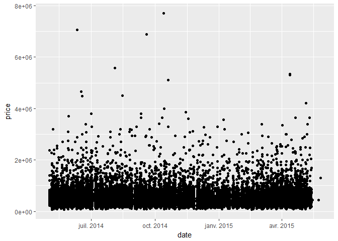<!-- -->

The scatter plot shows that there may not be as much of a correlation betwwen date and prices.It will help better understand the relationship and if there's a positive or negative correlation or it is more likely to predict the price. In case of categorical variables such as floors, the variation of prices is a good indicator of predictability.


```r
ggplot(df, aes(x=factor(floors))) +
  geom_histogram(stat = "count") # number of rooms by floors
```

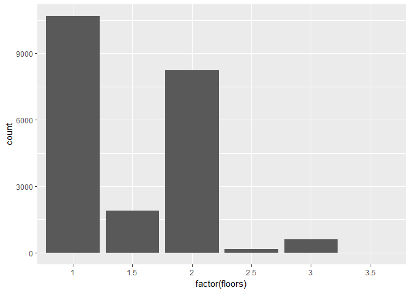<!-- -->


```r
ggplot(df, aes(x=factor(floors), y=price)) +
  geom_boxplot() +
  theme_minimal() # floors & price
```

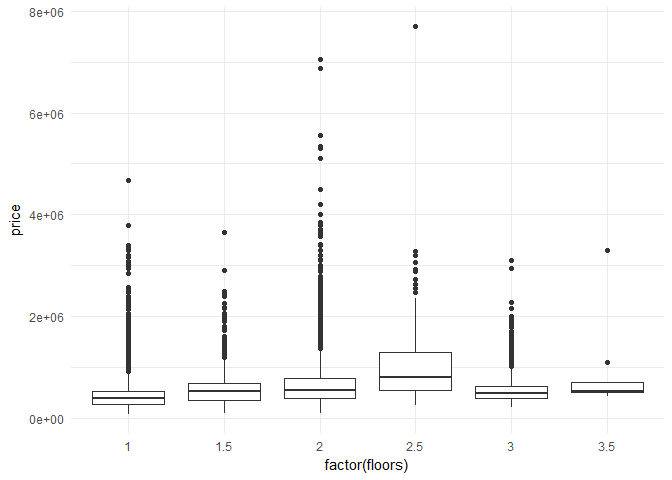<!-- -->

The plot shows that houses with 2.5 rooms have bigger interquartile range (higher variation) but despite that the majority of the houses either have 1 or 2 floors. Based on the boxplot we can also observe that the houses with one or two floors have quite a few outliers, meaning there are a lot of houses with prices far away from mean or even the majority of houses within in the interquartile range.

*** 

Understanding house prices based on geospatial data might also be an important aspect. We will try to visualize the location of houses based on their zipcode.


```r
# zipcode library & ggmap will help us do that
library(zipcode)
data(zipcode)
head(zipcode)
```

```
##     zip       city state latitude longitude
## 1 00210 Portsmouth    NH  43.0059  -71.0132
## 2 00211 Portsmouth    NH  43.0059  -71.0132
## 3 00212 Portsmouth    NH  43.0059  -71.0132
## 4 00213 Portsmouth    NH  43.0059  -71.0132
## 5 00214 Portsmouth    NH  43.0059  -71.0132
## 6 00215 Portsmouth    NH  43.0059  -71.0132
```

```r
zipcode.df <- zipcode %>%
  filter(zip %in% df$zipcode)

zipcode.df$zip <- as.integer(zipcode.df$zip) # convert to integer

# merge zipcode data with df in a new dataset for visualization purposes
df.map <- merge(df, zipcode.df, by.x = 'zipcode', by.y = 'zip') 
```


```r
# library for mapping
library(ggmap)

# getting the map
house_map <- get_map(location = c(lon = mean(df.map$longitude), 
                                  lat = mean(df.map$latitude)), zoom = 10,
                      maptype = "roadmap", scale = 2)
```

```
## Map from URL : http://maps.googleapis.com/maps/api/staticmap?center=47.559147,-122.212762&zoom=10&size=640x640&scale=2&maptype=roadmap&language=en-EN&sensor=false
```

```r
# visualze the house location
ggmap(house_map) +
  geom_point(data=df.map, aes(x=longitude, y=latitude, 
                              fill='red', alpha=0.6, size=price),
             shape = 21) +
  guides(fill=FALSE, alpha=FALSE)
```

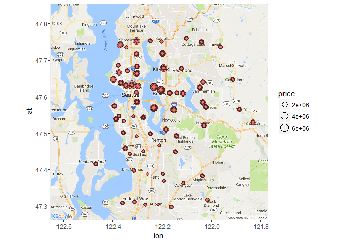<!-- -->

All of the zipcodes in the dataset are from Seattle. The houses are quite spread out in Seattle, and also the map show the size of the circle by price. There are areas where prices are more or less the same but some areas have more variability.

Let's visualize the relationship between zipcodes and price and better understand the relationship.


```r
ggplot(df) +
  geom_point(aes(x=factor(zipcode), y=price))
```

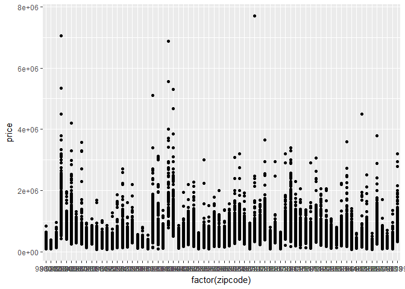<!-- -->


```r
ggplot(df) +
  geom_boxplot(aes(x=factor(zipcode), y=price))
```

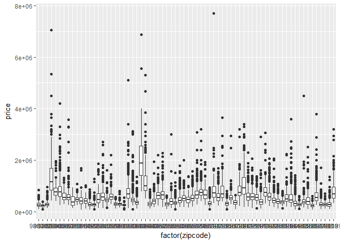<!-- -->


Scatter plot and the boxplot shows us that there are a group of zipcodes which have a relatively higher price range.

We will use this feature in our modeling. To keep it simple we will only use the zipcode.


***

Various indicators of house area are concluded inside 6 features

* sqft_living
* sqft_lot
* sqft_above
* sqft_basement
* sqft_living15
* sqft_lot15

We will visualize all of them relative to price.

```r
p2 <- ggplot(df, aes(x=sqft_living, y=price)) + geom_point() # sqft_living & price
p3 <- ggplot(df, aes(x=sqft_lot, y=price)) + geom_point() # sqft_lot & price

p9 <- ggplot(df, aes(x=sqft_above, y=price)) + geom_point() # sqft_above & price
p10 <- ggplot(df, aes(x=sqft_basement, y=price)) + geom_point() # sqft_basement & price

p14 <- ggplot(df, aes(x=sqft_living15, y=price)) + geom_point() # sqft_living15 vs price
p15 <- ggplot(df, aes(x=sqft_lot15, y=price)) + geom_point() # sqft_lot15 vs price

grid.arrange(p2, p14, p3, p15, p9, p10)
```

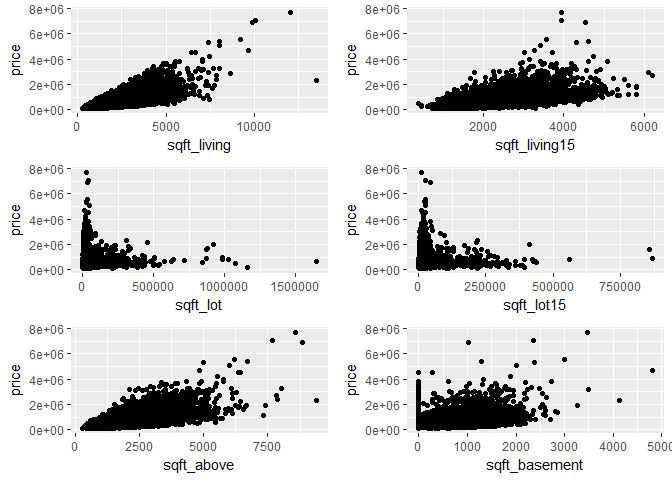<!-- -->

From the scatter plots, it seems that all of the above features have a positive correlation with price, with the exception of sqft_lot and sqft_lot15 where, quite a few of records have no sqft_lot or the ones that have are with less price. We will not use sqft_lot and sqft_lot15 for our price prediction.

***

Every house has rooms and that for sure should influence the price to a certain degree. 
Let's see how it does

```r
ggplot(df, aes(x=rooms, y=price)) +
  geom_point() + 
  theme_minimal()
```

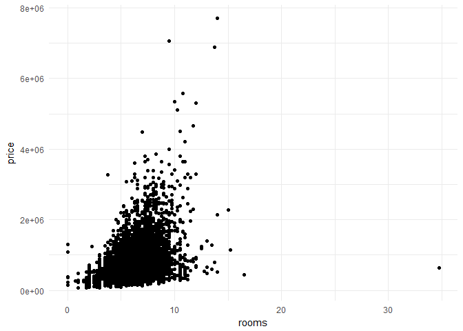<!-- -->

There is an obvious correlation with more rooms a house has the higher its price.

***

Year built and year renovated would be an interesting and important feature that can help predict the price. Let's plot it


```r
ggplot(df, aes(yr_built, price)) +
  geom_point() # year built vs price
```

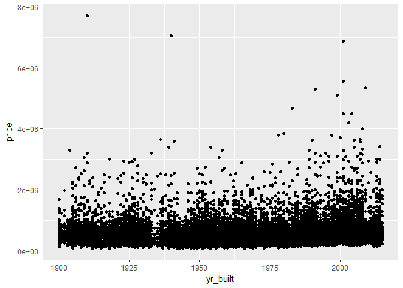<!-- -->


```r
ggplot(df, aes(yr_renovated, price)) +
  geom_point() # year renovated vs price
```

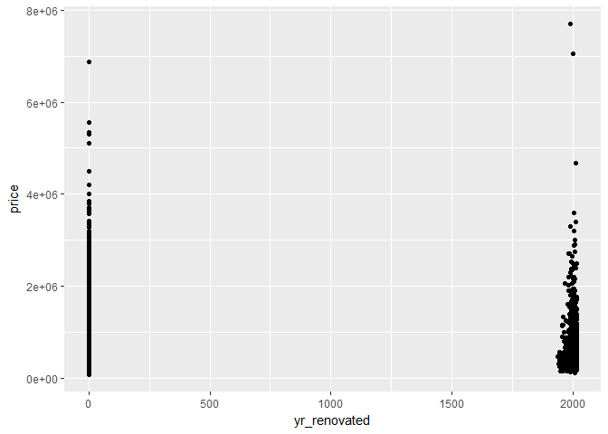<!-- -->

It seems that if the house is not renovated then the value is 0, which kind of throws off the scaling for this feature. We will ignore it for now and won't use it for our prediction. Also grade and condition variables potentially capture the quality and condition of the house already.

We will use yr_built to generate age and see the correlation of the price vs age


```r
df$age <- 2018 - df$yr_built

summary(df$age)
```

```
##    Min. 1st Qu.  Median    Mean 3rd Qu.    Max. 
##    3.00   21.00   43.00   46.99   67.00  118.00
```

It seems that the youngest house is 3 years old while the oldest is 118.

Let's see the correlation with price.

```r
ggplot(df, aes(age, price)) +
  geom_point()
```

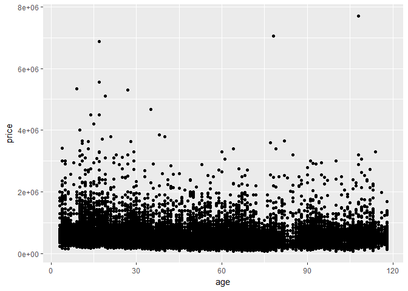<!-- -->

```r
cor(df$price, df$age)
```

```
## [1] -0.05401153
```

The plot and the correlation coefficient also reinforces the previous plot. There is almost non-existant effect of age or year built on price.

***

Waterfront and View are categorical variables. Waterfront 0 or 1 indicates whether the house has waterfront or not.

View with values from 0 to 4 shows the quality of the view.


```r
ggplot(df, aes(factor(waterfront))) +
  geom_histogram(stat = "count") +
  theme_minimal() # number of houses by waterfront
```

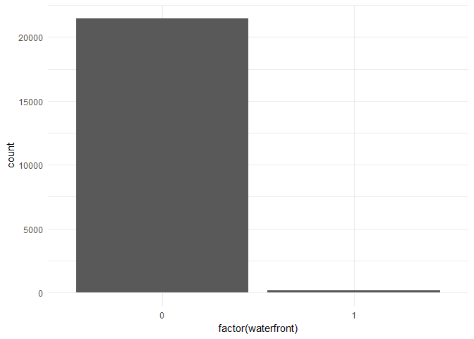<!-- -->

There are definitely more houses with waterfront than not.


```r
ggplot(df, aes(factor(view))) +
  geom_histogram(stat = "count") +
  theme_minimal() # number of houses by view
```

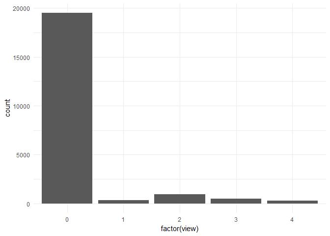<!-- -->

As with waterfront majority of houses don't have a view or have a poor view.


```r
ggplot(df, aes(factor(condition))) +
  geom_histogram(stat = "count") +
  theme_minimal() # number of houses by condition
```

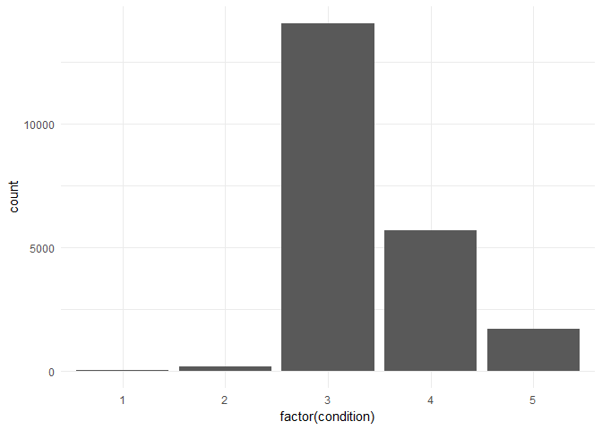<!-- -->

Most of the houses have an average view

Grades allow categorizing houses by their prestige and quality

```r
ggplot(df, aes(factor(grade))) +
  geom_histogram(stat = "count") +
  theme_minimal() # number of houses by grade
```

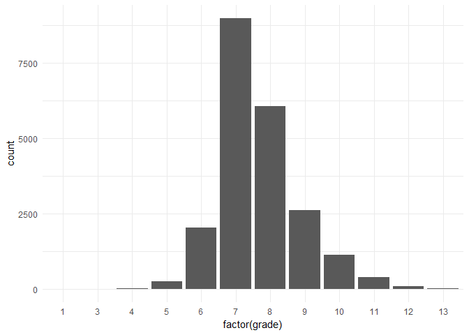<!-- -->

Houses are normally distributed when it comes to grade and most of them are average grade which is 7.

***

# Price Prediction

To develop a good model which predicts well we will set up 3 different models with various interactiona and test those models for accuracy. Our accuracy measure will be MSE.

## Train & Test Split

```r
sample <- sample(c(TRUE, FALSE), nrow(df), 
                 replace = T, prob = c(0.6,0.4))

# train and test sets
df_train <- df[sample,]
df_test <- df[!sample,]
```


## Modeling

We will use 3 different models utilizing linear regression.

To compare the accuracy, we will also use 2 models using random forest regression.

### Model 1

Our first model will be quite simple, since we will only use the following features that we think will better predict the price

* rooms
* floors
* zipcode
* grade
* age


```r
model1 <- lm(price ~ rooms + floors + zipcode + grade + age, data = df_train)

summary(model1)
```

```
## 
## Call:
## lm(formula = price ~ rooms + floors + zipcode + grade + age, 
##     data = df_train)
## 
## Residuals:
##     Min      1Q  Median      3Q     Max 
## -895468 -127566  -18379   88113 5495219 
## 
## Coefficients:
##               Estimate Std. Error t value Pr(>|t|)    
## (Intercept) -2.787e+06  4.221e+06  -0.660    0.509    
## rooms        4.241e+04  1.803e+03  23.525  < 2e-16 ***
## floors       2.661e+04  4.808e+03   5.534 3.19e-08 ***
## zipcode      1.237e+01  4.305e+01   0.287    0.774    
## grade        2.147e+05  2.406e+03  89.224  < 2e-16 ***
## age          4.158e+03  9.138e+01  45.497  < 2e-16 ***
## ---
## Signif. codes:  0 '***' 0.001 '**' 0.01 '*' 0.05 '.' 0.1 ' ' 1
## 
## Residual standard error: 241800 on 12980 degrees of freedom
## Multiple R-squared:  0.5404,	Adjusted R-squared:  0.5402 
## F-statistic:  3053 on 5 and 12980 DF,  p-value: < 2.2e-16
```

The model1 can only explain 54% of variation in price. (R squared)


### Model 2

Our second model will use the following features

* sqft_living
* sqft_lot
* sqft_above
* sqft_basement
* floors
* condition
* zipcode


```r
model2 <- lm(price ~ sqft_living + sqft_lot + 
               sqft_above + sqft_basement + zipcode, data = df_train)

summary(model2)
```

```
## 
## Call:
## lm(formula = price ~ sqft_living + sqft_lot + sqft_above + sqft_basement + 
##     zipcode, data = df_train)
## 
## Residuals:
##      Min       1Q   Median       3Q      Max 
## -1394083  -142278   -23411   103514  4341128 
## 
## Coefficients: (1 not defined because of singularities)
##                 Estimate Std. Error t value Pr(>|t|)    
## (Intercept)   -6.295e+07  4.223e+06  -14.91  < 2e-16 ***
## sqft_living    2.749e+02  5.026e+00   54.70  < 2e-16 ***
## sqft_lot      -2.010e-01  5.247e-02   -3.83 0.000129 ***
## sqft_above     7.754e+00  5.658e+00    1.37 0.170567    
## sqft_basement         NA         NA      NA       NA    
## zipcode        6.414e+02  4.305e+01   14.90  < 2e-16 ***
## ---
## Signif. codes:  0 '***' 0.001 '**' 0.01 '*' 0.05 '.' 0.1 ' ' 1
## 
## Residual standard error: 252400 on 12981 degrees of freedom
## Multiple R-squared:  0.4992,	Adjusted R-squared:  0.4991 
## F-statistic:  3235 on 4 and 12981 DF,  p-value: < 2.2e-16
```

The model1 can only explain ~49% of variation in price. (R squared)

### Model 3

Here we will simply add all of the available features and see how the model performs.


```r
model3 <- lm(price ~ date + sqft_living + sqft_lot + floors + waterfront +
             view + condition + grade + sqft_above + sqft_basement + yr_built +
               yr_renovated + zipcode + sqft_living15 + sqft_lot15 + rooms +
               age, data = df_train)

summary(model3)
```

```
## 
## Call:
## lm(formula = price ~ date + sqft_living + sqft_lot + floors + 
##     waterfront + view + condition + grade + sqft_above + sqft_basement + 
##     yr_built + yr_renovated + zipcode + sqft_living15 + sqft_lot15 + 
##     rooms + age, data = df_train)
## 
## Residuals:
##      Min       1Q   Median       3Q      Max 
## -1266807  -111324    -7244    88200  4392389 
## 
## Coefficients: (2 not defined because of singularities)
##                 Estimate Std. Error t value Pr(>|t|)    
## (Intercept)   -4.476e+06  3.990e+06  -1.122 0.261948    
## date           9.463e+01  1.661e+01   5.696 1.26e-08 ***
## sqft_living    1.730e+02  5.855e+00  29.557  < 2e-16 ***
## sqft_lot       8.813e-03  6.460e-02   0.136 0.891485    
## floors         4.346e+04  4.731e+03   9.186  < 2e-16 ***
## waterfront     5.469e+05  2.416e+04  22.634  < 2e-16 ***
## view           4.240e+04  2.902e+03  14.611  < 2e-16 ***
## condition      2.047e+04  3.216e+03   6.367 2.00e-10 ***
## grade          1.232e+05  2.868e+03  42.952  < 2e-16 ***
## sqft_above    -9.247e+00  5.762e+00  -1.605 0.108562    
## sqft_basement         NA         NA      NA       NA    
## yr_built      -3.066e+03  9.035e+01 -33.940  < 2e-16 ***
## yr_renovated   1.885e+01  4.881e+00   3.862 0.000113 ***
## zipcode        8.258e+01  3.994e+01   2.068 0.038688 *  
## sqft_living15  3.031e+01  4.708e+00   6.438 1.26e-10 ***
## sqft_lot15    -5.470e-01  9.942e-02  -5.501 3.84e-08 ***
## rooms         -1.452e+04  2.070e+03  -7.016 2.39e-12 ***
## age                   NA         NA      NA       NA    
## ---
## Signif. codes:  0 '***' 0.001 '**' 0.01 '*' 0.05 '.' 0.1 ' ' 1
## 
## Residual standard error: 213200 on 12970 degrees of freedom
## Multiple R-squared:  0.643,	Adjusted R-squared:  0.6426 
## F-statistic:  1557 on 15 and 12970 DF,  p-value: < 2.2e-16
```

The model 3 shows a 64% R squared, but we will compare the MSE to other models.

### Model 4

We will use features we used in our first model but this time use random forest regression to predict price.

* rooms
* floors
* zipcode
* grade
* age


```r
# load Random Forest algorithm
require(randomForest)
```

```
## Loading required package: randomForest
```

```
## randomForest 4.6-12
```

```
## Type rfNews() to see new features/changes/bug fixes.
```

```
## 
## Attaching package: 'randomForest'
```

```
## The following object is masked from 'package:gridExtra':
## 
##     combine
```

```
## The following object is masked from 'package:dplyr':
## 
##     combine
```

```
## The following object is masked from 'package:ggplot2':
## 
##     margin
```

```r
model4 <- randomForest(price ~ rooms + floors +
                         zipcode + grade + age, data=df_train)

summary(model4)
```

```
##                 Length Class  Mode     
## call                3  -none- call     
## type                1  -none- character
## predicted       12986  -none- numeric  
## mse               500  -none- numeric  
## rsq               500  -none- numeric  
## oob.times       12986  -none- numeric  
## importance          5  -none- numeric  
## importanceSD        0  -none- NULL     
## localImportance     0  -none- NULL     
## proximity           0  -none- NULL     
## ntree               1  -none- numeric  
## mtry                1  -none- numeric  
## forest             11  -none- list     
## coefs               0  -none- NULL     
## y               12986  -none- numeric  
## test                0  -none- NULL     
## inbag               0  -none- NULL     
## terms               3  terms  call
```

The Graph of the random forest


```r
plot(model4)
```

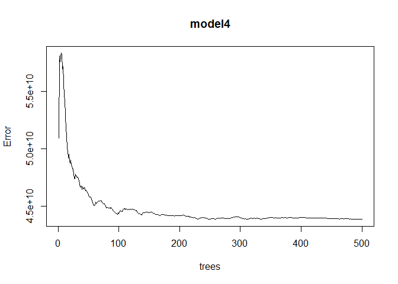<!-- -->


### Model 5

Let's now use features from our second model with random forest regression and observe the model.

* sqft_living
* sqft_lot
* sqft_above
* sqft_basement
* floors
* condition
* zipcode


```r
model5 <- randomForest(price ~ sqft_living + sqft_lot + 
                         sqft_above + sqft_basement + zipcode, data = df_train)

summary(model5)
```

```
##                 Length Class  Mode     
## call                3  -none- call     
## type                1  -none- character
## predicted       12986  -none- numeric  
## mse               500  -none- numeric  
## rsq               500  -none- numeric  
## oob.times       12986  -none- numeric  
## importance          5  -none- numeric  
## importanceSD        0  -none- NULL     
## localImportance     0  -none- NULL     
## proximity           0  -none- NULL     
## ntree               1  -none- numeric  
## mtry                1  -none- numeric  
## forest             11  -none- list     
## coefs               0  -none- NULL     
## y               12986  -none- numeric  
## test                0  -none- NULL     
## inbag               0  -none- NULL     
## terms               3  terms  call
```

Graph of model5


```r
plot(model5)
```

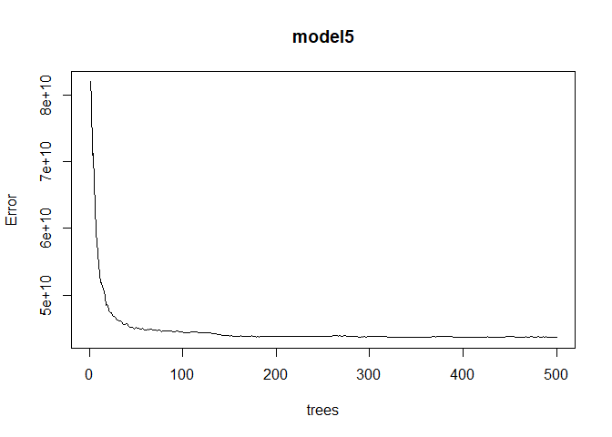<!-- -->


## Evaluation

Let's evaluate the 5 models we have built.

We will use MSE as a measure of effectiveness.


### Comparing predictions

Let's compare the prediction quality of each of the model using MSE


```r
df_test %>%
  gather_predictions(model1, model2, model3, model4, model5) %>%
  group_by(model) %>%
  summarise(MSE = mean((price-pred)^2))
```

```
## # A tibble: 5 x 2
##   model          MSE
##   <chr>        <dbl>
## 1 model1 66712303024
## 2 model2 72725946704
## 3 model3 50544901202
## 4 model4 48496362316
## 5 model5 47636492424
```

Based on the above table, it does seem that Random Forest regression for our model with the following features proved to have a smaller MSE. This doesn't always mean that in production it will be very effective but taking into account the current task, it does prove to be relatively accurate.


