# Business Data Analytics
Kamran Mammadzada  
`r Sys.Date()`  

__Solutions for Homework 3__

The notebook contains solutions for Homework 3 - Text Mining topic in Business Data Analytics Course taught by Rajesh Sharma - University of Tartu.

__Task:__ We will use Airlines dataset to perform text mining.

# Data Preparation & Libraries

First we need to load the necessary libraries and the dataset.


```r
# load all necessary libraries
library(tm) # Text mining: Corpus and Document Term Matrix
library(class) # KNN model
library(tidyverse) # tidyverse
library(lubridate) # helps with date manipulation
library(wordcloud) # wordcloud library
library(wordcloud2) # another wordcloud library
library(syuzhet) # library necessary for sentiment analysis
library(ggplot2) # ggplot2 for visualization
library(ggmap) # ggmap for mapping
library(gridExtra) # grid
library(rpart) # decision trees
library(randomForest) # random Forest
library(caret) # for easier confusion matrices
set.seed(222) # set seed for reproducibility
```


```r
# set working directory
setwd("C:\\Users\\kamra\\Dropbox\\UT\\2nd\\Business Data Analytics\\Homeworks\\HW3")

# load dataset
dt <- read.csv("airlines.csv")

str(dt) # check dataset
```

```
## 'data.frame':	14640 obs. of  15 variables:
##  $ tweet_id                    : num  5.7e+17 5.7e+17 5.7e+17 5.7e+17 5.7e+17 ...
##  $ airline_sentiment           : Factor w/ 3 levels "negative","neutral",..: 2 3 2 1 1 1 3 2 3 3 ...
##  $ airline_sentiment_confidence: num  1 0.349 0.684 1 1 ...
##  $ negativereason              : Factor w/ 11 levels "","Bad Flight",..: 1 1 1 2 3 3 1 1 1 1 ...
##  $ negativereason_confidence   : num  NA 0 NA 0.703 1 ...
##  $ airline                     : Factor w/ 6 levels "American","Delta",..: 6 6 6 6 6 6 6 6 6 6 ...
##  $ airline_sentiment_gold      : Factor w/ 4 levels "","negative",..: 1 1 1 1 1 1 1 1 1 1 ...
##  $ name                        : Factor w/ 7701 levels "___the___","__betrayal",..: 1073 3477 7666 3477 3477 3477 1392 5658 1874 7665 ...
##  $ negativereason_gold         : Factor w/ 14 levels "","Bad Flight",..: 1 1 1 1 1 1 1 1 1 1 ...
##  $ retweet_count               : int  0 0 0 0 0 0 0 0 0 0 ...
##  $ text                        : Factor w/ 14427 levels "\"LOL you guys are so on it\" - me, had this been 4 months ago...“@JetBlue: Our fleet's on fleek. http://t.co/LYcARlTFHl”",..: 14005 13912 13790 13844 13648 13926 14038 13917 14004 13846 ...
##  $ tweet_coord                 : Factor w/ 833 levels "","[-33.87144962, 151.20821275]",..: 1 1 1 1 1 1 1 1 1 1 ...
##  $ tweet_created               : Factor w/ 14247 levels "2015-02-16 23:36:05 -0800",..: 14212 14170 14169 14168 14166 14165 14164 14160 14158 14106 ...
##  $ tweet_location              : Factor w/ 3082 levels "","'Greatness has no limits'",..: 1 1 1465 1 1 1 2407 1529 2389 1529 ...
##  $ user_timezone               : Factor w/ 86 levels "","Abu Dhabi",..: 32 64 29 64 64 64 64 64 64 32 ...
```

```r
names(dt) # check dataset columns
```

```
##  [1] "tweet_id"                     "airline_sentiment"           
##  [3] "airline_sentiment_confidence" "negativereason"              
##  [5] "negativereason_confidence"    "airline"                     
##  [7] "airline_sentiment_gold"       "name"                        
##  [9] "negativereason_gold"          "retweet_count"               
## [11] "text"                         "tweet_coord"                 
## [13] "tweet_created"                "tweet_location"              
## [15] "user_timezone"
```

Our dataset contains tweets across multiple airlines. We will explore our dataset both from the perspective of the overall sentiment towards the airlines as well as for each airline to get a deeper understanding of the thoughts and feeling towards the airlines.

Before we proceed with visualization, I wrote a function which takes a dataset and performs the following operations

1. filter only tweet text and conver to utf 8 for compatibility
2. vectorize the corpus data
3. perform various clean ups


```r
airlines <- c('virginamerica', 'united', 'southwestair', 
            'usairways', 'americanair', 'jetblue')

# function to preprocess and clean text
process_text <- function(d, al = airlines) {
  d$text <- sapply(d$text,function(row) iconv(row, "latin1", "ASCII", sub="")) # remove emoticons and non ASCII characters
  tweets <- iconv(d$text, to = 'utf-8') # for windows
  corpus <- Corpus(VectorSource(tweets)) # vectorize the corpus data
  corpus <- tm_map(corpus, tolower) # lower all cases for words
  corpus <- tm_map(corpus, removePunctuation) # remove punctuation
  corpus <- tm_map(corpus, removeNumbers) # remove numbers
  cl <- tm_map(corpus, removeWords, stopwords('english')) # remove stopwords of the english language
  removeURL <- function(x) gsub('http[[:alnum:]]*', '', x)
  cl <- tm_map(cl, content_transformer(removeURL)) # remove urls from tweet text
  cl <- tm_map(cl, stripWhitespace) # let's strip extra whitespaces
  cl <- tm_map(cl, removeWords, al) # remove names of airlines from tweets
  return(cl) # returned processed corpus
}
```

We will be using airline_sentiment as our label and use it to predict the sentiment. Currently the dataset has three unique values for sentiment. We will convert neutral to negative.


```r
# check unique values for sentiment
unique(dt$airline_sentiment)
```

```
## [1] neutral  positive negative
## Levels: negative neutral positive
```

```r
# change neutral to negative for simplicity
levels(dt$airline_sentiment)[levels(dt$airline_sentiment) == "neutral"] <- "negative"

# check the change
unique(dt$airline_sentiment)
```

```
## [1] negative positive
## Levels: negative positive
```


# All Airlines Analysis

In order to better understand the twitter data, we will use some visualization tools (plots) to get a better feel of our dataset.

## Visualization

We will first visualize tweet data for all airlines, and see what are the most common words across airlines

### Word Clouds

Let's use word clouds and visually see the most popular words across the dataset.


```r
# process and clean all tweet text
cleanset_all <- process_text(dt)
```

To proceed with visualization we need to first create a Term Document Matrix.


```r
tdm_all <- TermDocumentMatrix(cleanset_all)

tdm_all # check
```

```
## <<TermDocumentMatrix (terms: 13010, documents: 14640)>>
## Non-/sparse entries: 125025/190341375
## Sparsity           : 100%
## Maximal term length: 46
## Weighting          : term frequency (tf)
```

```r
tdm_all <- as.matrix(tdm_all) # convert to matrix

tdm_all[1:20, 1:20] # check
```

```
##                Docs
## Terms           1 2 3 4 5 6 7 8 9 10 11 12 13 14 15 16 17 18 19 20
##   dhepburn      1 0 0 0 0 0 0 0 0  0  0  0  0  0  0  0  0  0  0  0
##   said          1 0 0 0 0 0 0 0 0  0  0  0  0  0  0  0  0  0  0  0
##   added         0 1 0 0 0 0 0 0 0  0  0  0  0  0  0  0  0  0  0  0
##   commercials   0 1 0 0 0 0 0 0 0  0  0  0  0  0  0  0  0  0  0  0
##   experience    0 1 0 0 0 0 0 0 0  0  0  0  0  0  0  0  0  0  0  0
##   plus          0 1 0 0 0 0 0 0 0  0  0  0  0  0  0  0  0  0  0  0
##   tacky         0 1 0 0 0 0 0 0 0  0  0  0  0  0  0  0  0  0  0  0
##   youve         0 1 0 0 0 0 0 0 0  0  0  0  0  0  0  0  0  0  0  0
##   another       0 0 1 0 0 0 0 0 0  0  0  0  0  0  0  0  0  0  0  0
##   didnt         0 0 1 0 0 1 0 0 0  0  0  0  0  0  0  0  0  0  0  0
##   mean          0 0 1 0 0 0 0 0 0  0  0  0  0  0  0  0  0  0  0  0
##   must          0 0 1 0 0 0 0 0 0  0  0  0  0  0  0  0  0  0  0  0
##   need          0 0 1 0 0 0 0 0 0  0  0  0  0  0  0  0  0  0  0  0
##   take          0 0 1 0 0 0 0 0 0  0  0  0  0  1  0  0  0  0  0  0
##   today         0 0 1 0 0 0 0 0 0  0  0  0  0  0  0  0  0  0  0  0
##   trip          0 0 1 0 0 0 0 0 0  0  0  0  2  0  0  0  0  0  0  0
##   aggressive    0 0 0 1 0 0 0 0 0  0  0  0  0  0  0  0  0  0  0  0
##   amp           0 0 0 1 0 0 0 0 0  0  0  0  1  0  0  0  0  0  0  0
##   blast         0 0 0 1 0 0 0 0 0  0  0  0  0  0  0  0  0  0  0  0
##   entertainment 0 0 0 1 0 0 0 0 0  0  0  0  0  0  0  0  0  0  0  0
```

Word clouds are a good interactive way to check for word ocurrences.


```r
# sort words by number of occurences
w <- sort(rowSums(tdm_all), decreasing = TRUE)

# wordcloud with most words in horizontal and min word freq of 350
wordcloud(words = names(w), freq = w,
          max.words = 150, random.order = F,
          min.freq = 250, colors = brewer.pal(8, 'Dark2'),
          scale = c(5, 0.3), rot.per = 0.1)
```

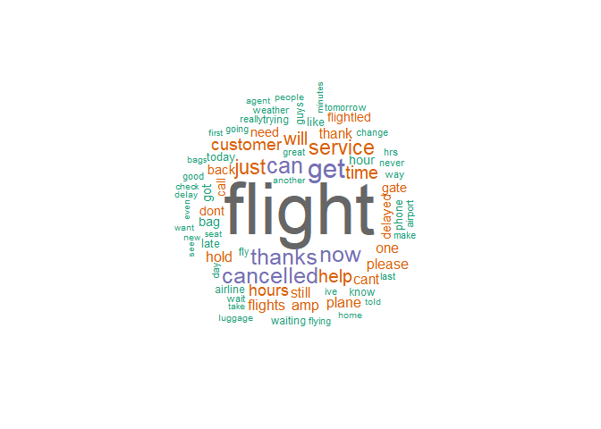<!-- -->

Let's use another wordcloud which is more interactive and shows number of ocurrences when hovered over to get a better feel of our dataset.


```r
# create a dataframe with words and their ocurrence
w <- data.frame(names(w), w)

# change column names
colnames(w) <- c('word', 'freq')

# main wordcloud function
wordcloud2(w, size = 0.8, shape = 'circle',
           rotateRatio = 0.5, minSize = 1)
```

<!--html_preserve--><div id="htmlwidget-51695136394ab6b14282" style="width:672px;height:480px;" class="wordcloud2 html-widget"></div>
<script type="application/json" data-for="htmlwidget-51695136394ab6b14282">{"x":{"word":["flight","get","can","thanks","cancelled","now","just","service","help","time","will","customer","hours","flights","amp","hold","plane","thank","cant","still","please","one","need","delayed","back","gate","flightled","call","dont","bag","hour","got","like","late","phone","today","airline","guys","fly","waiting","know","trying","way","airport","ive","day","great","going","wait","never","flying","make","change","hrs","last","weather","tomorrow","really","good","delay","minutes","home","even","people","bags","another","seat","want","new","told","take","check","first","see","luggage","agent","ticket","ever","getting","due","number","love","lost","worst","yes","email","travel","work","thats","next","someone","much","min","days","crew","baggage","flighted","two","made","didnt","well","right","trip","seats","response","experience","problems","let","online","sitting","best","sent","passengers","bad","staff","customers","wont","boarding","better","long","already","doesnt","said","ill","sure","left","jfk","line","since","youre","book","times","booked","stuck","give","morning","miss","reservation","flightr","tonight","airlines","whats","miles","think","website","find","agents","yet","nothing","flt","fleek","use","issue","says","care","booking","connection","night","refund","dfw","system","fleets","info","tell","delays","tried","hotel","put","mins","rebooked","air","hope","keep","pay","called","anything","rude","also","missed","free","nice","done","ago","tickets","follow","rebook","finally","wifi","class","awesome","issues","able","lax","checked","credit","week","business","every","working","appreciate","anyone","come","say","missing","looking","phl","board","delta","available","via","app","person","update","always","status","without","problem","answer","couldnt","making","thx","leave","many","team","isnt","terrible","yesterday","understand","voucher","havent","upgrade","sorry","helpful","look","fail","dca","planes","amazing","sfo","disappointed","extra","instead","year","speak","early","name","fix","send","rep","southwest","wasnt","almost","money","claim","pilot","paid","open","pass","though","earlier","contact","ord","happy","departure","took","different","try","talk","clt","supposed","connecting","site","vegas","hung","unacceptable","received","attendant","stop","least","something","employees","airways","job","full","actually","yall","direct","boston","poor","ridiculous","stranded","ground","dallas","card","horrible","company","tarmac","add","show","destinationdragons","family","everyone","chicago","denver","found","seriously","landed","calling","twitter","old","taking","weeks","ewr","start","leaving","needs","snow","chance","american","san","maybe","wrong","tweet","wife","far","reason","might","policy","bos","gave","food","account","point","vacation","away","reply","half","enough","message","big","sit","coming","return","hey","fee","desk","past","charge","theres","reservations","three","option","frustrated","mechanical","little","thing","may","together","went","confirmation","car","using","changed","offer","asked","twice","nyc","soon","link","question","kids","broken","possible","charlotte","cool","destination","less","stay","saying","weve","around","pls","used","things","looks","longer","makes","runway","lot","traveling","worse","landing","cost","newark","guess","given","awful","terminal","plus","real","youve","scheduled","waited","telling","idea","iad","checkin","row","houston","attendants","hear","heard","seems","minute","lack","else","thru","believe","friend","mean","arrived","happened","hard","life","lol","philly","international","frustrating","sat","member","points","sucks","cust","arrive","wouldnt","reflight","phx","feel","options","assistance","request","calls","fll","information","maintenance","monday","hoping","loyal","pick","swa","second","end","everything","lga","quick","glad","miami","jet","changes","process","forward","expect","joke","arent","usair","error","wanted","standby","ask","iah","busy","checking","ceo","room","apology","counting","deal","world","suck","pilots","years","thought","reach","theyre","needed","spent","human","bring","paying","lets","group","boarded","case","asking","unitedairlines","imaginedragons","blue","flew","club","wish","las","entire","empty","computer","months","form","guy","complaint","award","yeah","bought","provide","buy","lose","passenger","place","carry","currently","address","fees","taken","bwi","pretty","city","happens","updates","helping","whole","flighting","drive","run","communication","leg","counter","sunday","hopefully","either","wow","asap","tsa","respond","rather","seem","happen","den","live","beyond","moved","month","wtf","price","future","supervisor","sleep","fault","flightlations","appreciated","companion","holding","friends","support","fine","super","confirmed","ready","nashville","automated","correct","inflight","high","shouldnt","figure","mco","sad","offered","plans","apparently","access","easy","cabin","safety","upset","okay","situation","date","tuesday","cause","feb","atlanta","media","customerservice","flown","completely","handle","treat","probably","set","record","atl","hate","following","running","reschedule","luv","charged","helped","luck","storm","connections","orlando","top","compensation","original","means","huge","gets","switch","disconnected","kind","must","cold","middle","austin","fare","part","platinum","details","read","zero","members","delivered","employee","fact","seen","allowed","sending","losing","allow","share","shes","giving","priority","gonna","fun","gives","several","purchase","clothes","changing","schedule","flightlation","came","despite","shit","winter","weekend","extremely","front","crazy","wall","answering","rock","layover","takes","space","spoke","tix","reps","explain","ppl","aircraft","lounge","unable","multiple","sense","water","country","birthday","four","mobile","friday","gold","rescheduled","land","inconvenience","complete","word","services","knew","goes","held","works","arrival","unfortunately","fixed","list","rdu","hello","non","news","lots","totally","afternoon","report","husband","absolutely","mileage","overnight","kudos","load","confirm","nope","answers","phones","treated","hang","hasnt","true","relations","jetblues","virgin","oscars","code","friendly","folks","keeps","route","area","round","learn","wonderful","mine","drop","worth","responding","literally","control","showing","attitude","social","plan","haha","dividend","plz","page","anyway","closed","spend","americanairlines","bit","small","course","excellent","saw","overhead","connect","baby","matter","dealing","lines","letter","mia","flyer","ride","watch","depart","nonstop","choice","passbook","evening","submitted","short","anymore","vouchers","anywhere","arriving","note","feedback","offering","neveragain","letting","however","bna","worries","gone","excited","seating","sign","mind","shows","trouble","saturday","kept","hes","march","behind","forced","child","man","move","phoenix","ice","catch","complaints","usairwaysfail","door","failed","mess","entertainment","takeoff","btw","web","window","started","others","domestic","worked","gates","resolved","followed","ruined","knows","cover","explanation","bumped","hangs","warm","select","win","traveler","dropped","stuff","drink","frequent","happening","bank","svc","daughter","intl","mom","flightd","caused","conf","captain","updated","tag","post","merger","none","funeral","lady","useless","assist","receive","notice","expected","center","itinerary","order","story","emails","receipt","moving","unhelpful","youll","advisory","keeping","airplane","office","single","power","hell","safe","acceptable","meal","party","volume","current","absolute","definitely","notification","filed","routes","mexico","philadelphia","avgeek","werent","regarding","resolve","security","total","concern","unhappy","airports","file","onto","tired","major","failure","damn","screwed","talked","kidding","fucking","tmrw","close","match","program","video","special","count","charging","funny","nightmare","actual","travelers","cut","transfer","son","willing","equipment","pathetic","fingers","talking","train","forgot","clear","tells","difference","badservice","impressed","answered","excuse","compensate","hanging","per","except","enjoy","especially","south","fantastic","street","added","fares","emailed","view","seattle","upgrades","headed","requested","sort","planned","provided","picked","favorite","meeting","crossed","usually","premier","mistake","questions","tweeting","wasted","final","tho","denied","angry","flyers","departing","sick","listening","onboard","bother","broke","visit","refused","god","handled","catering","unbelievable","phlairport","youd","imagine","smh","fuck","mention","iphone","suitcase","wondering","loved","lovely","slow","ones","trips","waste","experienced","diego","serious","preferred","standing","switched","wonder","impossible","delivery","refunded","touch","personal","screw","deliver","bus","important","choose","fair","hire","sister","callback","clearly","department","turned","appease","america","internet","expensive","adding","deals","tracking","game","disappointing","midnight","welcome","purchased","dmd","ugh","along","arrives","representative","turn","rental","fyi","likely","filled","auto","badcustomerservice","refuse","dmed","dept","emergency","coach","flightling","passes","wed","inside","ohare","exactly","etc","sell","speaking","freezing","dollars","engine","till","upgraded","gotten","cheap","notified","leaves","children","prices","wednesday","dragons","trueblue","battles","congrats","step","music","text","premium","alone","expired","daily","apologies","item","based","watching","coffee","trust","sold","promised","resolution","solution","continue","omg","starting","additional","save","accommodate","main","outside","training","mileageplus","ahead","attempt","honor","ways","previous","diff","consider","lie","fan","patience","forever","fast","level","tweets","known","rate","eventually","exit","plenty","patient","columbus","dfwairport","cross","eat","worry","hawaii","enter","across","damaged","met","faster","pdx","sweet","event","usa","hot","treatment","avail","couple","bday","carryon","suppose","truly","third","rules","break","incredibly","yep","numbers","remember","within","nobody","example","quickly","overbooked","fit","florida","fill","policies","tampa","disgusting","incompetent","safely","conditions","ruining","amount","crews","type","mad","words","ended","straight","buffalo","systems","mint","journal","cities","shame","advise","infant","silver","driving","todays","sounds","become","advantage","stewardess","accept","perfect","economy","mail","bird","characters","funds","promise","unprofessional","courtesy","incompetence","carousel","loaded","clue","shot","gotta","avoid","simply","woman","redeem","issued","print","pleasant","act","honest","possibly","five","perhaps","figured","corporate","traffic","apply","slc","relate","wedding","res","pbi","suggestions","somewhere","bringing","wsj","nearly","death","thinking","messed","red","dal","feet","thursday","beautiful","dog","logan","april","finding","school","texas","ipad","palm","improve","fight","contacted","drinks","wanna","promo","low","announced","thankyou","items","advance","tough","announcement","pre","military","ontime","deserves","stopped","disaster","dia","showed","contacting","photo","frm","sea","play","blame","prompt","assigned","originally","london","jetway","double","officially","surprised","watched","surprise","chances","crappy","quality","cab","providing","heading","near","elite","automatically","juan","feeling","handling","lies","wasting","clean","legroom","allowing","nothappy","informed","apologize","rewards","professional","flyfi","chairman","brand","posted","hands","carrieunderwood","concerned","outstanding","precheck","afford","hand","sooner","cmh","york","screen","returned","ball","spending","cheers","easily","crap","raise","sun","alternate","jan","pull","thnx","simple","cheaper","seeing","washington","dead","responded","planning","absurd","feels","computers","delaying","experiences","floor","directly","otherwise","earn","til","head","management","states","killing","complain","public","manager","global","flightation","yyz","msg","write","rsw","aware","brother","annoying","frozen","pit","realize","prior","obviously","often","sleeping","reroute","passed","departs","mother","six","although","push","east","snacks","fort","feature","summer","sju","admirals","locator","skies","side","applied","ladygaga","february","marketing","song","biz","bet","recent","fuel","dulles","track","lame","ran","normal","begin","picture","rescheduling","paris","errors","sharing","dad","mechanics","whos","minor","difficult","properly","hotels","returning","cancun","pax","yea","considering","flightations","outlets","exact","easier","looked","costs","appears","frustration","effort","whose","heres","reimbursed","unreal","stand","wet","piece","rerouted","ual","raleigh","epicfail","house","bdl","buf","hearing","respect","felt","higher","taxi","knowing","expecting","shuttle","faa","state","deplane","memphis","shouldve","guarantee","roundtrip","loyalty","rest","cell","usual","wheelchair","listed","insane","specific","west","wifes","located","august","reward","lauderdale","mdw","contest","fortunemagazine","jblu","flyingitforward","opportunity","among","large","waive","queue","face","somehow","messages","aus","moment","model","laptop","paper","black","incredible","commercial","timely","wants","according","inconvenient","okc","unavailable","sna","fails","airfare","heathrow","california","transferred","inbound","doors","reimbursement","hundreds","traveled","discuss","stl","wheres","girl","certainly","rows","basically","speed","boards","lesson","ticketed","shameful","understood","cun","poorly","honeymoon","certain","value","connected","retrieve","pvd","won","pissed","travels","log","credits","causing","lied","discount","meant","fam","weight","carrier","yay","interview","msp","somebody","winners","embarrassing","nasty","mke","offers","drove","alist","gear","rocks","cmon","fraud","beach","australia","carriers","dirty","worried","whenever","meet","bin","uncomfortable","tech","include","reimburse","springs","continues","virginatlantic","position","positive","brought","manage","earned","method","payment","portland","ios","affected","pair","david","partner","nuts","outbound","lhr","canned","hostage","rooms","claims","nah","certificate","disappointment","existing","unless","daughters","theyve","diverted","announce","pic","wout","unfriendlyskies","notifications","yrs","poorservice","attention","legs","miserable","whatever","including","pts","dates","suggest","moms","meals","departed","police","acct","garbage","hit","workers","reasons","upcoming","comes","dinner","comp","official","false","ass","listen","sky","limit","notify","explained","personnel","million","immediately","peanuts","shitty","rent","sadly","merge","turns","flts","shout","decision","tpa","aviation","cares","rapid","golf","accurate","laguardia","size","alert","ripoff","prepared","confused","stick","puerto","pittsburgh","ashamed","heart","hunt","est","sale","compassion","lucky","sunny","balance","finish","lovedragonss","exec","aadvantage","fabulous","stress","anytime","elevate","chat","exp","francisco","complimentary","central","jump","sjc","mon","abq","light","revenue","degrees","saving","flightly","smooth","rates","lap","incident","towards","tea","forget","forcing","seated","toward","industry","express","medical","elsewhere","zone","excuses","private","meetings","doubt","valid","required","local","comment","charges","walked","apart","generic","canada","statement","signed","repair","responses","cuz","walk","consistent","general","placed","buying","mile","blog","cleveland","heads","seconds","english","steps","reserve","costumer","reaching","mci","eta","reagan","breakfast","ktn","switching","deice","truck","locate","extended","bummer","honestly","sight","bathroom","unitedsucks","sound","disgusted","conference","departures","alliance","star","accepting","alright","mark","age","badly","young","stated","hook","cnn","advice","assignment","ind","biggest","history","thoughts","decided","living","father","learned","yup","whether","lower","estimated","parents","flytpa","separate","bonus","initial","icy","midway","promotion","voice","noticed","plat","snack","republican","waterbury","serving","profits","disconnects","cowboycerrone","playing","leading","reserved","expires","dream","agree","shown","beat","student","remove","comfortable","hiring","field","password","sorted","inspired","grand","surgery","dtw","paperwork","partners","recommend","tweeted","eastern","pulling","bins","luckily","rough","shocked","penalty","deicing","common","january","awards","clients","ignored","throwing","sincerely","nights","huh","appear","stressful","heat","hadnt","hence","curious","lands","lbs","theyd","annoyed","bullshit","split","apple","bunch","notcool","served","reminder","device","reference","spot","itll","membership","karen","promises","boyfriend","correctly","lufthansa","uniteds","replacement","hates","lit","article","ton","strand","accommodations","result","flightst","reasonable","consistently","epic","operated","lousy","tues","csr","managed","metal","worstairlineever","coat","dumb","programs","disconnect","availability","cleaned","drunk","slept","handlers","staralliance","passport","ahold","standard","unitedfail","cle","concerns","degree","airbus","operations","jax","eyes","freaking","pushed","names","technical","horrendous","disgrace","cup","guitar","furious","saved","wheels","fans","wth","practice","cont","anniversary","rico","coast","reported","actions","accepted","replying","yelled","nexus","places","jacksonville","spiritairlines","scavenger","aug","stroller","band","opening","spoken","wouldve","stupid","cash","velourlive","selfie","lauren","snowing","transportation","njb","bluemanity","livery","prefer","unused","interesting","sarcasm","kicked","failing","white","wine","putting","bug","reset","flier","purpose","results","race","salt","benefits","barely","turbulence","nytimes","visa","gift","grandma","dollar","destinations","europe","abc","dear","serv","prevent","shoes","beginning","existent","upon","mistakes","disappeared","continued","quite","enjoyed","causes","october","whoever","coupon","louis","client","atrocious","machine","blaming","deep","ripped","period","fleet","assume","requesting","included","yvr","msy","male","gross","location","wallet","damage","opened","abt","forth","unfriendly","aspen","deserve","hassle","terribly","shopping","loving","released","extend","aircanada","shut","suggestion","rights","worstcustomerservice","limited","copy","theyll","picking","prob","desperately","mech","crying","bay","solve","volunteer","holders","idiots","named","suit","click","exceptional","pushing","deplaned","pending","chi","tvs","tire","reading","attend","communicate","stinks","inexcusable","starts","announcements","belongings","loses","treating","humans","designed","serve","families","cutting","cxl","created","weird","define","decent","fire","beer","disregard","dragon","sons","disappoint","plastic","useful","operating","tkt","roads","expedia","fliers","accounts","procedure","teach","extension","john","cart","responsible","painful","approach","troubles","june","turning","lifetime","misplaced","hungry","exchange","tablet","dying","courteous","die","compensated","join","directed","ignoring","review","wrote","suggested","term","camera","harder","van","toddler","fresh","realized","ric","neither","understandable","alerts","indeed","success","pricing","kid","birmingham","brutal","charleston","throughout","discounts","fall","noon","interest","loss","baltimore","resched","receiving","corporation","aww","college","chaos","dealt","regular","nantucket","hpn","seeks","decide","shoutout","ctl","key","commercials","suicide","teens","fully","awaiting","impressive","stat","bill","interested","hows","unexpected","getaway","oneway","design","cabo","redcarpet","bucks","license","button","dullesairport","nervous","nicely","wheel","adds","pillows","fav","atlantic","understanding","performance","facing","jacket","constant","fat","brilliant","needing","channels","cards","spread","kinda","malfunction","jose","opens","movie","cousin","manner","weak","thankfully","besides","search","carrying","unfortunate","guide","scam","december","ref","grounded","operational","esp","responsibility","writing","tel","hou","flyohare","stellar","pocket","happily","highly","claimed","bar","helps","monitor","spare","impact","efforts","confusion","software","unnecessary","decisions","flat","chicken","canadian","proper","stood","prove","fucked","hubby","refuses","typical","driven","pleased","choosing","overweight","dming","holder","peoples","loading","mex","ten","written","chair","fixing","worthless","transaction","cry","ber","replacing","frankfurt","humor","grr","hilarious","facebook","tiny","kiosks","lazy","parked","girlfriend","exception","hurt","travelling","capt","bhm","accountability","concourse","trapped","updating","sometime","continuing","tomorrows","itineraries","journey","cvg","pulled","albany","detroit","bush","routing","addressed","abysmal","submit","download","hnl","extreme","similar","directtv","everyones","closer","backup","formal","commitment","roc","north","smile","overall","recently","document","incentive","charity","locations","basic","bump","tight","warning","lying","expire","costing","maint","firstclass","progress","estimate","gas","heavy","alot","desks","forgetting","crash","customs","shortly","scale","blah","hartford","lmao","earth","fortunately","couldve","technically","refunds","gogo","thankful","sigh","dropping","data","southwestairlines","fell","unreliable","bae","insult","terry","oakland","bostonlogan","arrangements","enroute","fired","credited","ring","cali","spring","kelly","triflight","accommodating","nearby","savannah","costa","rica","evaluate","disney","national","stole","cuba","chairs","mosaic","goodwill","perks","asleep","digital","significant","birds","agency","backs","merged","onhold","usairwayssucks","filmcrew","understaffing","recourse","eye","operation","touchdown","winning","shared","random","desktop","boy","plain","secure","cake","andor","beats","views","ability","dancing","crisis","scared","sec","assaulted","girls","boo","selected","profit","application","flylaxairport","sos","inappropriate","gma","flies","badges","superior","greeting","road","deserved","sucked","classy","strong","bumping","umm","popular","accident","hooked","chase","september","illegal","cessnas","removal","requires","bothered","bogota","crashed","negotiate","scheduling","disrespect","shocking","july","skis","century","property","horrid","china","dms","aviv","action","fran","pos","constantly","wks","vacations","appropriate","corp","falling","rectify","scan","thinks","finest","ogg","closest","pacific","carseat","pjs","ensure","reserv","inadequate","stolen","nonsense","fits","poorcustomerservice","lake","glitch","truth","someones","orf","premiere","cute","kindness","beauty","outsource","foot","advertise","confirming","forces","understaffed","dry","assign","btv","solved","notes","lisa","irritated","wearing","freq","dot","pleasure","explorer","ads","snowy","dozen","catching","disgraceful","tone","reconsider","valuable","pretzels","legal","advertising","spanish","sincere","contract","memories","ski","attempting","circumstances","reliable","organization","flightaware","tail","efficiency","worstairline","ideas","philippines","aisle","hdn","numerous","relationship","everytime","green","present","breaking","stt","proof","crashing","texts","cluster","bereavement","appalled","notch","logged","occurred","screwing","enjoying","particularly","pricey","layovers","trained","sits","unknown","operate","ramp","cranky","matters","hardly","operator","fiasco","proud","ladies","chose","pain","belize","blamed","reminded","remains","fra","executive","orleans","map","sales","messing","skills","login","bahamas","officer","inches","consideration","brothers","walking","bankrupt","google","marks","folder","darn","clarification","embarrassed","belt","transport","recording","repeat","lavatory","necessary","wind","table","box","massive","annual","driver","dest","cleared","sept","magic","selling","downgrade","customerservicefail","incoming","survey","annricord","smiling","admit","boss","dobetter","yesterdays","custserv","owe","messaged","follows","mission","subpar","pref","communications","nonexistent","toilet","packed","provider","content","odd","omaha","died","feed","lives","hits","dang","clubs","magazine","benefit","greatservice","rno","staying","thousands","speedy","dime","hitting","wanting","ivr","husbands","rule","injury","parking","sites","grateful","hopeful","antonio","ohio","heavily","conversation","offices","aka","loves","jamaica","harbor","conflicting","photos","greenville","indy","northeast","loose","heck","ticketing","louisville","lunch","anxious","gary","printed","partnership","utah","pwm","park","anticipate","lead","gain","unlike","film","fastest","involved","vieques","barbados","mem","getittogether","brandmance","inform","kill","sxm","waiver","flyitforward","bottles","hub","dissatisfied","awe","alaska","meaning","jvmchat","sympathy","chairmans","flydelta","women","merging","vile","logistics","assult","americanview","guests","prime","innovation","entered","headphones","rain","loads","redirected","user","version","cheapflights","farecompare","representatives","register","comfort","globe","destroyed","market","investors","psp","pressure","safari","clicking","hahaha","blasting","severely","expectations","santa","exhausted","refunding","financial","regulation","ordered","consecutive","competition","increased","sees","temperature","chrome","tonite","bound","mentioned","checkout","mood","embossed","patches","standards","ellas","cue","exist","requirement","develop","dallaslovefield","thurs","cheese","richard","plate","haul","network","recieved","risk","law","ase","emailing","debacle","caring","int","trusted","silverairways","touched","breaks","guitars","addition","preboard","active","brain","handed","coincidence","apps","silly","negligence","coats","faith","continually","severe","confident","lostluggage","various","compliment","pays","assured","continental","regret","manchester","encountered","delhi","stressed","thin","strangers","overbook","adopting","ftw","teams","sched","friendlyskies","manually","tags","bed","quiet","ends","devices","failures","norm","terrific","madrid","reports","clothing","randomly","kindle","caught","attached","yelling","connector","saver","shall","incur","assuming","pqd","resume","rarely","claiming","etihad","theworst","enquires","understatement","tom","robin","hosting","partial","nrt","practical","retrain","puts","bridge","confusing","oops","scott","cleaning","segment","searching","nite","oct","zurich","hanger","sdf","robotic","deck","servicefail","deltaassist","acknowledge","definition","efficient","wake","attempted","jacked","jobs","pat","restore","lowered","intentionally","singapore","dreams","worker","toronto","strategy","segments","bagage","describe","albuquerque","strikes","nowhere","planet","haydensteamboat","dark","origin","ana","replace","shv","boise","atc","kiosk","smallest","continuous","dunno","toilets","outrageous","carryons","norfolk","stranding","tucson","notifying","self","ntrustopen","redeemed","cae","deleted","staffed","anthony","def","hospitality","snowboard","honolulu","miler","sacramento","arranged","providence","deiced","icing","quicker","mths","easiest","accidentally","duh","tremendous","tonights","goal","nature","orig","cookies","operators","calgary","approve","ship","wno","halfway","texted","strike","congratulations","remind","lmfao","ali","collection","pen","responds","ages","normally","trash","aboard","stock","threatened","mid","comcast","cruise","nola","inefficient","promising","favor","cramped","awkward","detail","forgive","newyork","smoothly","becoming","thomas","seemed","elses","ignore","refuel","armrest","remote","insulting","twelve","letsgo","combine","therefore","notimpressed","functioning","played","pile","jets","patiently","chocolate","kit","jeff","chill","tray","rented","donation","galley","alternatives","alive","nocustomerservice","dial","accordingly","duty","fave","problemss","average","dpt","expedited","refundable","hide","force","falls","oversold","admiral","experiencing","considered","sop","pet","entering","perfectomobile","ups","menu","supposedly","incorrect","storms","promotions","sayin","tab","incorrectly","dep","equally","timed","uniform","cana","punta","linked","rushed","treats","specifically","selection","unaware","boys","headache","corrected","sydney","hardworking","oscar","britishairways","sticking","rudest","cats","approved","movies","boeing","screens","hoped","comments","precious","locked","shannon","lowest","identical","honored","federal","passing","internal","flyunited","moments","functionality","cheated","rudeness","highlight","holy","entirely","nynjairports","disorganized","nicer","budget","packages","proceed","anamarketers","birth","allows","clever","temp","profile","streaming","personally","waits","hero","signal","reflect","integration","interaction","arizona","rethinking","daytona","signs","aruba","telephone","sometimes","color","elderly","nolove","battery","holdup","photography","november","maiden","spirit","doug","servicing","books","indianapolis","disrespectful","winterweather","cxld","inclement","students","stories","crowd","steal","amex","responsive","paypal","gracias","rid","oak","videos","bottom","bestairline","ragandisney","recovery","wknd","airplanes","kicking","guest","woohoo","bloody","require","ahhhh","behavior","letters","tryin","dsm","create","deplorable","pooling","companies","madness","deny","nassau","jetbae","gladly","glass","surely","opposite","idk","odds","yest","gorgeous","circle","brandloveaffair","release","glasses","haiti","loosing","div","wyou","seven","lovejetblue","hopes","unwilling","choices","fed","nvr","italy","marie","anybody","kylejudah","jayvig","utterly","picks","frustrations","inconvenienced","oneworld","drunks","sabre","kphl","phil","dividends","fear","usairsucks","dozens","crackers","cherry","srvc","jeanine","yousuck","askpaypal","meds","yuma","neptune","cot","thenewamerican","rampers","sexual","revs","goodbye","derekc","aggressive","faces","hats","men","vegan","roasted","worstflightever","downtown","blew","entertaining","andrews","julie","mary","modify","distribution","scanned","appointments","peeps","apt","butt","browser","reputation","hotline","dude","indicates","spoiled","refreshed","sunset","browsers","dance","wing","recline","pros","precipitation","refusing","unusable","sanfrancisco","faanews","painless","woaw","shares","arms","lieflat","mayweatherpacquiao","kciairport","soooo","dislike","capaaviation","winds","mostly","section","noooo","cancer","urgent","duffle","soft","challenge","bruh","lighting","pink","celebrating","atx","gesture","furrow","lone","middleeast","ploughs","thenationaluae","channel","heaven","wings","announces","xweekly","jack","usatoday","consumers","mph","minneapolis","waived","town","hop","hugely","glasgow","logic","gee","repeatedly","terminals","married","newly","instructed","recheck","regulations","austrian","expense","expenses","codeshare","disabled","flex","plague","improvement","complained","roger","buddies","worstunitedflightsever","resolutions","neglect","repeated","legitimate","systemwide","unrelate","french","tourist","indication","bot","quoted","remembered","convenient","recommended","completed","thanx","strange","wour","runaround","taxis","skiing","pack","centers","addtl","stall","rearrange","ethiopia","frigid","sandwich","unscheduled","suspect","mass","displayed","fairs","reinstated","christmas","secured","greetings","vice","tool","voided","argument","baggages","shaking","committed","isis","blocked","assisting","musicians","tuned","deaf","president","dublin","confidence","woke","coworker","replies","settled","saga","preboarding","kick","bkk","compared","jms","collect","formally","handler","pointless","stunning","piss","deplaning","pray","altitude","drops","slightly","milan","childs","paste","terribleservice","blatant","wreck","ons","groups","hopeless","solutions","snowstorm","peace","filling","inept","fucken","frontrunner","charm","performing","stayed","regards","sunglasses","bull","hourdelay","happycustomer","relatives","oma","timing","otis","probs","irresponsible","sympathetic","paulo","relative","rcvd","comedy","aint","discover","voicemail","resolving","educate","intention","practices","winterstorm","gettin","arrogant","thus","rikrik","fewer","overflight","seg","siting","separated","disgruntled","screaming","competitor","talks","strongly","renting","allowance","grandfather","approaching","tick","pants","empathy","calendar","delete","happier","priceless","eco","thread","purchasing","shoulder","pressurization","cnx","checkpoint","throw","immediate","visible","guidelines","shouldhaveflowndelta","taxing","clarify","conversations","checkins","tks","border","con","finds","tour","appreciation","flysfo","perk","jeokoo","solo","exclusively","qantas","cruel","flattering","legit","increase","speaks","approx","buddy","regardless","foxnews","inch","transit","preflight","culture","ranked","livid","murdering","opal","woven","pens","internationally","individual","turnaround","concept","econ","submitting","carried","competent","catered","insulted","vital","guessing","hole","hrmin","celebrate","denphx","backlog","upgrading","advised","downhill","username","orbitz","inevitable","greedy","chief","noted","curbside","hundred","jailbreak","kingscollegelondon","rag","columbia","rotten","cheer","explanations","owner","notgoodenough","airlinegeeks","pound","blankets","verify","improved","bye","former","pia","quit","bro","jfklax","blowing","idiot","transfers","booze","beware","memory","base","beg","frontier","harsh","entitled","indicated","reeks","vomit","discrimination","reminding","expiring","enjoyable","jedediahbila","path","warmth","sentiment","regional","friendliest","clarifying","thousand","arrange","stow","pnr","smisek","exceptions","issuing","hug","hangar","janet","erj","xdaily","entry","sobewff","lights","resulting","stepping","ont","uncaring","pro","shots","perth","nxt","evry","mht","praying","silence","stars","rant","moon","argentina","woo","typo","pleasantly","replied","awake","shipped","nothanks","promptly","parent","lounges","heathrowairport","irritating","err","travellers","loc","xday","stillwaiting","slip","overseas","registered","stopping","accomplished","batting","procedures","slapintheface","capital","reinstate","tnx","fallow","health","invite","guaranteed","math","metro","laugh","insufficient","midland","tears","certificates","westjet","apparent","blown","nicest","technology","coworkers","cert","storage","bitch","knees","windows","wrap","troubleshoot","volumes","forms","stone","court","hashtag","warnings","previously","priced","equal","payed","headaches","fella","presented","dining","hometown","hypocrisy","replaced","captive","jane","input","disappear","hidden","decency","fianc","protect","everywhere","asks","ferry","inbox","honoring","assignments","boat","outdated","myers","durango","improvements","meantime","survive","cld","stays","proactive","pregnant","processing","ffl","taylor","vallarta","honey","checks","finger","runs","france","delayscancelled","affordable","receipts","lynn","nephew","lindsey","principle","larger","nonprofit","combination","texting","luvswa","capacity","closes","entertain","proving","locals","earlybird","apologizing","cellphone","weatherrelate","stops","intercom","nsw","chg","flgt","scene","unveils","orangecounty","spam","series","phxskyharbor","robot","athletes","tue","huntsville","lasairport","miracle","carpet","amazed","homeless","unpleasant","props","project","soaked","comped","boycott","aarp","impression","goin","alex","seatac","coupons","wld","relax","concert","restroom","coordinate","paso","craziness","stations","wheelsup","portion","opinion","colleague","bgr","insist","theellenshow","complicated","flynashville","gun","jumped","horror","condition","divert","soul","range","buyer","rip","noone","arrivals","jacquie","plitt","unhappycustomer","refer","bwiairport","southwestairs","laws","srsly","gosh","happiness","vaca","invalid","android","jason","weekends","carolina","gotcha","bathrooms","gmail","hrl","oversize","forgotten","protocol","goto","wmy","logo","agt","mvp","understands","physically","misleading","filing","whoa","giant","stewardesses","mardigras","hmmm","sooo","display","flysouthwest","babies","bike","txt","communicated","covered","test","imo","rocked","gsp","separately","runways","starving","bummed","caller","attitudes","hangup","inability","staffing","jetbluesofly","thatd","uvf","westchester","tatianaking","redirect","discovered","stealing","rely","wmcactionnews","blank","toledo","lord","community","managers","awww","woof","charter","joanna","specified","amybruni","worlds","maimi","testing","terms","geeks","forecast","disorganization","apologizes","syracuse","pics","hayes","endless","srq","jetbluerocks","nine","flite","chs","praise","mercy","jumping","marathon","ping","likelihood","trading","dare","reality","diverting","sunshine","lovesongfriday","classes","taxiing","crewmember","sounded","island","pictures","angel","qualify","coverage","physical","convo","zkatcher","comm","youth","bottle","balls","dcabos","sensitive","greatest","exists","paint","robbed","safetyfirst","crewmembers","ellahenderson","vincenzolandino","style","rings","roxydigital","registration","challenging","breast","beamske","citizen","grace","bougth","basket","argued","detailed","shock","bussey","derrick","misunderstood","eyw","kim","cargo","nbr","waa","delayedcancelled","cincy","restrictions","gloves","gainesville","pst","patrick","flightno","sauce","onholdwith","goingforgreatnessfail","gso","usaa","unload","housing","lodging","contingency","unusual","colleagues","jtrexsocial","xna","faulty","obj","horriblecustomerservice","joined","diversion","callers","sweetingr","sean","billing","fresno","cho","bout","appreciates","crowded","manch","execplat","faithful","inferior","mastercard","yell","parker","provides","notmyfault","deadhead","jackkairys","senseless","grk","pets","manners","dialing","wichita","mce","aas","veers","auh","worstcustomerserviceever","chicagotribune","latimes","fourth","pounds","evoucher","cnnbrk","alternative","mtg","cll","billions","badmgmt","hoops","blast","obnoxious","ear","gentleman","amazingly","permanently","maneuver","lampf","selfservice","moodlitmonday","sciencebehindtheexperience","vibe","moodlighting","angeles","los","mountains","spotify","gaga","carrie","meh","floors","tables","films","neverflyvirginforbusiness","prince","sfolax","fllgtsfo","sneaky","tripping","beautifully","represents","compatible","delighted","intern","jfkgtsfo","xoxo","anxiety","creates","princesshalf","css","dallasaustin","dallasnews","eps","inquired","restr","thrown","recd","goodness","killed","mac","subsequent","silicon","impending","shift","sentinel","female","seatbelt","gopro","exceed","forecasts","profitability","sorrynotsorry","sanity","comps","assets","battling","freyabevanfund","freyasfund","stunned","momma","portfolio","jkf","demo","rockstar","ourprincess","adore","sfofll","mere","product","digging","singer","squared","avis","yummy","hair","kewl","bounce","donkey","integrate","boom","slots","caffeine","austinairport","intro","returns","refreshing","apr","expanding","sandiego","dalaus","nerdbird","frequency","lock","tailwind","jezziegoldz","bff","steel","hotspot","cus","exposed","grouping","definitive","reclining","bonuses","enroll","potentially","nonrefundable","cheertymedad","flawed","adult","loaner","inop","awhile","colo","avoided","addresses","disability","grp","starbucks","construction","folk","surly","hmm","ordlga","informative","booted","unaccompanied","bench","donatert","hannah","helppls","requiresshe","surgeries","remorse","obvious","intact","coasts","tide","tides","prepares","reduce","fiance","panic","steve","politely","iceland","disrupted","requests","lusaka","transatlantic","season","holiday","defines","frankly","kul","wdelays","solving","bright","screws","flypdx","consolation","challenges","publicly","phn","mammoth","reviewed","impress","flyyow","holidays","cpap","patterns","beverage","refueling","ward","sked","resulted","advising","prevented","fro","projects","dispatch","adjacent","mandarinjourney","momsgoodeats","wastedtime","reno","behalf","jac","goodenoughmother","thanked","cared","agnt","threatens","permission","phrps","overwhelmed","ondemand","upload","goodnight","bom","searched","flysaa","bio","placing","investigated","kevin","enuf","belfast","raising","spaces","communicationfail","reaches","clearing","campilley","planehow","reuniting","recovering","measure","epicfailunited","max","mos","gains","wiped","thrilled","slowly","jimmy","samartzis","surf","desert","remedy","stillnobags","stndby","conveniently","duped","extent","focused","urgency","bulkhead","ohead","medal","reunion","unnecessarily","overselling","compliant","cushion","senior","supporting","timco","clesfo","shoe","unsafe","fake","shanghai","fritz","confirmations","verbal","complains","taiwan","averted","beers","prize","injured","roadwarrior","del","preferably","intended","flierfriendly","doctors","supplies","maysep","badbusiness","joking","seatback","birthdate","noservice","companys","reissued","applying","timeliness","condescending","barbara","downgraded","savings","freaked","denairport","inefficiency","interior","rollers","removed","goodflight","welldone","caned","iahmnl","clicked","bounced","tryna","seriousness","liars","maui","flightfail","shits","colombia","spotty","quote","trace","sanm","amongst","excellence","kci","intent","misses","sundays","horrific","contents","fueled","inaccurate","attentiveness","compare","bohol","cebu","educational","cos","mechanic","clutch","mike","packing","retain","sjo","explore","ongoing","ensuring","sunrise","describing","decline","spots","inconvience","convince","alwayslate","bots","fiorettindward","garciachicago","invest","astounding","centricity","sisters","unsure","premierk","ashley","toddlers","jackson","misfortune","copilot","ouch","meaningful","rubbish","processed","oversized","defend","maine","bagsno","smoothest","affect","violation","flightledflight","maintained","ordywg","volunteers","gay","recovered","tock","spelled","citing","consistency","adopted","occur","hep","skilled","belong","hemisphere","western","pointed","earliest","radio","leadership","curiosity","pin","laxiad","noticing","edinburgh","gtgt","disappears","courier","ramps","danger","asia","korea","begins","populate","build","ottawa","ruin","unitedairlinessucks","doo","feces","sprinkled","monitoring","unbelievably","deciding","redeye","nonweather","bangkok","acknowledgment","foreign","airborne","hacks","jokers","rage","relaxing","investigate","parachuteguy","cnnmoney","tagged","unitedlies","hurry","stepped","gpu","cases","stream","travelocity","suffering","offensive","legally","rated","msnbc","skin","horribleservice","yow","firstworldproblems","refrain","cnxn","unlikely","overheating","breakdown","dreamliner","walls","events","millions","draft","somewhat","explaining","context","flightua","connects","irrops","wcancelled","raised","led","blocking","block","wheelchairs","counted","mgr","observe","compensating","deodorant","shampoo","prom","flyerfriendly","looong","satisfactory","rhonda","movement","filthy","disinfectant","cldnt","developers","morn","huston","preference","troubling","phenomenal","values","royally","boots","covering","doubtful","humour","pedro","assure","custexp","ops","festivities","meanwhile","difficulty","makeup","nothin","contains","difficulties","airnzusa","earning","outsourcing","boeingairplanes","adam","frequentflyer","jaclax","afraid","yuck","inspected","pita","herman","relayed","satisfied","smells","bgm","typically","gluten","supervisors","rare","gfc","danahajek","screenshot","panamerican","vicky","situations","standbys","brian","liable","arguing","luggages","remaining","wayne","damages","fwiw","misinformation","recognition","flipped","swiss","significantly","resend","afterall","handy","historical","mix","wins","sfogtbos","clockwork","battierccipuppy","puppy","skywest","conection","awesomeness","conveyer","unanticipated","num","partly","followback","reassign","everybody","slight","sir","contd","menus","losers","wave","chain","naming","unhappytraveler","rolling","motel","tokyo","cream","potential","standbye","stocker","waitlisted","jim","burn","tshirt","upgrd","mouse","ticked","businessfirst","rubber","shrug","education","concentrate","jam","spite","believing","embraersa","papers","craft","unitedfirst","unsympathetic","unitedappeals","queues","swapping","char","dissatisfaction","jenniferwalshpr","prebooked","flow","betting","settle","shed","privileges","cloud","thick","slower","capable","complaining","downgrading","selections","grouchy","nap","oregon","womens","reminds","beforeafter","waivers","ams","logging","antigua","burbank","prem","rear","crashes","abused","iamtedking","instagram","inquire","ailing","employer","busiest","expedient","dispatcher","trick","gogh","ramada","relevant","angrycustomer","beating","stranger","hii","wht","appeared","rerouting","ruth","rez","abroad","recap","goods","unitedairline","grab","sue","hoot","jerk","turkish","clouds","breach","counters","despicable","lookin","thirty","negative","cushions","loganairports","remotely","shenanigans","activitiesprevention","condomrito","familywe","helacohlc","aaba","anchorage","protected","dominican","energy","houstonbogota","tkts","flighttold","began","determined","overpriced","par","overflowed","luxurious","explains","includes","reads","creative","trains","beneficial","burningman","motto","staffer","grown","yards","reduced","amateurish","customerexperience","dispute","increasing","communicating","scratching","referral","loud","finals","shuffle","rapids","mailing","dramatically","package","ilchp","atleast","helpless","shades","pretend","upgd","neworleans","appalling","miriam","montego","ins","smf","shoddy","laurasbrown","pgatour","itproblems","thparty","associated","fields","flashlight","neighbors","smoking","humiliating","serves","bold","bourbon","savethediagonals","satisfaction","born","india","ooh","nofun","alaskaair","convinced","qualifies","amsterdam","surrounding","gents","debating","speeds","toiletries","wandered","pointing","distance","bizarre","outage","bandwidth","hubs","fab","mothers","delight","shoulders","swag","incl","overheard","greater","btwn","torture","heartbroken","research","teaching","loooooong","prev","ding","swell","sweetheart","bestflightever","perfectly","vacay","expiration","smiles","magically","length","solid","tourists","carol","marriott","science","americas","largest","vineyard","entrance","shifts","tip","urgently","hail","badpolicy","theft","uncool","partnerships","filmjobnoequipment","donate","allergy","peanut","ann","vinyl","sass","professionals","honesty","stoked","strip","bellagio","kelsey","destinationdragon","television","prioritize","dice","hooking","station","rudely","genius","purchaseerrorinvalidloyaltymemberaccountstatus","dnt","sld","uxzj","fri","equip","linking","pleaseeee","fron","allergic","ignores","oil","websites","triple","nwn","soaking","existence","passive","workaround","knowledge","athlete","flymidway","alt","inconsistent","mates","canx","discontinued","memorial","combined","subscribe","slowing","opposed","chaotic","smashed","theacademy","zoom","msgs","boooo","gent","denverairport","flyswa","noexcuses","tear","justsaying","arkansas","specials","tfw","jimcramer","holds","asshole","orl","tips","blames","suitcases","priorities","iflyswa","laughing","valentines","diabetic","grabbed","poteettj","trees","tmadcle","mcogtcmh","avon","dcoadavon","rating","sanitizer","blackhistorymonth","musician","recruiting","bravo","leinenkugels","letdown","forgiven","alas","wounded","sooooo","particular","unorganized","skip","corner","pleasehelp","tld","trvl","mouth","kay","que","cockpit","invited","tmw","backroads","competitors","pulse","batteries","dale","portcolumbuscmh","waitin","sally","handing","sleet","clarence","sanitized","troubadour","salted","vote","alls","purely","whens","dultch","horse","intend","graduate","bless","gal","labor","acknowledgement","bestairlineever","southwestverity","draws","enforcing","forfeited","larry","isp","bestfriends","repeating","tarmack","provo","accommodated","besty","betsy","memo","buttons","itd","nascar","cattle","lined","michaelbcoleman","perform","gng","execution","nvm","rescue","fairly","became","sammijons","setting","bestemployees","southwestrally","swaculture","addressing","singing","instruments","reviewing","rocking","bwisjd","hayleymad","malfunctioning","dialup","childish","remain","yearly","glitches","raving","ctr","enterprise","intelligent","thirtylives","thaw","aside","knoxville","monthly","eligible","chimid","internjohnradio","mrerickv","specifics","beatsmusic","personalized","snapchat","ireland","postcode","sing","flowers","karajusto","expedite","vinylvegas","swadiversity","announcing","lemme","university","craving","jackass","caribbean","oki","development","forecasted","cried","displeased","winner","amazon","plug","unloaded","emp","wide","phi","reddit","bigger","dick","pieces","reopens","swamped","store","spilled","grades","tul","lodge","callbacks","unspecified","guidance","imma","valentine","hournot","insight","laxgtjfk","chart","alleviate","modifications","geg","answerthephone","jetbluebos","george","org","readers","formula","jetbluecheeps","natca","county","noplacelikehome","setup","maatkare","syr","comfortably","infants","lag","establish","rebooks","possibility","thy","redemption","wut","parts","chips","staring","rectified","brandssayingbae","fustrated","nojetblue","brands","thewayoftheid","martysg","tweeter","reconsidering","pitt","drawing","debit","sudden","ems","strollers","environment","robert","attended","sittin","pure","tim","selfies","measured","ricoh","emv","younger","abcnetwork","shannonwoodward","reactions","dissapointed","bqn","costumers","preciate","essentially","stairs","untz","jetbluefail","criminal","bluecarpet","expressed","perspective","hawaiian","msbgu","justify","littlebirds","newburgh","alcohol","league","gracious","umosaicmecrazy","autoresponse","lil","ideal","wat","direction","woulda","upstate","port","scheme","protection","sylvie","followup","bumper","controllers","minimum","relationships","coke","rum","nhlonnbcsports","goodcustomerservice","charles","pig","predicted","warmer","folding","regularly","nasdaq","dakota","inc","vetr","foolish","beverages","iata","aerojobmarket","corevalues","passion","nigga","mideast","nov","bein","cal","lgb","nasdaqjblu","burger","dec","lucia","joe","escape","cheesy","lay","smart","finder","dre","slide","truebluelove","sleekmoney","bucket","thevdt","broadway","ardent","poughkeepsie","wkrb","schedules","havana","slowest","camp","scenario","carsl","anku","jetblueblues","capture","ninadavuluri","patronizing","gangway","heated","disappoints","pages","ruins","doke","legacy","telephones","roll","marked","needcoffee","rifle","transferable","bretharold","diversions","brazil","sexy","closepwcs","attendees","festival","allergies","sand","warriors","skytrax","sch","dads","ath","postpone","relief","registers","applicable","engaging","badge","eight","jbeatz","susan","depends","hotter","celebrates","blumanity","brushing","applepay","kate","delicious","participate","accused","warehouse","becomes","targeting","delivering","backpack","professorpaul","tsapre","oui","quoting","generated","painted","navy","asset","learning","phdmama","realtime","chronicleherald","weighs","deedee","iowa","diamond","pump","referred","impressions","reverse","youi","spelling","employ","flaw","insanity","chkd","flexibility","flexible","army","shortcomings","wrongfully","weary","transf","fing","dividendrewards","cardholder","dividendmiles","established","customerrelationsaacom","mitchell","argue","unmonitored","rachel","airway","owes","tammy","jealous","planets","mel","sticker","endlessly","gatwick","publicity","gnv","involve","lists","plot","proactively","thanku","chosen","ricdfw","bora","finnair","maam","affecting","elaborate","wannagohome","differently","clown","russia","likes","inconsiderate","phlmia","managing","offload","instructions","poorplanning","sav","southern","transported","compliments","plains","lexington","brokenpromises","elm","grounds","locating","rumors","shameonyou","preventing","breath","behave","realistic","nocrew","claudoakeshott","fas","cha","rivets","overhaul","josephtreis","brush","assholes","havoc","aggravating","overwhelming","nburnside","reaccommodation","pops","exercise","miserably","cots","gifts","processes","jabevan","midght","des","moines","abandoned","followers","emerald","dumped","reaganairport","sys","depending","flght","hve","recorded","usairwayssuck","kentuckymbb","tamara","eagle","delayedconnection","aal","dedicated","represent","quarter","franchise","prepare","wasteoftime","lawsuit","stephenrodrick","jammed","prepurchase","nrhodes","opportunities","bttr","sync","comms","weds","flightedflight","yvonne","burning","nicedismissive","thks","scotch","worstflight","embarrassment","occupied","baggagelost","fuk","cocktail","scattered","backwards","accts","annettenaif","roberto","evenlate","amateur","myrtle","transactions","tsaprecheck","prompts","desired","pity","ignorant","blizzard","occasions","upsetting","requiring","spf","itin","secret","disruptions","leads","fate","shld","cycles","waivethefee","ordeal","versus","uncalled","gray","closing","hat","hsv","reactivate","casimir","nocareforcustomers","filthyplane","hopeidonotgetsick","mold","frustratingit","nexttimeiwillflysouthwest","tpadfwlax","lex","faus","addl","prds","prolonged","allende","chef","miguel","ampwait","buttonthatcalled","calledampit","horriblewent","hungupnohelp","minsampput","andrew","andrewwasila","sma","rollercoaster","yesso","guysfor","killeen","droped","wcustomer","aadv","aano","rwrd","narrowly","snags","standbylots","pbpinftworth","robertdwyer","americanairlinesfail","choppiest","iwantmymoneyback","whiplash","reversed","trustget","okyou","stuckinmemphis","texasisclosed","faves","sheesh","espinosa","crated","wouldbe","inexperienced","painfully","paged","spaced","mattersits","biggie","clarkey","coached","itunesmusic","rams","spagnuolo","whammie","robocalls","onplane","twitterdm","gems","origindestinationdates","ordpvg","arbitrary","pafe","aadfw","amso","trvlove","boatstyle","dietcoke","happyflier","swivel","marshaled","retired","resoled","kax","beantownmatty","grievance","beanie","maria","lpalumbo","laguardiaair","diapers","fyicall","stilling","souljacoy","obscene","acquisition","youyou","nitrogen","fligt","americanairstill","advisories","outta","tyr","superyan","chasefoster","cvgairport","platitudes","embassy","herndon","suites","tcf","abilities","swear","dialogue","clueless","react","gunna","swu","yikes","nrosenb","aafail","rizzilient","loop","maryellagreen","lima","btr","envoy","wudda","nbc","meelan","chnge","amm","chapter","deflator","shawn","orange","lan","lacked","mxpjfk","goingforgreat","shortage","numerical","automatic","justynmoro","iberia","oaaret","witnessed","tisk","dawn","ggreenwald","shirt","robinreda","sample","txfd","centre","ticks","mentions","sizer","breeze","cincinnati","slcairport","everythings","taste","teco","sacraig","travisamex","refsd","deane","norma","sedholm","neglected","dhepburn","tacky","worm","parody","didntbut","graphics","iconography","minimal","seductive","virginmedia","sfopdx","daystogo","bosfll","graphic","hipster","bosgtlas","noair","sfotobos","vents","andchexmix","noob","sendambien","bked","pacificbiznews","moodlight","calming","freddieawards","hollywood","bid","laxgtsea","travelhelp","elevategold","soundofmusic","tribute","lgagtdal","guiltypleasures","wowd","elevatethey","uphelp","martin","classics","guyyyys","heyyyy","travelzoo","loft","cmfatfeet","ratepolicy","doom","supp","dreampath","flightattendant","teamim","begrudgingly","plannedneverflyvirginforbusiness","neverflyvirgin","avatars","disproportionate","kitty","helpva","jperhi","rnp","nomorevirgin","redesign","ressie","raeann","reluctant","pleasecomeback","oneasy","reservationhelpful","naelah","backend","frontend","built","crossbrowser","nycjfk","boslas","vabeatsjblue","fidifamilies","lucas","chrysichrysic","likingyoulessandless","reallytallchris","irmafromdallas","waltdisneyworld","jessicajaymes","backtowinter","drivers","greyed","rang","vendor","todaychecked","pairings","redwineisbetter","wonked","designated","pasengers","arab","emirates","topnews","baggageissues","lister","ketr","clincher","sfoewr","cudtomers","ttinac","seevery","asarcoesar","matchgot","virginamericayouve","persisting","stink","revue","beatstheothers","soreback","tossed","headerelevateusernumofpointsavailable","diehardvirgin","flightledgonna","meetthefleet","nominated","disruption","fastcompanys","fcmostinnovative","incubator","valley","bubbly","moose","spruce","classiq","greetingz","airplanemodewason","rockies","iced","banned","selecting","dentedmissing","miranda","flightsfo","vodkatonics","cruz","avalonhollywood","lovegratitudempower","vipswagbags","werin","luxuriesaesthetics","budapest","oscarscountdown","newsvp","dfwlax","rise","cutest","pepper","shaker","iol","lizautter","doctor","dress","renttherunway","callah","atwonline","fullyear","net","posts","javascript","stylesheets","handily","achieves","outlook","reuters","caching","tmm","madbee","links","choppy","gusty","windchill","wthe","mondays","responseplease","iny","biztravel","ssal","holla","keeper","shrinerack","vday","wifey","callemail","baldwin","bestcrew","debbie","lassfo","sherocks","rockstars","suuperg","styling","bandie","lofty","silverstatus","transformative","statusmatch","taxes","uphold","checkinbut","daldca","wjere","deeply","dontdothistome","blazer","kooples","boost","conversion","etailwest","payments","noneother","promoting","giannilee","vxsafetydance","obsessed","cabaret","swanky","dirtiest","skift","chinese","karinslee","comenity","transactional","sugafly","accelerate","livewelltraveled","sytycd","strayed","brisk","ipaddont","wfares","sprint","laxlas","infovirginamericacom","newsflt","dicks","giants","nwkgtsf","apostrophe","apostrophefail","surname","tinder","tinderchamp","tindertips","drinker","herbal","expansion","austindallas","affiliates","afiliates","flightchng","dreaming","earphone","battle","dallaslovefieldaustinairport","backyard","competes","nerd","extortion","brokenstolen","worrying","artisanal","pairing","jfklhr","freeneversucks","tminus","thestarter","paul","visors","beans","thoughand","infographic","segway","defiantly","scolding","myvxexperience","apathy","virgins","priortried","wervirgin","amazings","fargo","fargoairport","kickin","letsgohome","starryeyesdev","lineup","jenniferdawnpro","assistants","eriewr","eriord","steep","glamco","globalfc","selects","wupgrade","childridiculous","unrealistic","beautifull","necessity","allan","kmmvlkm","highbuddyyy","dan","rosetta","wasappreciated","tiredofwaiting","executives","aeroport","aegeanairlines","availab","defibrillator","aampc","flyingainteasy","indicate","newarkliberty","preexisting","reissue","shattered","ladan","inappropriately","latrice","abbreve","helpgot","uctraveladvisor","daysits","gateagain","tiredofthis","ecertificate","measly","addressusername","signon","interim","incls","unitedbreaksguitars","wantmymoneyback","impolite","telaviv","outcome","unfamiliar","icu","neurosurgery","zccu","kcthanks","mobility","considerable","accompany","getmeontop","mclarrensp","category","controlled","verizonwireless","pesky","screening","choosekind","rozana","ccicanine","eager","vision","servicedog","wtfodds","enforcement","gong","blackmailed","nullified","umpteen","concrete","simonroesner","honour","hollow","wellbeing","pattern","outofdate","copypaste","localized","accountable","bbbnesdksia","listens","insta","limits","produce","negligent","resent","pop","dmcome","learncustomerservice","ridiculousness","twitterliterate","recouping","travelbank","choosechicago","flightsand","yulord","helpdo","montreal","distress","seeking","attained","onestop","unrivalled","yearround","thai","thaiairways","atlord","pennypincher","brokenwheel","youcouldntmakethis","delayedno","ordseriously","connolly","efficiently","disputed","adventure","capeairs","guam","saipan","owed","remembering","abundance","platter","getmartyhome","shower","finalizing","ewrsti","jburg","unforeseeable","lindaswc","fend","flightn","kuala","lumpur","malaysia","asem","bgkwm","eserviceunitedcom","narayanan","melaniespring","inquiries","bergstrom","equals","thrombosis","vein","connectns","hotl","waking","gonnabealongnight","darquenloveli","briefings","ray","razor","tumitravel","xmas","inconveniently","dvt","sarcastically","lukemcintosh","nada","helpimstuck","ampfeel","mismanagement","sabe","decorum","revisiting","spoil","twitteremailweb","onboad","questionare","volt","html","effing","finishes","walks","encouraged","jobslose","statusand","transition","dencle","ker","zambia","newarklets","ordlhr","balancing","cyberattack","pbampj","statusmatchpaidoff","vancouver","investigatedmy","corrective","maryjo","trend","pivotalcf","rebooting","shaky","controlthe","comically","grkm","wouldhow","repeatably","rim","burgundy","loner","amenity","kits","correctness","siteits","thehipmunk","mllovelace","salisbury","renoairport","continentals","feat","whitterbug","funnycaptain","laughedhard","referencing","devalue","vacatinn","dorns","apollochplayers","delyd","lasden","gjt","goodenufmother","anyonethere","cozy","helpmeplease","vaileagle","businesstravel","bagdisgutedindenver","inline","listing","reebok","rockinwellness","dustyob","empathizes","entertainmnt","stclass","wnonworking","douglas","mcdonnell","lifestop","mysterious","rookie","svcs","demoted","goldsspousaldiscriminationangry","reveal","bettween","droppeditoffyet","amazefor","ceases","icloud","absurdly","albanyairport","betterfrom","dfpietra","tsk","rtb","wayway","acosta","jana","waives","alwaysdelayedonunited","branson","continentalairlines","notfair","poornoncommunication","unaccounted","possessions","levels","realistically","responsesme","unpleased","nonenglish","panicked","art","cluecould","rollerboards","iove","miscalculation","aging","aspenbaggagefail","truutall","condo","noanswer","wmom","gthr","dedication","forum","winston","pedophile","bass","flyeia","imranr","pairs","cnxns","drone","keambleam","activate","heattrap","mojave","pressurecooker","jon","descending","farce","shambles","writers","ambut","clientnothappy","missedwork","justifiable","suffer","gcvwj","kailua","refresh","mandatory","greatly","melissaafrancis","classed","quotations","tbd","usd","saves","fwa","nowhereland","adapted","noooooooooooooooooooooope","occurs","yyj","airlinesyour","sfolaxsalclo","cristiannot","faundation","ideologias","judeo","workersinstead","knack","outsourced","substandard","misconnected","temps","iadsat","outdoor","unwind","wifiand","linesforever","ampsock","hardearned","plundering","retailbagholder","sfoyyj","dinosaurplane","jurassic","eticket","farelock","sfosea","faire","laissez","peopleon","wothers","crewtells","electronic","precioustime","fyvrfn","tickt","helpbeen","sukhdeep","sba","youdo","siouxfalls","waitingonapilot","whyairtravelsucks","discomfort","frustratingly","jmercadomma","mpagent","peterstraubmma","seanmfmadden","tonysimsmma","exhausting","stretching","robbing","megzezzo","iha","scl","travelled","scotthroth","invoice","ewrbrudel","sharp","pqds","pqms","makechange","communicationdetails","brussels","zrhairport","venezuela","servicehaving","malpensa","mar","airportfra","jul","rachelle","laxewr","dismissed","bounces","worstservice","clowns","yearold","campus","recognize","terri","homeintentional","jersey","damper","jxst","sti","building","orddca","newarkbrussels","agreement","hahahahaha","begging","stamp","displaced","bouncer","fraction","showexpert","affiliate","straightend","victoria","sombrons","michelle","chkpreboardnotcomingback","pssngrs","fuckinlame","naiamiaa","befor","lastflightwithyouever","kiosksbag","layout","sleepbut","bausa","bagcould","cmhiad","ciscojimfrench","cobedien","blatantly","encourage","reinterview","sole","stable","cgjase","superfast","responsedisappointed","branding","cxp","mktg","dcam","limbo","lifevests","salvaged","levi","rebecca","aaaand","amstuck","hotelhows","delongerry","uggh","wmass","uplink","cousins","language","walkway","airlinesecurity","fampampcking","expects","nogate","belabor","pointbut","alittlebetter","howisthatpossible","maybemange","flightleddelayed","fampking","woeful","sponsor","friendlysky","frauds","gottogetbetter","placedranked","bait","tactic","advertised","bookable","resourcesratings","heh","reccewife","courrier","avalible","hotelliving","fulfill","prolly","thailand","badmaybe","sfonew","disservice","melbourne","clarita","jaramillo","mejia","myyb","doorstep","stressors","unitedrebooked","vague","hourandtenminutedelay","strandusindenver","dangerofgettingsnowedin","multipledooropeningandclosing","dissapointment","braving","thanking","madeit","findanothergate","vacate","acc","kansas","disastrous","fedup","unanswered","baftz","deliveredhotel","cooker","clothessuit","mtgs","suitshirts","riot","reboot","fernheinig","belief","sardine","ewrfll","safer","jeanette","uncle","thoughtful","fax","faxlike","gnvltltltfsd","ktm","mcogtiad","oscarnight","maintenece","comparison","pales","wages","gills","improper","houstonbush","deceptive","granting","neverflyunited","tries","claudia","mdtmy","meseems","cdglas","flythefriendlyskies","trappedhouston","unitedworstever","whichisworsedenordfw","laxjfk","steamboat","lungs","welcomed","grumpykim","unbalanced","curtesy","ers","inpolite","nippon","subtlety","responseservice","awfulness","lpdstock","pgh","attitudycustomer","fixes","jeffsmisek","robertfor","shirts","viable","eqms","pres","pqm","wampb","poker","remarks","snobby","erieairport","logs","coastcoast","nomorecheckedbags","denewr","givethoseladiesraise","comethis","extraordinaire","fong","seau","cek","daysofoscar","didinteresting","radioi","tcmparty","disspointed","americanisbetter","volkswagen","whatacluster","evacuated","fransico","ndary","wyoming","countries","flydeltanexttime","govt","agoyet","eri","unitedairlinessux","ans","synonymous","unfair","bastards","ptfo","stingiest","stingy","delayedagainevery","fete","barrel","unitedexcited","vouchermiles","outfitted","clehelp","uniteddo","miscounting","rayja","enforce","mpwnc","mqxc","lsuquinlanduhon","lsusoftball","pitiad","minsits","funited","worded","historically","lifeline","moderate","worldhungry","sector","whereby","phlsfo","geography","downmy","flyingwithus","lostacustomer","yxe","aerocivilcol","aircrafts","fkxb","lmuschel","sep","unitedthats","connex","ewrord","reseated","bringbackrealstaff","earnings","dishonoring","emailscalls","smoothie","fantasy","rapidly","hiccups","smelled","japan","improvetheprocess","swipe","timeswitch","inquiry","universally","todaywhats","retook","goose","goosebayairport","labrador","czamkoff","greed","characterize","tiffanyandco","jockeying","twtr","delayua","honalulu","kauai","theairhelper","norway","shrugging","dependable","skyteam","helpfulness","lastella","buzzkill","bogothouston","holdover","boot","emptied","nightyour","distressed","startling","burst","geiger","crewe","miscnx","runners","authors","fiction","realise","stuckon","counts","nightdeplaned","employeefaceless","apeared","phantom","hopped","winwin","mbr","assurance","daiber","russell","induce","involuntarily","newest","badbadbad","iep","nicole","professionalnice","quito","makestoomuchsense","unitedk","arose","midtravel","washingtondc","dkyde","helpunitedsucks","auciello","transpired","unitedhatesusall","hdndl","englishspanish","trashy","mislead","iahwowjust","outrage","sends","ots","flightstart","noenertainmentonhourflights","wamo","bil","fifty","engineer","frame","unitedagainstunited","delayconsequence","onboardalerted","socketyou","vouchersno","beta","flip","restriction","bish","scream","indm","suntoshi","chkoutfltno","fltnext","onehmissed","ticketh","trvlno","voucherhotel","wifihotel","wifimissed","european","fabrice","ggqzqd","muc","newamericanstinks","aircrft","ending","greeeaat","whereabouts","maxabrahms","scooby","manilla","unconscionable","hepl","thisiscoach","robotweeting","disrespectfully","strive","actively","averaging","published","avoidable","goldentickets","againto","draw","accommodation","edge","routinely","scary","traveller","impacts","mis","hahnot","weasel","nit","comping","tryn","freakin","abcwtvd","continentalunited","flsfoewr","getmeoffrhisfuckinplane","rdui","progressed","laxsyd","outward","connectfor","nolo","rentals","virtually","aggiemensgolf","thman","costumerservice","segs","closet","threw","refueled","retards","snit","compensates","swapped","zrh","ewrpdx","lagging","threehourslate","prescreen","makessense","immensely","airlinegave","pounding","commented","sandra","blind","handedly","blow","invoices","unitedsucksdick","sides","unplanned","hoursat","teeth","failurethen","peer","liesstill","copay","myselfothers","restrm","restating","additionally","yxu","prepaid","anaphylaxiswill","contradictory","peanutsnuts","houstonjust","needtobehonest","unitedunimpressed","hourslove","electrical","interiors","whyjeff","mental","wbroken","witness","activities","flintstone","fred","regrading","ehsanismpowered","diligent","adams","egregious","sam","usurious","capabilities","stevelord","prison","arvls","custs","americanone","mga","uncontrollably","kurt","lhriah","mild","poisoning","flightedstill","voucherwhatajoke","casenothing","spamjunk","sloppy","backing","tagging","conversational","exiting","offenders","toothpaste","rollaboard","zones","yaayy","awaynow","loudspeaker","againget","yepused","hmmmseems","plowing","dies","ebola","straightened","robbedexplain","gig","minwow","rivals","wipe","wipes","stains","pins","ordewr","buybacks","substitutes","munich","nathankillam","cowardly","ticketeven","hops","lostmybusiness","disrespected","appropriately","fakesincerity","happyflight","angriest","angstiest","dadoralive","tasha","nonservice","mpls","deployment","appointed","elected","tropic","mistaken","scarf","surveyemail","overcharging","interviewed","recruiter","accuratetraveltimes","rdtimethishashappened","timezones","bums","cableinternet","xfinity","fairway","overlooking","swing","pricediscrimination","ripoffs","crackerjack","bagswhich","bullying","workforce","hilo","laxsna","ampwebsite","geneva","spaghetti","nonempty","nonupgrade","argueing","continentalair","wakes","bshave","images","supply","astounds","psngrs","pssgrs","npbhd","poles","dtwase","fuselage","router","bites","isjx","mite","mites","sfogtaus","growing","reopen","holdguess","puj","froschtravel","newarklondon","panynj","baldordash","rebookedarrived","errored","sms","jimtrotternfl","listened","burlington","diverged","vermont","dubjac","laxdub","bhxofficial","liberty","taxies","unhappyspend","cond","wproj","issuecould","conversed","piggy","wireless","nyt","routine","airserv","calamity","contractors","lostsuitcase","noreimbursement","comeonpeople","difficultieswhat","coupled","exacerbates","policiescost","issuenot","longterm","skibootbag","generally","inbaggage","unhelpfulness","illogical","elp","elpaso","emb","teamusa","addair","cpdone","earnedmybusiness","cleanliness","delayedbecause","pek","complimenting","paigeworthy","servicemost","employeeslack","sobbed","enoughisenough","worn","irreplaceable","milestone","repaid","competing","copa","bringyourown","kleankanteen","championship","servicessomething","atgate","exasperating","undergoing","touching","scvpools","laxm","commission","royal","connectin","nyfw","wmiles","youretheworst","acted","mentioning","mortified","lea","facts","keepingit","knownot","weaktea","leighemery","coshared","ordealsigh","weblink","avoiding","validity","underweight","awayhere","everglades","faint","fallflorida","sunburn","saddening","wheresthepilot","straighten","dildo","terriblecustomerservice","credibility","chickenidiot","ravioli","attendents","platinummember","marcus","unavailableto","breezy","unsmiling","sydneyairport","dtv","spin","opaque","ted","behaves","amy","lloyd","bosnia","cpus","proportion","goddamn","society","elbows","resting","seatmate","alavera","youto","flightstill","reallyyou","soda","milesstatus","tucking","moneynotspentonunited","disunited","wpg","keepit","bach","ordgtmsy","incompetentrude","untd","hoursplease","maintain","cmhord","southbendinwhere","lindsay","iflyalot","iflyoakland","launched","nws","honululu","montana","waiverskeep","refreshments","seatout","worseas","preemptive","tomorrowwhy","uhuhgroup","friendlyfriday","paws","appt","blood","litter","waiving","resell","dgoodspeed","dimensions","dmangenvisualclubconceptscom","flycould","againflying","disappointmentyet","grossed","checkincorrect","delewr","flyingretro","acw","gjqxj","inconveniences","ewriad","miaewr","beingsuckontarmacsucks","visibly","mainline","sato","unnerving","checkouterror","dounotwantmybusiness","refreshes","jedediah","title","voted","chitocle","whatstheholdup","morons","teeming","flightsyearmy","thanksseat","railed","bobwesson","ethics","quadruples","splitting","trials","pleasurerelief","transcontinental","lining","antkneee","groundstill","accruing","depression","familiar","hopethegearmakesitintact","inaccuratemisleading","hkg","bila","workin","narita","gently","whipped","canadaair","abuse","overcharge","privilege","robthecameraman","airfarewatchdog","tripitpro","transparency","sarah","victim","boiled","preventative","unresolved","bloated","narrower","lightbulb","yyc","handshake","problemsolvers","yhzewr","utmost","tpallini","hurricane","checkers","overkill","clarkhoward","lrunscupcakes","kathryn","sotelo","aggravation","azzf","compton","insurance","fullfare","gsa","ithica","keepingtraditionsalive","thanksunited","kat","tasty","pad","kathrynsotelo","acts","amarillo","sucking","surcharge","belfastairport","busads","bushug","format","thinkbus","unmissable","screensand","adamkarren","premgold","guilty","newflight","vegetarian","irene","linkemail","paxex","cunewr","mysteriously","guessflight","flightu","smallerthinner","asses","chocked","unmet","abigailedge","dullessucks","whatgives","evansville","jun","slew","boardingpass","hemispheresmag","rad","thtimemonthsold","lfw","londonfashionweek","cement","alreadyrebookedonce","needtocatchmynextflight","sjoiad","traditions","flightdelay","nocompensation","despise","thee","delayedovernight","dullestostatecollege","runningonthreehoursofsleep","ambassador","newarktiredandwanttogohome","confrontational","wating","predawn","senses","stickingtodelta","danroam","dimmed","loudly","throug","oreos","asus","wondered","reclaim","aunts","customerservices","onlyinamerica","transparent","clifton","handbag","rick","seahou","escorted","und","lagos","nigeria","keepitclassy","bragged","fib","robbogart","vanished","idaho","hournever","anna","alerted","showsomerespect","wcomputer","nawww","formed","fraif","frano","youbag","abcdef","ordsfo","tolerable","breakup","lastflightofthenight","dpted","whatstatus","scare","spook","spooky","aweful","bridgewaitingforbagsunitedewr","heretiredcustomer","sidewhy","dmbshows","caravannyc","hiltonworldwide","maysvillenyc","nycas","assumed","alb","multicity","ump","lugging","justgetmehome","seek","sbn","lgjwb","voluntarily","roanoke","sous","doumented","ohand","crucial","youragentshavenoclue","lonflight","worseoh","pointsmileage","agotoday","illiterate","airlineguys","bars","eyeglasses","msn","waitstill","robcnyc","substantial","corny","demonstration","daysofunitedfailures","thingafteranother","labyrinth","swindle","accomidating","alwaysdelayed","qro","agtb","amt","impatience","partits","untruthful","overchargedampunderserved","sonyasloanmd","comedian","stage","reboard","duecto","willl","aok","snowforce","hoo","grow","bwood","surveying","nudgenudge","vocab","donna","interrogated","poorform","thatisall","boozefood","golfunited","installed","possiable","schiphol","outin","func","fedex","byod","flightflew","lgacleden","worksnicely","subsequently","tennis","bossf","flexibilitycompassion","cantlogoutofunitedwifi","logout","saddened","fcking","inchecking","netherlands","systemsyouareonyourown","johns","extravaganza","deaffriendly","weighed","inampdidnt","hime","autoapplied","estellevw","syastem","suite","isthisyourfirsttry","keepusguessing","kms","ham","cabine","sao","fsqthg","therealaviation","itpretend","heartless","interrupted","lacking","definately","trafficfuel","joni","baggagefind","oncall","orthodoc","karma","regains","sweaty","supported","centerl","tokyonarita","sitters","earlyon","unitedgt","jokesonus","wellplayed","rechecked","uncvsduke","areyounew","feeltheheat","nonumber","ritz","kidnapped","sellout","siteapp","obsolete","boarddeplane","unitedairlinessuck","customary","randomactsofcorporategreed","spends","refundplease","ridiculousor","milage","hopetogetanswersoon","idnumber","airporthave","paperampsaid","medallion","probablynot","thinkdo","situationagain","hotelstonight","startingbloc","monica","unitedfailsworsttripofmylife","bfans","unitedflyerhd","anotherdisappointment","naders","ralph","uals","discouraging","koalax","thier","inst","bite","foodnot","threat","belligerent","ranting","aaron","tellpurchase","blanket","whiskey","flightgotta","blacked","lifesaver","olds","twin","oversorry","preparations","kmm","beought","unexpactable","ecom","conflict","erased","christinebpc","versions","shin","splits","sprinting","income","exams","dcaewr","pac","missin","aussie","cowboy","cowgirl","estelle","vusaaustralia","failagain","fashion","reunite","unitedvusa","usas","distinguish","auckland","quantas","professor","skiplagged","startups","amateurs","awesomebright","habitrails","vibrant","coughed","lung","sprinted","amypoehler","bafore","simplify","lhrt","yyzua","cthanks","repurchased","turrible","unaccomidating","careyon","leah","kerry","ebokeers","themon","cdt","delayedover","tickethotel","airside","atlhou","fairbanks","ewrmco","reupgrade","overheads","itsaaronchriz","aquadilla","sortawe","parryaftab","withheld","pty","punished","accrue","cosmetic","homefamily","conveyor","weigh","istanbul","februaryi","lly","detailsno","stacey","dvr","potus","motion","drinking","sub","plumber","string","edit","observation","williams","nothingand","thingwill","ypu","qlyss","nonvegan","noodles","peas","yogurt","zukes","stillmakingmepoorthough","automobiles","hughes","longstanding","shoulda","flightledthor","idonotcare","doc","pressed","cabins","churchmouse","sailed","dengtyeg","mligtden","checkbaggage","fay","rdureimburse","heathrownewark","retracted","affiliated","waysilverairwsys","houstons","intercontinental","margo","reduction","exhorbitantfees","outpost","incurring","shulemstern","ftlauderdalesun","orlandosentinel","pleasent","inner","lowstandards","winters","annnnddddd","delaykilling","sunkist","trade","webbernaturals","bypass","locally","confuses","surliness","speechless","monopoly","doesntfeellikestatusyet","inflexible","iatanbul","levd","numbered","suggests","certs","diminishes","structure","clearvision","tvu","deter","latter","preferences","ridic","paycheck","crackersnabisco","farms","pepperidge","thingunited","daysofhell","cbcallinaday","cbcnews","exitrow","lta","rjs","amounts","apologized","sobbing","uas","answerthis","dreadful","whacked","harris","verifies","circulation","premiers","mkwlkr","ansleyhutson","emilydonneiiy","expressing","regard","lostyou","consoled","sfodfw","sfoord","disappointedunited","waspaid","tightconnection","winnipeg","coltsmissingbags","frightening","lightyears","breathe","namesdallas","borderline","letsworktogether","dope","staffcust","lgaord","fulldont","unempathetic","opsec","pri","leisure","masters","companyi","aircargo","bcn","ltltltltlt","whatsoever","ltltltltltlt","correspondence","tablets","skateboards","anticonsumer","respects","pretending","welfare","tracing","turquoise","swimsuits","upc","competitively","unitedwithivy","falseadvertising","tons","addr","signin","dxb","hearts","noapology","sime","brotha","restructured","multiplier","teleportation","directv","cigarettes","rtbgtiah","bagyet","prohibits","stonewalled","colliding","wontflyagainwithyou","staffers","faults","isolate","mtn","hemispheres","ritacomo","chipper","edgy","understandably","chatting","ser","stdby","sivi","stewart","amid","ewrlax","fullfa","seatarmrest","contracts","boldflavors","dadboner","flavors","ingredients","csfail","milageplus","shady","onall","phonehung","undetermined","chicagos","flyquiet","ordnoise","cyndi","troy","superben","glance","starboard","kosher","reinstating","laxwhen","planesplane","screenslousy","upfare","connectors","luggagethen","rantyou","considerably","wise","cheeze","jilted","moneyelsewhere","tryagain","ezee","wilson","pvdiad","amnt","overcarry","igiveup","signup","preselect","sfogtyyz","forelock","vary","elingeniero","ito","teamagain","firing","loaned","classic","elizabeth","whyany","retweet","doublestandards","disastertravelingwithsmallkids","sendingposting","drivermissed","jetbridge","passenegers","allright","frankpostsecretcom","recheduled","rmoug","carerespond","closings","birthdays","resending","disloyal","huffpostbiz","taller","firm","batman","insanely","upsellladen","mrandyep","albeit","tissues","programhorrible","customersyou","wantvirginamerica","safealone","buytransfer","milesthe","nonetheless","vouchercompensation","audition","accompaniments","entrees","quiche","tandoori","equipped","txting","junkspam","pittsburg","untrained","crossing","whispering","bitty","acquire","flightmarch","brokeni","flightncy","userperceived","blegh","phlord","braved","shipping","edition","febs","headphonesbut","njvbp","brandi","zabsonre","farmington","slopes","rajuchinthala","feck","flyanaofficial","transpacific","selfinterest","casleah","jsumiyasu","gist","indicating","aback","squarely","timenot","cockup","ijustwanttosleep","proficient","iahhnl","reactive","getphilz","juice","mot","clusterfucks","moar","bully","employeerelations","fostering","inspiration","mentality","ports","biscuits","crpe","sentimental","bwiewrmco","flightsairports","connetion","servicecare","prompted","glassdoors","luvthem","notsurprising","snagging","leverage","brancato","fouty","meagan","wkids","parentsonboard","chromefirefox","flypbi","midwaychicago","thapril","logically","altonbrownlive","sohappy","unfollow","flyfrontier","scramble","auction","invitational","postmasters","throwback","cocktailor","heavenlychc","flyaway","newsbusiness","facepalm","approvals","onlinewas","fml","medusafridays","teyana","themenofbusiness","carmen","playa","christine","dignity","baitandswitch","redeempoints","callwhats","ids","chibuf","barelyexpired","rapidrewards","lasttweetaboutthis","groupa","portal","reverted","flightsdelays","rolemodel","barzegar","euros","tent","village","chantilly","agovacationfail","frozenwater","gettingimpatient","theycouldatleastofferfreebooze","thrower","crook","venetia","oyu","centric","strives","checkinout","smalls","hammer","scalpel","sledge","traditionally","bible","vipliveinthevieyard","careers","intuit","intuitlife","jhamilton","leanin","resource","reboarding","kta","vip","oscarworthy","happycamper","ellamae","penguin","alifestory","als","alstdi","kevinswan","smoooothest","southwestsmoothie","makeitright","stepup","wewillsee","sol","raps","partnerrewards","openin","evolved","aimed","nanosmattering","satisfy","etd","sauna","midlandflight","buisness","schoolgirl","typing","bagsflyfree","cheatcustomers","mugged","wrongiswrong","badbussiness","arehis","bwiand","terribleno","attempts","organizations","poc","nowarmclothes","tus","lostbags","cistudios","youdidit","boson","higgs","nonprofits","thebachelor","wah","floridavacation","smoothflight","flutter","fullprice","bethonors","economic","honorable","cdn","customerappreciation","gaincustomers","keepem","towns","lovedflyingwiththem","notanymore","lubbock","tmobile","crooked","shouldwearmasks","fneqm","lou","ourguest","enrolled","katie","canthurtasking","nutsaboutsouthwest","sweepstakes","brooding","homeandreadyfornexttrip","mdwmci","monkey","justsayin","satisfactorily","comparable","genuinely","shittydeal","responsiveness","taylorlumsden","thevery","escaping","maltese","mdwfll","meanit","improving","fuyukaidesuyo","hugeeeee","callif","emailtextphone","evennotified","isdelayed","theflight","wererunning","chemistry","tests","melissa","albums","accidents","fistfights","applications","positions","agcommunity","aif","briughy","comclassic","aprilmay","gardening","healthbenefitsofplants","plants","productivity","darrel","lifting","spirits","clues","devalued","mkt","whathappend","detective","sadie","sports","booo","givethemraises","crabby","grrrrrr","nycfeltthelove","netneutrality","northern","paradise","entertained","gin","tonic","toyingwithouremotions","kristicapel","toughtomakeplans","gettingthirsty","businesstrip","hdsportsguy","announcer","donts","dos","broad","flightedsent","notsatisfied","georgia","dons","lotbut","motions","preboards","allgood","onlineapp","rncahill","ideserveareward","hilton","partnering","marriage","thanksare","lukewyckoff","matthewebel","coachgs","helloare","ftlauderdale","ftmyers","clinicpolly","sellmypointssoon","minno","body","downs","meat","punishedforflying","flamethrowers","plow","furryfiesta","tok","possession","airtran","emailcall","qvnmb","displays","nakedmeetings","banning","dust","pnut","sighed","ing","nelsjeff","lin","mdwsan","lasalle","kkwhb","directional","dislexia","looped","gis","whatd","flightplease","daysinn","ewk","pseudovoucher","empathetic","lease","monika","mwa","ambivalence","patricia","ranging","jparkermastin","grassy","muchas","nbd","dissaponted","rita","sansfo","specialolympics","olympic","akron","wretched","mdwgtmem","suspended","allegiantair","companionpass","dendal","ichangedyourdiaper","megelizabeth","eom","tru","thatthis","contingencies","mitchellairport","mighty","countryshes","marchand","retiring","gtsouthwestair","weatherless","anderson","sweeps","precludes","pleasemy","southwestluv","amponly","destroy","wthem","companions","sweethearts","aim","pleasehow","functionally","gimme","combat","dontmakemebeg","secrets","brighter","hollymais","qualified","mines","obtain","minenow","investment","fransisco","saleim","fasten","businessso","tiday","planing","bur","gettingbetter","infinity","sfogtsna","angering","slowness","ack","wentook","shouldhaveflownjetblue","bros","gameboy","mario","crappiest","enemy","handicapped","strandednyc","graders","airfares","inexpensive","ohk","notmadeofmoney","curse","deed","essentials","hotlanta","galaxy","scroll","letitgo","rumor","peanutsonaplatter","planefirstclass","phxgtdal","dani","danihampton","flightingdelaying","firstboth","stowaway","defective","sweepstakesit","chalk","coldly","neveryamind","busted","seam","zippers","unapologetic","uninformed","dynamite","irate","quietly","promofly","rnd","gov","governor","legalizes","lend","lgbtcan","expeditious","onechildfourbags","redirects","audience","rscheduling","tyspent","useopen","complimentarybeveragesneeded","earlybirdmeansnothing","drenched","gtmin","yday","bwilax","consumermarketing","cxed","nev","sisterampbrother","safetyservice","alison","bobbi","flightledtried","unprecedented","dallasnext","getmeouttahere","southwestsucks","slaycancerwithdragons","noluv","monfr","ebook","happend","flightlationyou","fixedcertain","mashing","themestimated","tones","tracks","compassionate","delacy","pilotsamp","muh","laps","dilemma","daynot","tomorrowwould","bfs","insulin","grandcanyon","baggagefail","bagsflyfreebutnotwithme","epitimeoffail","jamie","mckinnie","owning","flightsmilespoints","retroactively","couponsi","optout","freejust","furnish","talents","stopclaim","xmost","swas","outgetmeoutofhere","suddenintlcheckin","sink","homegirl","stuckintampa","chicagomidway","mgmt","calves","cavalli","interfering","mccarran","southwestfail","qmfd","loser","wills","insubstantial","blacklivesmatter","auditorium","davidson","internships","jindalcmc","jsom","utdallas","dosequis","fattire","vitaminwater","dcarsw","fehqne","tomorro","ant","fwwef","brag","totalfail","highhopes","presidential","fszyo","lasbuf","omagtden","sev","getyourlife","vets","manchesterbwi","healing","vet","idols","callmestanley","flysw","urged","forty","beenhours","minflight","celebration","windy","unmanned","tweak","microsecond","tgcyalate","whenitsnowsitpours","library","grandmothers","positionhow","anhour","advsry","chng","werenot","whch","removes","readily","imjustsaying","cable","mans","portable","happybirthday","ryand","isitthegarykellyway","profitable","venture","cutoff","countingjust","artluggage","chapman","designs","bnardu","getmorehands","aruna","aunties","indian","airlineive","southwestoliver","worknogood","tremendously","cspkcats","showentered","velour","kdepetro","dalmdw","getmeoffthisbird","crutches","stlbos","ticketsforjax","olive","directs","okcdirects","okcprofessionals","customerloyalty","minutesi","launder","phoneridiculous","hiremorepeople","approximate","keepitmovin","grandkids","supvsr","timedout","implement","hyperlinked","evedidnt","frank","childrens","purifier","seatstray","baking","wee","sourhwest","airlinehave","dread","surveys","tifffyhuang","sac","betch","nationwide","bone","kmdw","stretch","albuquer","emer","jasonwhitely","maverick","adjusting","snowstorms","airpt","luved","swagglikebean","nolaorlando","applauded","takemeback","stlatl","fwhei","wifiless","buzz","ahah","annamarie","norris","recognized","changesdeval","morrw","nmaryland","scumbag","bestinclass","sacintlairport","takemehome","djimpact","djqkc","rndtrp","radish","noc","desperate","lamp","marry","nashvilledenver","promotionscodes","julgood","miscommunicated","aminaur","popped","prospective","schools","eternally","blatimore","songs","hoom","alway","concerts","interferes","liveatfirefly","treasure","wellen","defcon","stacy","weathered","wernicke","fairfax","lacma","ripme","thetroubadour","disneyland","heyo","februaryfreezefox","headlines","liveonfox","pleasecan","okaaaaay","franks","capn","fouryrolds","manana","stlouis","lefteven","bradley","wway","spvsr","blows","padresst","teamspirit","samoore","southwestrocks","cocktails","neverchange","controllove","mytimeismoney","roundtrips","wmnlifehotmailcom","deficiency","luvagent","assuring","planesnot","guessweflyingdelta","apples","ipodtouch","needtogethome","buck","carryonbagssloweverybodydown","volleyball","graduation","absoulutely","captiveaudience","manufactured","mmm","quirkiness","ashevilleair","functional","thth","midb","murraysawchuck","luxuries","expireswhy","nowmightmismybrosgraduation","shhhh","deborah","raisegreat","wantcharge","creditwhats","daysnotahappytraveler","extending","obey","imdetermined","luvits","allowabl","howwhy","relay","horizon","kats","geekstiel","vindictivetk","moveaboutthecountry","fjbfsc","frigidfriday","stlaus","ahhhhh","jackpot","devaluation","retire","excruciatingly","hover","inbrowser","intrusive","pockets","goingtovegas","getconnected","achieving","luxury","missedflight","lbb","releasing","tripofalifetime","baitampswitch","laguardiadal","sorta","contend","landings","preregistration","sinuses","eould","wannaa","flipping","whiny","homewardbound","mostbut","bringin","mor","parhetic","bagawim","bands","veryloyalcustomer","useable","xxvm","tos","bebetter","budweiserduels","disupdates","mrn","unacceptablei","desirable","stellarservice","byebyeusairline","knowexpect","medically","avb","southwestairgive","brd","messcng","nowfrustrated","overbk","rocif","chiberia","miracles","bec","destfeel","overbookedgng","amiltx","customerits","resort","wilco","sundown","subterfuge","hhp","mixtapethough","mustve","panchojoe","recordi","loveeee","capitalized","empathize","lowercase","oopsno","excitement","bcuz","livvyports","awaywhy","heroes","swapic","auscun","dresparkles","luvin","cbsbaltimore","presceo","therofo","bowl","pleaseeeeee","luvintheair","unobaseball","joy","heartlanta","bumphigh","fist","hopin","igotmonte","golfbags","hardcase","saianel","charttopping","ifthesneverstopped","permanent","saturdays","ineligible","answersno","fiancee","evrytime","rolled","nasbwi","prettyplease","airliner","customerstime","cache","exclusive","seasonal","heartdestinationdragons","bosbna","bayespecially","cmhoak","daydreaming","ohioprobz","oldpolicieswaybetter","origami","vent","yeehaw","ensured","accommodates","archaic","brittanyobx","quirky","onelove","favoriteairline","luvforsw","unserved","constructive","criticism","feesbut","bringbacktheluvtordu","directflights","dispatchalerts","wholly","consultant","accumulation","phishing","cheapest","atlno","personallyabout","superb","areas","timerest","jlittle","nonstops","mbps","infanttoddler","fewdirectflights","whyso","bestfriend","ownerhelp","presenting","embed","roadmap","integrating","milwaukee","homosexual","jesus","judas","performs","portrayed","supporter","atlaus","whoot","gap","lasted","redeeming","races","england","chaching","lovetotravel","laura","luxclark","shortlycb","onlywaytofly","weekmakes","leathery","faaaannntastic","airwe","horribleattitudes","acoustic","chgd","players","bffs","disneyprincesshalfmarathon","girlsweekend","airportheld","att","customersfirst","nancy","rich","westagard","qualification","flightspots","mobileboarding","bridesmaid","beijing","tbuccherifrnce","unpredictable","tiks","herb","laflying","canplease","impersonator","nelson","peanutsandtoons","sang","willie","ripskymall","skymalls","passngr","flythroughs","timieyancey","tonightgreat","sporadically","uncharacteristic","aired","bets","bookofnegroes","sests","pleeeease","chicagolaxphx","spotting","sweatshirt","craftbeer","transports","caution","dependents","phoneinperson","whyyy","damion","damionflight","threatening","kaneshow","leeannhealey","demolish","imessage","reservationwe","repartee","witty","attentive","bso","bicycles","bikes","criteria","faq","austinbergstrom","lanes","luvsw","curb","alistey","bingo","noah","messaging","loveluv","swvyilxklrogfsja","humphrey","maybeijustlost","whyyounoloveme","yearslate","sets","taylormdowns","fkqw","fedexed","worstthingever","ubergizmo","courtney","lgabwi","anni","brent","jamesasworth","additonal","cantblametheweather","mhtforlife","brendan","brendanpshannon","shortlyrs","shortlysouthwestair","kindly","straying","ifeeldumb","thingsishouldknow","roadtrip","sureill","southwestairswadiversity","pastmypatienceexpirationdate","inclusion","popping","ohing","kirkwoodtiger","saysorrychris","swfollowed","customerservicewin","itravelalot","approval","government","companionpasses","residing","compete","fuckinf","sht","deltanews","screakjmf","emerging","leader","lovesouthwest","mybday","sagerooski","freedrinkcoupons","undignified","mltple","pmcan","jaxbna","notokay","lastly","balt","caroline","superhero","vomited","bnasnow","astounded","contempt","purse","holton","wendell","secondly","brianregancomic","packingayak","cockroaches","crawling","traps","fsve","nutsamp","deltapoints","policyfees","devotedyyours","disappointments","arena","discusses","nhl","possibilities","smusportmgt","sportsbiz","closetoverhead","cakairport","octavia","downnnnn","courtsnod","changer","charger","hillaconlin","solar","usb","bicycle","fla","tinaisback","neveind","businessmodel","innovacion","modelodenegocio","flightchecked","oakgtmsy","johnwayneair","divadapouch","thepoopqueen","wonderfully","yesnot","reload","freecomedyshow","newlifetimecustomer","engadget","theverge","wired","iusedtoloveu","emerg","erw","commit","kisses","snacksthank","disheartening","familyand","backpacks","requirements","smaller","shotwest","conffvfyw","swrr","codes","serviceopen","acting","shortshorts","assistanceyou","reachable","thrueverything","interviews","uneventful","outline","scenarios","hood","travelportland","nashvilleshould","snag","nas","pumped","attire","essential","grant","monthwill","majority","tomoro","feelingtheluv","profitbeforepeople","rubs","wigs","michele","goodhumored","natures","noairport","poisonpill","snowbama","promos","dealsmay","cgroup","undefined","workingfamily","comeon","matteboss","predict","iiiii","slowfi","timeand","costarica","pennies","vacatime","denbna","fattuesday","awwweesssooomee","keepmy","prchase","retailer","gras","mardi","instrument","deicer","bushleague","weakservice","nochill","mcogtdca","msydca","swamistake","electric","skateboard","fpmy","jennifercascinogmailcom","becuz","swfan","nftyconvention","spreading","gtmins","necessities","southwestluvsweeps","tulsa","waitingcan","tomvh","hahayeah","elevator","southworst","girlfriends","annebevi","bnagt","desparately","mikeabramson","paulbev","wresos","vegaschicago","alistpreferred","cbssoxfan","offcalls","phonedied","soured","thu","screencap","payton","paytontaylor","assisted","swair","tortured","incidents","willmake","bham","conffgkxv","bernhardtjh","adjustment","bool","niggaz","loyalrrmember","lovesouthwestair","notpghtimothy","gruber","dontchangeathing","snowfall","fhkte","measles","outbreak","frzz","challemann","jvstatus","commute","streamline","condescension","serenitynow","octaviannightmare","eqp","graded","fusturated","himy","tuldal","southwestairsouthwest","disconnectednew","daycare","harass","mistakefurious","temporary","ballsturn","aisles","evermoreroom","marty","nobaggagefees","pgfryz","boundless","gala","proposal","tied","sameday","republic","tan","rejecting","canister","divider","powder","optin","sxsw","verified","pointsme","cattleslaughter","herded","overchging","rainy","poop","credentials","signing","amirite","baejet","terrybrokebad","airspace","askamex","destin","walton","catfoodbeerglue","nycgtpdx","nycgtpghwish","yer","lbc","napkins","justdoit","ruthslobodin","youknowyouwantto","versa","firstlove","longing","hipunis","leatherseats","guyana","eatgregeat","greg","teamnkh","wowthx","annnndddd","glowing","nokidhungry","sparkled","foodnetwork","tummy","sunrises","jetbluehatesbtv","answeringdont","trublue","mcokeep","veterans","caribbejan","discovergrenada","gopuregrenada","islandexpert","occasion","janna","jannasaurusrex","jetbluefame","weappreciateyou","alsoyayforsnacks","frequentflyerappreciates","sosmart","prbound","weekday","atct","lane","flightline","marinadomine","briansumers","ericbradleypt","suffered","fifth","persistence","eventhoughitsdegreesathome","sleepy","soooooo","pid","dim","thewayoftheidhaa","blushing","container","totes","cameras","hike","hitch","passengersarepeople","adv","civilized","datingrev","aiecraft","fuckin","ltltnow","facilities","lbairport","longbeachcity","flu","navigating","charlestonvery","gonenow","pricy","zombie","welp","chging","isit","froward","workednot","sway","contributiontopool","transferring","abducted","arc","extractions","lessening","agencies","herewhen","bucketobolts","ceos","columbian","compartments","weepysweetmonty","depressing","lingo","mrjustyn","studying","lololololol","overreacting","tails","neighboring","relieved","omgee","onfleek","foh","noooooooooooooooooo","chats","contentmarketing","mag","kangaroos","deemed","blade","freberg","lmfaooooo","planewide","greatgranny","yrold","fuccc","yasssss","unfollowing","preciation","whyjetblue","fedora","lolol","smyc","etiquette","tongueincheek","fights","stahhppp","thisjetblue","welllllll","caucasity","peak","moves","lmaoooo","hired","lmfaooo","assuage","indignation","records","exits","wens","okayd","agojetblue","appropriation","cultural","ballin","bostongarden","welcoming","manbut","thisor","ticketits","toss","wit","bankruptcy","brink","laxnyc","laxnycarea","sporting","hellobrittney","stahp","bops","newspaper","ihop","multimedia","courteroy","lolz","usingthisword","blizzue","hizouse","petty","hahah","yasss","thatlol","bruhreal","digg","alynewton","designer","donut","ducttaped","ohboy","shouldigetoutandpush","tlc","universalorl","citystrangeand","alternatively","cafe","eatup","flipside","irina","buggy","mons","abassinet","gerne","billmelate","methods","timeseverytime","vmsgyour","dig","heels","novel","denisejtaylor","jeffhofmann","laurieameacham","multix","misspelled","junsep","geraghty","gopatriots","nyjets","flybetter","westpalmbeach","chasing","selfcheck","catsanddogslivingtogether","redsox","pearl","complex","formsmaddening","pulldown","suboption","astoria","outfit","waldorf","liking","shocker","daniel","webpage","birder","trap","rats","sloooooow","jfksfo","safetyconcerns","separating","emaleesugano","delinquent","homeward","reunited","monsoon","devastated","bridges","gatestill","extralight","happytohelp","zakkohane","blacklist","cosmopolitan","contactless","siblings","diffused","inflation","andthewinneris","nexttime","permissions","whyabcwhy","dressed","nerds","informs","accessibility","equality","julesdameron","missingtheoscars","ooookay","tap","forevercold","shiver","sdq","domingo","paseengers","santo","surfboard","gif","thng","prechk","medium","tanked","justwrong","alamo","tatiana","aha","oust","smith","accurately","finleybklyncfs","mgood","dissatisfiedthanks","sayas","wellmy","focus","psgrs","nikon","reliablefriendly","repexper","smell","onbrd","undrstnd","wlcm","bulb","cabcelled","byebyejetblue","token","distances","itboarding","untzlike","snowbound","scent","tht","customerservicenot","deli","prefference","jfkeven","inconceivable","ishouldhavedriven","chrishasmadeusblush","trending","increments","seabos","summit","uschamber","communicationiskey","hawaiianair","ventilation","hunkydory","broinlaw","garage","replyingi","dobut","timethatll","expediatheres","luggagegate","yoga","edits","mbas","pto","mintyfresh","fourhour","ctg","brittany","captured","loweredexpectations","amtoday","txtemail","enzo","pooch","setorii","directing","bevies","cookjaycook","amagrino","wiyh","newborns","inebriated","closure","quickie","cartagena","pact","praises","organizational","chartering","sugar","idlovetoask","description","expanded","startled","bonnie","newburg","rly","belti","investigation","tux","cannedtweet","demanded","handles","waved","inserted","truebluecolors","circling","timesomeone","updateyourwebsite","desires","dobetterjetblue","carta","apnea","buffaloniagara","coles","glenn","airportwide","unlucky","nowsunshine","haning","mosaicmecrazy","nofilterneeded","miraculously","higherandhigher","liftin","resources","soulandinspiration","acy","takr","erie","fllairport","authority","badairline","pitts","mde","tfgreenairport","wore","henrikwagner","mxo","yourock","ammisery","eternity","animal","hella","americanairbr","surprises","dubai","misbehavior","equalizer","dgruber","shucks","engagements","tarmat","backhome","pandoras","maddieflood","hesitant","sized","babyfood","stuckonaplane","cushy","helplindsey","motherinlaw","jfkyou","rethink","hatch","pbijfk","interupt","staduim","ijustwanttobeinboston","thanksdc","suckwe","lburley","callbackthe","concerning","hasshe","loststolen","ada","sex","sxmgtjfk","compd","morrow","cory","greatcustomerservice","incase","cave","distributor","heinekenusacorp","livethelegend","playlist","rainsleet","instant","lipstick","belttoolong","restless","maarten","exciting","sodone","tempting","treacherous","knock","rockers","johnnosta","allowances","lizaapproved","mosaiccant","pgashow","weathers","pant","phew","wheeze","pricewise","cough","compact","redo","thismosaicnothappy","bestdressed","giggled","goodgenes","ilookyoung","itslaloca","downthanks","airlinehate","condolences","analytics","institutional","predictive","viraltech","alicia","exceptionalservice","colombian","lauderdalebogot","disapptment","bdng","tad","earthquakehaiti","rebuilding","chatted","lowdown","paulgordonbrown","confs","gether","beloved","paulgordonbrowni","session","heckbooked","itenary","foreverrrrrr","analyst","nixchangefees","orphan","portauprince","villages","booksampmedicine","orphanage","crib","foldup","monthold","campaign","usatodaytravel","dualcam","redreserve","benjaminokeefe","coatunfortunately","werenotincalianymore","happytweet","nyers","barriers","tuftsenergyconf","lifeisgood","guacamole","weatherhere","westpalmbeachbound","zackscom","incidentals","anyways","nomoreaggravation","bossju","flywhonotblue","wailing","kin","ferrissalameh","delayforwhat","sittingonthetarmac","nix","dlewis","inflght","thre","abcletjetbluestreamfeed","cavs","nooooo","disturb","pura","vida","sharktank","toplay","vainglorygame","feelbetter","makingthingseasy","effect","markie","markiepost","mayweather","pacquiao","terra","daddy","mommy","hill","insider","airportsst","fitbit","flexes","completing","hgeronemus","installation","ridiculously","sooooooo","blueblackish","checkinbag","pbiboston","streetwise","query","scrum","underway","learnt","certificatess","mont","sondo","exceptionally","uncourteous","butnot","grumpy","inflatable","savethoseseats","grasshopper","kung","twitterz","discontinue","bitcoin","negroni","beefjerky","natural","flyin","frown","muscles","jdhadp","howhardcanthatreallybe","nogearnotraining","negativedegrees","snowwillnevermelt","warmest","hanneslohmann","pandora","steward","bliss","indenial","whatfrozenpipes","dontflythem","alarm","older","misread","sweresomuchfun","colder","bedofroses","colored","guns","iwoulddoanythingforlove","partnered","iadore","miamore","bestinclasssocial","idontwannalivewithoutyourlove","itwasminttobe","stevie","jetgreen","jetred","feelsgood","flightlanding","sunscreen","blueheros","flawless","saharasams","stacycrossb","disabledtraveler","expowest","natprodexpo","wikipearl","evenmorespace","evenmoreview","firsttimeflyingwamo","internship","tke","evenings","mega","sis","isitsummeryet","wager","wylie","snoop","thanksjetblue","princess","trivia","wsjplus","makingloveoutofnothingatall","patienceiswearingthin","americanairs","itscostingmeincome","mintalicious","shelleyandmarcrock","gtgtgt","lostinlove","wemosaictogether","bearable","whod","notwheelsup","bosmco","conjunction","steamed","complainer","bryantmelton","grandmother","shanese","everythingsgonnabealright","holdon","serviced","ccndjp","cling","hrdelay","countless","strips","playsoon","workhard","bostondenver","crumbs","denverboston","hip","sirius","sttimeflyer","contain","olavarria","ricardo","countingdown","kitties","nny","erring","upwherewebelong","suuuuper","config","core","jfksea","samchampion","marketwatch","muchneeded","cflanagian","toolittletoolate","predictable","icyflight","poorcommunication","waitingsince","comedic","othr","incomprehensible","fromthefrontseat","yaffasolin","cartago","pereira","streets","misunderstanding","kgonzales","scandal","tower","inoperable","sox","loyalmosaicmember","gettingoffplane","buffaloairport","maro","currentlysittingontarmac","mosiacfail","helene","reevaluate","lopezlaymari","massages","hurts","static","novemberdecember","bureau","markets","airbusintheus","arubaairport","warmweather","tvsmusic","syscon","firefighters","bugging","expand","doubled","inquiring","disclose","mcogtjfk","notbabysitters","orlandoridiculous","whrsthecoach","coffeeat","dictionary","semantics","itscold","latte","rack","peaches","rtjetblue","bdldca","lick","ahoy","allyoucanjetpass","mosiac","itthis","okie","acces","vino","analysts","receives","murdock","oveur","julian","substitute","ami","disneys","magical","milehighselfieclub","rockys","reassigned","bruins","hof","jetbluebruins","nhlbruins","repping","reposted","awfulcustomerservice","jetscrew","gifting","wendi","dealings","demanding","noting","stubborn","comparing","laish","donuts","dunkin","hazard","switchsbux","thingsyoucantmakeup","coffeeneeded","excusegeez","remembers","hourhope","relying","ineedcoffee","glassslipperchallenge","princesses","wdw","jetblueforever","onlyblue","descent","truebluememberlife","hunting","pistol","themed","tsanightmare","acquired","kravitz","bored","fixthis","isthisreal","nevertoldus","lile","bloodymary","fancy","jetsetter","lobstermac","saxonandparole","telleveryone","justifythissupport","angryandsober","bachelorpartymishap","lostrevenue","sham","nottrue","nosupport","infuriated","ionlyflyblue","andrewbiga","codycleverly","heidimacey","motherpollock","thelodge","yeniettelswood","ithelpsabit","staticy","disneyworld","rundisney","bestplanesever","airlineadviser","lessme","sayget","seeampeter","bcz","rqstd","pillow","skyw","tailfinthursday","reveals","travelpulse","icelandair","miboston","ozs","tattoo","stbernard","gnight","jua","jorge","cri","samantha","bossan","evasive","kylecomer","african","marthas","gripeo","tsparrow","programming","swift","teamtreehouse","courses","refresher","dorm","fridgethat","huxleyesque","lovedoll","pattonoswalts","themhence","reliability","benadryl","epipens","firststari","seetonight","sofly","waters","annnnnd","crewsignage","hall","headphone","memgrizz","okcthunder","spurs","announcementno","confusionno","triedconsiderable","nba","pointer","corpgreed","nevertakeno","scope","wallstreet","teaampnot","bwiboston","wrestle","stafford","target","airlinequality","cty","jetbluesucks","gears","grinding","highest","patriarc","affects","entrusted","portsmouth","prfriendly","cometoaustin","harf","iraiq","marieharf","earthquake","laptoplarge","fool","swap","feelings","happythem","pilyoc","thefutureisweird","incidentally","sheila","ashes","grandpas","lived","naples","usnavy","helpfaith","restored","swooped","stockhouse","lgafllpoor","foodallergy","dangerous","foodallergies","insensitive","lifethreatening","opinions","reckless","uneducated","unsolicited","daytonabeach","extraspeed","personable","hid","tore","valued","lisapal","steered","consult","interns","jetbluemember","truebluepoints","bread","sliced","beatriz","ais","xjareds","ftl","pizza","easter","cameronroe","udub","caymanislands","seattlebound","agianand","controller","bonsinthesky","cinnabon","cinnabons","smitten","slog","likeagirl","smm","lekvhg","lift","itsthelittlethings","compounded","jetbluemess","drwinston","philpete","suddenly","argh","okayim","nogood","dumps","justdippin","produced","thetakeover","yponthebeat","bloombergnews","lasfllsju","career","italian","ocean","daydelayed","flightledrebooked","impressedand","loveisintheair","valentinesday","centerworst","geraldine","jetbluejfk","homeschool","kleinerin","pastor","prefundia","spirited","controllableirregularity","fluid","bosgtjfk","jfkgtroc","hacked","highway","spade","spiced","heller","ifc","leopoldsic","phillip","gum","chillycvz","mypompanobeach","thankgoodness","bwibos","fitz","erewards","invitation","blindsided","humiliated","uncompromising","flatiron","activity","declined","sil","bundleup","leastthebeverageswillbecold","ohno","analystdoc","fashioned","accessing","hated","structures","thieves","vulnerable","citi","corrupt","towed","supertzar","whilst","meggersrocks","tinmanironman","lightly","penalized","unloading","writes","satellite","cramming","planeno","delayedl","peanuttreenut","freeconcert","mfps","printers","cantlike","cbarrows","enraging","oahu","wellpriced","forwarding","mailbox","nightlife","wires","awesomeee","effective","ment","keepitup","cinziannap","bluetiful","lifeneedsfrosting","hint","constitution","declaration","independence","tailfin","geekandahalf","cooler","engagement","slash","ilovejetblue","pdw","connecticut","rotary","stpatricksfoundation","pamgrout","backtodelta","tighter","colonist","mcgraw","embody","thanksdave","famous","sxu","inspiring","vegecomgirl","rockingthetweets","alittle","weyburn","irons","okayyyy","nzherald","ella","flightwouldve","liked","simultaneously","wishmyflightwaslonger","didflyfi","foodso","knowledgeprovide","jbi","squished","peggy","lft","hemophilia","rudeservice","bleed","leeds","selectionchange","nycgtbos","irregularity","oversleeping","uncontrollable","stocking","nerves","greenfield","reporter","badwebsite","ripping","tixs","deboards","crummyservice","goodluckamericanair","whydidntiflysouthwest","cathy","pho","impossibly","lesscustomer","travelpurchased","cheapoairchat","donotflyusair","xtra","germany","lifes","srv","carolinas","alsonodrinkcartcomingaround","ashleykatherton","dmoukdarath","leakingwhats","friendlyteam","disciplined","divided","pumps","phlbos","presentation","pandu","spain","israel","openskies","whining","overcharged","minsthank","wrecked","yorkshire","lengthy","retweeted","mystery","cxd","availableyour","impaired","jetblueanyone","outofbusiness","weathercall","ruiningmy","cap","revision","casual","earlyconnecting","thete","grandparents","sarita","statusdelays","semester","asgmnt","statusawaiting","listsomeone","wouldt","yellow","herba","forgets","ricky","courtsey","forfeits","illness","solves","swallowed","dmscusairwayscom","applies","helpcomplaint","forfeit","inactivity","csm","daryl","louder","sine","initiated","glitchy","powers","rwg","charac","wiil","socialtantrum","tonightnot","caren","mccaren","cltgtsfo","supv","skyscanner","bosclt","narrow","responsivethoughts","usaw","breastfeeding","joyadventuremom","mommas","fulfilled","reqs","combo","mediocre","switchingboth","fligths","steering","disconnecting","schooler","flyknoxville","noclothesnoinfo","failingyourcustomer","philacarservice","connectionand","delaymissed","usairwaysfailscustomers","guinea","pigs","missedupgrades","hopkins","intel","mitchsunderland","dissemination","convey","emailmailtocustomerrelationsusairwayscom","itfits","toes","candy","exe","vincesviews","gregm","noaccountability","scenes","grandcayman","againlate","tailwinds","greeted","welcomes","drinksnack","moveup","brings","terminology","verbiage","priv","queries","hhagerty","cbsnews","shined","inout","thur","tlh","lostandforgotten","nailed","exchangecredit","nines","shadier","shutting","flyjetblue","theyareallbetter","exhaustion","killin","runnin","reiterate","unreasonable","offended","notourfaultyoudontuseyourgatesright","sided","winstonsalem","logistically","desition","nade","goodgriefpeople","weatherbackup","parizad","voucherconfirmation","manifests","wedontcarebecauseyoupaidalready","cltdouglas","takeresponsibility","diane","dulleswe","onmultiple","assurances","deteriorating","enters","marvinatorsb","responseall","thnk","wother","auf","deplanes","german","shorts","wiedersehen","flywere","nonprofitcant","applaud","periods","dividendsmember","afterward","resorting","avduffy","ivebeen","fathers","depot","squeaks","restrooms","faced","inputted","sittingontheplane","asha","readded","wilmington","removing","initiative","minefits","bcs","mnth","ownership","ticketnow","breathing","aye","buys","bracket","problemive","callguys","grrrrrrrr","jhughes","twist","unsecured","taping","attach","ekvm","lxa","thansk","bosdca","flightedrescheduled","stare","chillpill","hutchinsjim","workout","await","height","prompting","stepitup","lightning","struggling","downhow","grrrr","pleads","dominick","guardia","offline","rodeo","acarlhotmailcom","acnewsguy","oprah","minors","phomia","documentation","itineraryconfirmation","fendurself","tonnes","laughter","recordings","phoneonline","burned","contagious","virus","measurements","tia","americanairlnes","sport","bashing","unproductive","freeflight","pumping","relied","weighing","referring","verification","quintana","roo","fendyourself","pamper","youareonyourown","hegshmeg","jail","sections","bailed","integrity","negatively","tallahassee","extinct","reflection","bailey","barnum","peeled","ringling","trivialize","communist","ben","phxfor","legitimately","mundane","pdquigley","landonschott","pride","upholding","alwayshappensthere","angrytraveler","todaygiving","theworstairline","ultimately","flightrexcept","rescued","carts","handicap","todaythis","eventprof","departments","recover","undelayed","bwahahaha","notafanofyourmerger","wewanttoknow","flightits","clarion","marriottrewards","renhotels","airs","computersweredown","peterpiatetsky","ummmm","meright","hindered","snapped","fudgin","justwantmybed","billed","phonenot","denphl","synch","fudgers","pattonoswalt","longbeachairport","followdm","flightdincompetence","abcnetworks","farmy","whatcustomerservice","flyrepublicair","nma","teen","hrsampwaiting","stupidity","waaaaaaiting","cents","gregwallace","efficencies","sexually","elmira","detectors","specialist","agentthen","csrs","charlote","istead","funflightattendants","sundayfunday","solate","bozos","godelta","mooks","smarter","jetways","planepisspoor","pissing","nodrinks","nofood","nohelp","issuesshe","todayall","failover","truthh","phltoslc","unansweredquestions","aflame","printer","aurorabiz","angryairtravel","improves","danbury","usairwayscenter","servers","bufclt","emily","drunkpilots","islands","stuckintheloop","crashedeverywhere","valuables","outtage","hotterandlongerthanhell","regretting","confirmedso","downright","hostile","cbsphilly","dcamanual","ystrdy","rsrv","tryng","unsuitable","cavan","gofundme","rett","deferring","offensively","particulars","bosphl","helpinfo","sampgs","cstsvc","honors","rcd","usaireays","eating","interpreting","sarcastic","excellentcustomerservice","waitinginphilly","letsgoalready","usdelayways","wonderingirritated","whyisusairalwaysdelayed","emotional","approximately","incurred","superiors","barclaycardus","emplid","appealing","influx","sum","wlil","wthat","utilize","theuso","nocommunication","milesneed","reweather","sympathize","wtop","bradleyairport","planeso","firevan","effortless","tory","churn","nondelayed","americanairother","todayno","takingthistothetop","baggageridiculous","stuffing","sweat","mrrenevendez","scoop","accomplish","corybronze","thehaileytate","aboout","mhtt","hrsminonhold","careless","lastnight","weekampinbound","overloads","sorude","delayshandling","bze","sby","flightglobal","nose","reinforcements","conditioning","phoneeeee","malcome","replicate","dayi","empl","greatjob","boggling","melting","luggagecancelled","agentsno","tense","attndt","norush","smugsmirk","wrecking","alfamilyoffour","flightrfor","cheapslogannotmotto","exhibited","newamericanairline","attdt","decides","msscottwg","mellani","superstars","mellie","vouchersany","icecream","collectively","percentage","sectionturn","yout","liza","idiotic","bizness","cokenice","diet","inlaws","suggesting","podium","tiffany","autoreflight","momentand","nanceebing","failphone","infrastructure","massivefail","flgjt","brizzyberg","uhi","grief","flowerssmfh","loans","travelpoints","abounds","evv","forcedovernight","lodgingfood","missedconnection","sxmclt","getmehome","worstflightexperienceever","loanr","canld","cng","opt","resch","lapse","poorlyhandled","usairheads","revers","vacationing","estplatinumeventually","tabitha","minssss","anotherfail","hanged","cgqueen","smoothtransition","vows","secs","flightamp","fkn","failback","unaccpetable","unbelieavle","actualy","fakesnow","hostel","situationsyour","airmiles","fwd","stillbagless","departuredealing","commitments","excusable","lynchburg","noexcusesaccepted","kieranmahan","usuck","pleading","grt","imtired","uppp","flierssomeone","saveface","showup","classwrite","midterm","professors","whichever","hooray","ebhset","caterobbie","answerphone","pleasehurryup","reschedulemyflight","fiousairways","tools","lotttttttt","mishaps","prayerdisappointed","chmom","nmagoodlife","synergy","robprice","idontwanttocallback","becuase","disappearing","tovery","allready","fulleven","voucherno","amend","traveloneworld","needlessly","wronganswer","unnoticed","yroldtwins","chl","worstairlineinamerica","mod","cuts","hlp","hosp","trys","kitchen","mewhat","hasty","plows","pushback","unwise","pullin","terriblecommunication","trbl","essence","reschedules","topflight","truthful","donaldarobertsgmailcom","ontarmac","phlmco","workforces","eyyyy","drift","gmas","alreadycrowded","clog","vegetarianproblems","ontario","informationstill","tripnever","determination","cabinfever","dmqf","hourwait","respectful","cesspool","germs","undelay","rylietolbert","tequila","stopover","flustered","kristy","kristiesp","promotethatgirl","tomrw","custservicehasnonumber","flightcancelled","backanother","minhour","cltnyc","notion","biceps","versace","toll","cls","flightedmechprobs","flightedsnow","nght","genious","sche","hormones","preggo","curvygirltravels","digit","familys","okee","stats","nick","comin","thankjesus","thankme","amppraying","hubbys","ladys","eaten","dulleswashington","ute","effin","shitting","iusair","respondi","multi","differ","acu","attendantcan","thisgreen","weatherflight","timbennettg","assed","dmv","noshadetothedmv","pregame","amtrak","flightsrefunds","badcustomersrvice","whereismybag","itis","poorcustumerservice","veg","flightnever","intelligence","undermines","template","flightget","enormous","cltbna","inaccessibility","discourteous","frequentflyers","marccopely","chuckhole","issuesmy","menow","shivadelrahim","retweets","nuw","feeyou","aligned","mobay","sapphire","profsolutions","urgentlyget","callplan","seanvrose","largesize","owen","usairwaysfflyer","fdk","xzmscw","weatherbut","basketball","wheresmyrefund","jerks","getmeoffthisplane","ineedabeer","leak","mbj","callnow","hourswhat","stating","timehave","delaygreatcustomerservice","fltkeeping","selves","reativation","backed","hospice","dontflyusairways","soc","destinationrude","shitshow","jobfail","weights","guesstimate","incapable","airbusseatfproblems","aumilo","neverfails","scareways","fracat","movements","zigzagging","havin","shuttles","authorize","gtk","alreadygot","dadeland","lawyerup","misery","disbelief","themagicalstranger","zip","pmtold","advisorynow","gohelp","timesenough","dumping","theworstairlineever","winclement","delightful","lostfound","professionalism","pulls","pleeeeeeeease","corporatepaid","sailor","wsomeone","attendanttrue","creditcardsales","keithlaw","propositioned","commands","naval","slogan","recharging","anyhelp","dontmakemegooutside","reservationexplain","incedentals","noworstairline","worstever","daddyshome","notnice","tellyourstory","jwa","terrifyingly","reachingnewlows","shade","smelly","waitingagain","deliberate","expens","misjudging","burroughs","yourairlinesucks","personality","triage","travelfail","nightmarish","patiencerunningout","barclay","avp","freeze","tgif","findurgrip","offeringat","advis","anyones","missingstollen","mobil","wishing","prn","neverontime","paymytab","planebroken","myrcltord","problematic","dayreward","evn","shavon","choclt","satmorrow","notmy","squashed","itthen","miamii","achieve","navigate","yield","congratulation","ghettofab","nationalairpor","nothini","proceeded","tricities","boyfriends","amsound","iwas","emphasize","vape","saddens","mini","nofee","upinairclaire","timei","greensboro","jewel","melinda","pushy","workng","danny","dfwclt","gagent","sarahpompei","beareavement","lunchtime","andrewfallis","stillnotonmyflight","mimosa","kinder","breavement","reschedulereplane","youcandobetter","groan","marys","valuing","curt","eternal","mergerdisaster","dcapit","api","happyfriday","tier","complainers","inperson","robyn","grossedout","sprawled","bagtag","recycle","crosswords","nohelponboard","oldseatnocushion","coathanging","obama","dispatchissue","frozentoilet","mechanicalissue","medicalissue","gassing","finalstretch","mileagerun","dcazero","willsunday","offloading","jdbwaffles","dishonest","exicted","colors","psychological","tricks","worldwide","guyssee","circles","dcagthpn","minnow","mvmt","prof","takerswe","ripoffquick","unemployment","affairs","consumer","ffstatusdontmatter","thenewaa","births","grandbabies","geeeeezzzzz","phltolas","cinci","thinkof","zfv","minutesand","clearance","paypals","tedious","overfilled","lavoratories","phxgtord","madnyc","vueloes","vueloses","webs","anarchy","knowhockey","sticks","pits","pleeeeease","babys","stillbut","ihatemergers","fog","monterey","olives","veggies","velcro","footrest","shelf","mask","realizing","habitually","polite","fuking","salad","reqing","uncertainty","undue","wewantcomps","strandedattheairport","sponsorship","valleys","garywerk","sandwiches","montereyregionalairport","alan","alanbledsoe","lve","wopen","onlinerep","mergers","barking","irony","chathes","everleft","destroying","gastoncounty","lively","nostalgic","benes","problemjust","cak","lmaooo","scheming","dreading","albertbreer","interchangeably","player","usage","lilly","badcustomerexperience","candice","dothatd","onion","tbt","tiredampfrustrated","cakendeath","ethan","laundry","revive","tabs","pipes","skys","imagined","stubbornly","phf","flyus","mphx","flighthis","holz","labeled","musical","occupy","correlate","hirasmusbidragi","dublinairport","loveloughneagh","rswwebsite","ideasshe","petition","todayat","docs","namemarried","tys","gtclt","gth","usaiways","coded","trumping","booster","problemhad","brochure","mergedbaggage","touting","cincyjust","landedyou","cteam","notevenjv","recvd","sucksi","tckt","phxphl","pointy","anyonemin","flightrcould","cheapoair","smoothoperation","misplace","freaky","dcadsm","ckin","allegianttravel","crewand","thereisafirstforeverything","attendanteliz","crosswinds","eliz","barclays","pkg","wallstslumlord","notfriendly","devs","sill","wdeicingthree","usexpresspsa","reopened","screenings","secondary","tomorrowhelp","disconnection","tarmacthanks","considerate","marciaveronicaa","uncles","marsha","thankyouforeverything","awol","lite","misguided","preparedhonestly","nothings","creating","iti","vrm","fallen","farthanks","staffamericanair","moneywhy","portlandjetport","pple","countingphoto","daysand","worstnever","betty","ilm","drvrugby","surprisingly","strandedinnashville","againlost","livepersonplease","encounter","outright","disguised","coffeemaker","coma","installing","tvmovie","muzak","samsonite","totaled","baked","replys","usairwaysssuck","comforting","stationary","waitlol","sucksusairwayssucks","lucycat","scm","timbit","reassess","thatbut","numberthe","rejected","fendforyourself","dnxv","hourconnected","systemtransferred","flailing","chairmanlove","severally","monetary","overloaded","emergencies","whatajoke","gramp","isabelle","divident","disallows","systemic","makeovertimecustomerserviceplease","donthavehighhopes","admin","dns","filters","noreplyusairwaysmobilecom","antitrust","unprofessionalism","dayslate","pordes","helpfulim","holdtime","bohnjai","cussed","verbally","peeved","sdfairport","pascucci","mumbled","uses","mumbai","navimumbai","surat","svllindia","forsythfactor","passengerslose","dsearls","gthour","gooutofbusiness","fispahani","worsttraveldayever","maddening","unexplained","dallasraisenow","anythin","doin","tweetin","wiser","crewi","neverflyusairways","clicks","heel","redheaded","thislinehasntmovedforanhour","shaquille","tysvm","tyvm","hectic","husain","husainhaqqani","malik","protest","rehman","bewhat","issucks","noltnancy","jokeboston","ladyone","erickofiejones","spreadtheword","borrow","fish","praised","barklays","bookin","throne","conn","executiveplatinummeansnothing","iwantcoffee","powered","longday","imateacher","neptunewaivethefee","reposting","techcontd","vmail","schedulecontact","cups","snaps","steaming","wheresthecustomerserviceat","emilylyonss","hungary","daysno","usairway","phlcrw","satesq","hts","goodday","theend","ernievigil","sickcrew","bostonbbb","tanpa","tic","waivefee","unprofessionally","fmjtyl","anticipation","freddie","sibling","wether","approproately","command","tooooo","absorb","deceiving","reprehensible","winkwink","intimate","firefox","submits","travis","jetwaywhy","rush","apx","nobackup","begun","lineoh","lgaiah","accessible","customerfriendly","planestrainsandautomobiles","preparedness","snowballed","couldwanted","aforementioned","hoodlums","patron","doi","aaus","character","speciifc","hogs","impediment","duke","mason","registering","researching","wclass","contaced","eyewitness","unheard","manned","crickets","smth","ubetter","seet","offwish","dating","edreamsen","optimistic","tara","delayedthats","gem","someoneawesome","coin","upsmh","onehouronhold","dwell","encouragement","logical","timejust","wear","xxx","costwhy","vastly","bundle","applause","freezes","inflating","beaches","temorrishotmailcom","goldsapphire","greati","mddc","ods","cdg","brrr","chilly","probls","rtrn","wcomm","nickeled","dcs","planb","upgrademe","americandairlinessucks","animals","experts","preventable","foru","wcompanies","allowable","admitted","wconnection","daysplans","delaypending","hormonal","teenager","wastedeffort","reappeared","avios","undone","respondingmy","utevgw","bragging","donedeal","talktoahuman","mauererpower","reached","strength","amshould","froute","guysi","rnodfw","tomorrowplane","calibrated","nozzle","struts","groundoutside","waybig","hellomy","absorber","ksml","enhance","dooronly","fuelamplikely","fuelcycle","communicationcompetition","yucki","prerecorded","milesthank","ordwe","refundprocedurenottoopainful","lala","tmr","leather","seams","marsh","cityandsand","handoff","nutella","veryimportantproject","refurbish","exeu","haulba","intraeu","drain","fearing","mcigtdfw","potable","recommendation","burrito","overzealous","parentthey","pns","frequently","wiggle","sliver","cannoxtralegroom","dumasttg","nocoatcloset","faail","yayayay","bueno","wack","cheque","unknowledgeable","potatoes","dcastl","ballbag","worrisome","flagging","observer","preoccupied","counterparts","bsuxlu","whereas","sgf","crewnow","mebe","mikes","chk","spk","presumably","reform","reproach","sufficiently","pretsa","bitchy","cater","wayi","happenedwhat","usxlon","weekly","nofunatall","excess","memake","mesit","timesampstill","uwont","celebs","press","clunky","motor","rising","awheelchair","miasfo","nonewplanes","countingthanks","noshow","scoot","miserablemorning","commence","restaff","dpdfpp","argg","regina","bpdfpp","trite","virginia","woodland","neededwhy","laxogglax","infobag","thefaaonline","jayfranceschi","machines","attitudeissues","pouting","extenuating","downstairs","elise","chking","ees","schd","compmech","plainly","reboarded","makers","mindset","journalist","daysampapologise","medication","colours","slacksoftuk","skippers","walkaround","ife","timemoney","suprise","vanity","disorganised","gah","abcnewsbayarea","airportcalledplease","letterwent","timeshand","onafter","inhumane","humanity","terror","roomsthat","bills","helpphone","twicegot","xox","subscription","hopingpraying","argentinaclaiming","daysampcharging","toarrange","tollfree","upin","emxlyy","earrings","dayjustgotworse","earring","winks","commutation","drives","flightrs","outtoo","bagits","curfew","leavingtomm","notahappycustomer","bleh","onlineis","airstairs","crjs","valet","brave","conferencewe","chicagosmayor","noise","norahm","spiritairpr","djevolutionhd","lawyer","wrath","planelooks","drag","laxshe","gerrielliott","chronological","mispurchase","footage","abi","figures","jordnnicole","megentripodi","retaining","midnite","whisper","responsibilitytoo","reread","flightnightmare","joanne","dart","dartmedia","dendfw","cameragear","suntimes","delayedstill","waitingyou","dub","injuries","periolodicly","leeway","pmwe","snowice","snaord","geez","unserviceable","jfkman","onei","yestwicefor","twa","thanksm","aacustomerservice","louprice","cabs","wsmall","slides","taxiway","outoftouchwithreality","appointment","deactivate","deactivated","acctits","inv","successful","wbuses","ridicules","infinite","hamsters","rabbits","agentbooked","pregnantwithtwins","candace","thecandacesmith","krescate","posting","contactcej","bqonpa","posmia","displeasure","bbbmedia","donotflywiththem","fidencio","isle","kybilc","employeeworking","gabriela","mialga","lip","continuesstill","directbag","shafted","abandon","twins","pensacola","jokerunning","cuzco","saidi","ares","buenos","jfknot","sre","hon","blanc","pronounce","sauvignon","multibillion","multimillion","barrettkarabis","agts","unamericanairlines","southwestairwasthere","envoys","ofi","reallythey","unfold","wrench","apron","suree","grnd","jeans","suits","iahdfw","tpadfwaus","amen","rec","funerals","unaccommodating","capability","hitawall","newplanesmell","evil","pissedvery","anythingjust","angle","chariot","damageluggage","oldplanes","originating","chge","americans","ecuador","triedits","yepfiled","phoneonly","pickng","retrn","complaintquestions","preparation","commend","rubbed","airportcardio","refunddm","travelproblems","entree","newamerican","nosedived","delaney","kanne","aateam","rigorous","minutewere","brownsville","hardtodo","hrsthere","problemsbtwthe","miamiphl","hoursi","hah","hahahah","foolthats","liar","pacify","believable","daysnone","fin","span","elwoodblues","americant","reuse","aaadvantage","balloons","maf","needknow","todayrather","hardest","agentwhats","minutessaid","providenciales","becky","piela","ish","aadavantage","lessand","bankruptcies","probability","dallastx","jcolenc","uhmmm","dogs","helpline","holler","gtsvyb","unprepared","booklet","ystday","angrybird","wheresmybag","svu","gang","doyourjob","pats","extraordinary","acpt","trickling","buses","wakinginmemphis","maxfitgirl","carlton","specially","amiga","gladys","fllight","bussines","genuine","natt","panam","neverflyaaagain","backended","fluctuated","mattthomasnews","siberia","helsinkiairport","winterops","woase","prebook","midoexhibition","backfas","nastiest","slime","yesterdayrubber","meit","congested","dissapointing","edplotts","thanksamericanairlines","bdsm","dungeon","porn","talent","servicelooks","tulsanot","raft","rob","yessir","yourlocalnyer","absurdity","botched","tug","meetingoutraged","fiveword","memorize","phrase","shortcuts","detailsthat","thingsthe","tywinter","itover","ohi","nbsnewsr","protocols","laughed","reservationchange","mikehertzgmailcom","phrased","fakeawards","luvisbetter","attendent","terriblebeen","mty","agenti","noloveforsurfers","surfer","laxmad","escalate","adjustments","seemless","surfboardbag","nomoaa","formality","mait","reader","rudelyreturning","nohotel","ahem","frowny","unsat","sjcgtlax","angelo","lucymay","discussing","hfjkto","unimpressed","clewould","dallasairporti","erroring","howdy","skycaps","thousandth","mistreated","weekthats","guru","ease","evidently","meetingsinterviews","rides","breaker","circuit","busfirst","milesaaver","whyfly","hourwaitsucks","madhouse","skycap","responsetough","montrose","allrepresentativesbusy","nooption","packermama","bademployeeproblem","surgeryhelp","flightupset","irrlcd","unamerican","cathaypacific","cathaypacificus","airsouthwest","dehydrated","beis","ciddfw","chaperone","loaaret","rldelahunty","againestimated","crazybitch","mrobinson","andyellwood","delk","halfthought","pie","meerikangas","hahahaha","hoagy","pasting","wreservations","anticipating","bride","honeymooni","attending","earlieror","notreceive","brooklyn","amexserve","jacqueline","denise","noworse","rtn","morninghow","airat","incompetentmanagers","rudestaff","eleonora","awfully","unclear","audio","pir","cud","marisol","pimentel","wong","reasonably","mallowfairy","cnext","kthxbai","strict","statuswill","lacks","doorclose","drinkssnacks","selfupgraded","dehli","jaipur","ccwhy","murphyjulie","abcs","basics","stiiiil","malhoit","hating","cac","familyfriends","lmk","michael","mwangbickler","flighttherere","thehours","infuriating","riedel","activealy","usairwis","kaha","teamit","americanairif","itamericanairlines","qsvgru","getyouracttogether","stmt","painandsuffering","emrey","aft","loctjycqh","nitenot","unt","remained","callbag","insanehelp","unreachable","datetime","revieving","agreed","chkin","wsupervisor","baggagedrama","squawked","admiralsclub","worstcustservice","zurichnew","flightsthis","nationalized","nations","declared","squawking","fligth","somthing","dayneed","nickcunningham","qqbmug","reticketed","loganex","epicfailure","unsettling","emeyerson","walmart","awrd","koalaxphlord","koalaxphxord","savr","apologise","blameshiftoverload","helpthanks","jfklas","visiting","languages","latinamerican","ithaca","rulesshouldbend","xld","reigning","sheer","sloooowresponses","twenty","prank","plt","karaax","neuer","flyingflighttravel","lvdfw","reebooked","champagne","ordnrt","tokyomarathon","nothinghoping","somethingwhich","waynot","fricken","insure","responsibilityamp","americanaireveryone","dickheads","methey","weeksampthose","callings","finale","rebookplease","instance","nonperformance","unsuccessful","onholdfordays","plebes","youredoingitwrong","tree","foresight","tahiti","kevolt","sozldj","importantflight","chargersclothescoatcontact","lenses","scareair","callcentre","hooooo","pace","whoooo","passengersstranded","nashinmypants","quitting","cars","bitchslapped","juliasinton","sounding","dmstill","waitingso","interestingagent","autorebooked","refers","trial","crystal","toby","holdcan","lieslieslies","arminrosen","bensonhenderson","bmi","reciprocate","dogbuckeye","onholdforever","suboptimal","incompetency","tusdfw","wcx","itwhy","forgotmiahe","willneverflywithyou","lesliewolfson","ltr","nlrphoto","espncoachmack","conv","pigeon","warn","mcmullen","mdbeei","whyareyouyelling","doll","virtual","agostill","users","emailtext","ratchet","jennings","watson","greyhoundbus","els","queuing","quickest","exboyfriend","electronics","maps","gratitude","goodthingscome","ltaljx","barrier","shiz","racist","barcodes","betterother","whereisthelove","whybeaaff","duanenclark","citynot","apathetic","organized","methe","plse","dirt","equivalent","sfojfk","programmers","avenue","instantly","cathay","jal","marshall","tracker","americanairsucks","hiremorepoeple","hints","wnothing","wtw","perhr","waitabout","burden","kys","oxgen","tank","informing","aircraftrunways","todaytomorrow","combative","hury","miacur","detailsu","shouldhavedriven","texarkana","dallasfort","psych","customersshafted","yourphonesystemsucks","phldfw","blessed","adolfo","garcia","twiiter","vcp","banana","undies","mall","inclemental","vanessaannz","strtd","pummeled","arpt","activated","destn","nosecuritylines","poorest","alabama","thickens","aaalwayslate","dandy","lookforwardtoflywithaa","helper","motvida","aged","internally","hurting","profiting","covert","tactics","jeopardy","daipresident","cncdld","hoursgot","cookie","snuck","spectacularfed","cinedrones","carlw","nan","bear","retains","cstmr","grossthe","cancld","discnctany","abidfw","ticketi","cheat","horribly","stray","praywinn","slowdown","lhrdfw","spectacular","priceline","paranoid","troubleshot","howabout","jaynegelman","moreblacklist","retrieved","flightive","insisted","heymynameissean","newairplanes","berlin","kconti","james","jameswester","wflights","cjdjpdx","multinational","unmoving","kaps","totallyconfused","freaks","surreal","cisnerosmedia","rcmoficial","representing","rio","yourstoryhere","cyncyn","dfword","watered","dinosaurs","maximization","patrichruben","bloombergradio","cnbc","derekaustincenturyca","manuelc","ezemanalyst","impatient","impersonal","flightness","skillful","snafu","untrue","cncld","brothaaaaaa","repaired","reinvest","sarahzou","translation","colossal","infringement","jimdaytv","unannounced","fingerscrossed","missmykids","pleasegod","aex","overflow","rem","concierge","ensued","gru","marcos","sorting","chargesi","sleepless","useles","worthy","dfwgtgtmke","siss","allll","convenience","jln","joplin","temper","weeklycommuteonaa","sour","saveus","hassles","patheticcx","compares","shortstaffed","adress","spontaneously","overtime","ampamp","bershawnjackson","ddean","deoderant","reclameaqui","tripadvisor","sabotaging","advan","unloads","supvrs","austic","fruit","mistreatment","changemassive","numberphone","ege","ordgtcdg","delayednot","replyour","repainted","passengerbillofrights","foodnothing","parameters","usable","saviour","sharon","planner","rtw","spec","iceday","gather","flightledcant","thxu","abcnews","abandonment","hinted","phillypm","platinums","stupidly","nothelpful","aggravated","dawndavis","hospitals","flightchange","tofrom","delayedwow","arrangement","cncled","dotnetnate","exps","seguinej","nevergettinghome","warrants","peculiar","yeseniahernandez","fixyourstuff","complt","lav","lnded","pln","inedible","shrimp","theydontanswer","sentierimelinda","consumption","pasta","tastes","hateful","gobankrupt","spell","usvi","niece","ordering","sitecomplicated","volumecan","lhrord","skypewell","viracopos","fuckoff","minsrescue","lgasat","ususdo","inventory","americanforlife","fiscal","guc","backattempt","gvn","customercant","tcunningham","jacquelyn","tomo","onlineuseless","aadelay","stucked","amazingflightcrew","junction","aftr","bng","cnceld","fnd","hstg","med","downloaded","cop","fcuk","vacancies","foreveranyone","karabuxthomps","renewed","sux","thnkx","macario","golfwithwoody","prerookie","woody","miatoiah","russ","russellswriting","advisoryreally","slammed","coffin","nail","chicagothanks","aacom","authoritative","stagnant","doubletriple","metars","topdown","thenatek","calderon","king","luz","struggle","securing","cheerupdates","helpaa","naomicooper","bdindallas","boofin","emmaclifford","attackingbabymomma","crazinessintherockies","ejacqui","russelneiss","guatemala","canadians","ringing","appleton","airtahitinui","eliza","communicateor","oranything","sweetmel","evidence","ils","caexhibitions","compounding","incompetenceunderstaffing","tennetexan","marxsterbcow","aaso","actingoutmgmnt","brewcrewfan","emailingcallingdming","controllable","unavoidable","yvonneokaka","shesaidrun","twitterhug","messes","wthis","nthin","evr","natl","dfwno","hourflight","manuel","sapgtmia","disconnections","chewey","oatmeal","cst","golden","tops","custy","pvr","shannonbloom","duck","robertsamps","stuffy","arbitrarily","passengersdont","retribution","dump","cxldprotection","amenities","function","nocharge","aires","nycbuenos","jlhalldc","tilleymonsta","blackberry"],"freq":[3895,1336,1108,1072,1056,1023,966,956,855,770,763,746,678,646,641,638,620,602,579,569,560,558,553,529,518,515,502,500,498,484,473,463,427,425,421,407,396,376,375,365,355,348,346,344,334,333,332,326,318,317,312,312,310,308,306,303,301,299,297,295,294,294,293,283,274,272,271,268,268,267,266,265,263,261,260,260,249,245,245,242,241,239,239,239,238,238,237,236,234,233,232,229,228,227,225,223,223,221,212,211,210,209,208,207,203,202,200,199,196,195,191,188,187,185,185,184,183,183,181,181,179,179,178,178,178,177,177,177,176,174,174,172,172,170,169,164,160,160,159,157,157,157,157,156,156,156,155,152,152,152,152,151,151,150,150,149,149,148,146,145,145,145,144,143,143,142,142,142,141,140,139,137,136,135,135,135,135,133,131,131,131,131,129,129,129,128,125,124,123,122,122,121,119,119,118,117,117,116,115,115,113,113,112,112,112,110,110,110,109,109,109,109,109,108,107,106,106,106,105,105,105,105,105,104,103,102,102,102,102,101,101,101,101,101,99,99,99,98,98,98,98,98,97,97,96,96,96,96,95,95,95,95,94,94,94,93,93,93,92,92,92,92,91,91,91,90,90,90,90,89,89,88,88,88,88,88,88,87,87,87,87,87,86,86,86,85,85,85,85,85,84,84,83,83,83,83,83,82,82,82,81,81,81,80,80,79,79,79,79,79,79,78,78,78,78,78,78,78,78,77,77,76,76,75,75,74,74,74,74,73,73,73,73,73,72,72,72,72,72,71,71,71,70,70,70,70,70,70,70,70,69,69,69,69,68,68,68,68,68,68,68,67,67,67,67,67,66,66,66,66,66,66,65,65,64,64,64,64,64,64,63,63,63,62,62,62,62,62,61,61,60,60,60,60,60,60,60,60,59,59,58,58,58,58,58,57,57,57,57,57,57,56,56,56,56,56,56,56,56,55,55,55,55,55,55,55,55,55,54,54,54,54,54,54,54,54,54,53,53,53,53,53,53,53,53,52,52,52,52,52,51,51,51,51,51,51,51,51,51,50,50,50,50,50,50,49,49,49,49,49,49,48,48,48,48,48,47,47,47,47,47,47,47,47,47,47,46,46,46,46,46,46,46,46,46,46,46,45,45,45,45,45,45,45,45,45,45,45,44,44,44,44,44,44,44,44,44,44,44,44,44,44,43,43,43,43,43,43,43,43,43,43,43,43,43,43,42,42,42,42,42,42,42,42,42,42,41,41,41,41,41,41,41,41,41,41,41,41,41,40,40,40,40,40,40,40,40,39,39,39,39,39,38,38,38,38,38,38,38,38,38,38,38,38,38,38,37,37,37,37,37,37,37,37,37,37,37,37,37,37,37,36,36,36,36,36,36,36,36,36,36,36,36,36,36,36,36,36,36,35,35,35,35,35,35,35,35,35,35,35,35,35,35,35,35,35,35,35,34,34,34,34,34,34,34,34,34,34,34,33,33,33,33,33,33,33,33,33,33,33,32,32,32,32,32,32,32,32,32,32,32,32,32,32,32,32,31,31,31,31,31,31,31,31,31,31,31,31,31,31,31,31,31,31,31,31,31,31,30,30,30,30,30,30,30,30,30,30,30,30,30,30,30,30,30,30,30,30,30,30,29,29,29,29,29,29,29,29,29,29,29,29,29,29,29,29,29,29,29,29,29,29,29,28,28,28,28,28,28,28,28,28,28,28,28,28,28,28,28,28,28,27,27,27,27,27,27,27,27,27,27,27,27,27,27,27,27,27,27,27,27,27,27,27,26,26,26,26,26,26,26,26,26,26,26,26,26,26,26,26,26,26,26,26,26,26,26,26,25,25,25,25,25,25,25,25,25,25,25,25,25,25,25,25,25,25,25,24,24,24,24,24,24,24,24,24,24,24,24,24,24,24,24,24,24,24,24,24,24,24,23,23,23,23,23,23,23,23,23,23,23,23,23,23,23,23,23,23,23,23,23,23,23,23,23,23,23,22,22,22,22,22,22,22,22,22,22,22,22,22,22,22,22,22,22,22,22,22,22,22,22,22,22,22,22,22,21,21,21,21,21,21,21,21,21,21,21,21,21,21,21,21,21,21,21,21,21,21,21,21,21,21,21,21,21,21,21,21,21,21,21,21,20,20,20,20,20,20,20,20,20,20,20,20,20,20,20,20,20,20,20,20,20,20,20,20,20,20,20,20,20,20,20,20,20,20,20,20,20,20,20,19,19,19,19,19,19,19,19,19,19,19,19,19,19,19,19,19,19,19,19,19,19,19,19,19,19,19,19,19,19,19,19,19,19,19,19,19,19,19,18,18,18,18,18,18,18,18,18,18,18,18,18,18,18,18,18,18,18,18,18,18,18,18,18,18,18,18,18,18,18,18,18,18,18,18,18,18,18,18,18,18,18,18,18,18,18,18,18,18,18,18,17,17,17,17,17,17,17,17,17,17,17,17,17,17,17,17,17,17,17,17,17,17,17,17,17,17,17,17,17,17,17,17,17,17,17,17,17,17,17,17,17,17,17,17,17,17,17,17,17,17,16,16,16,16,16,16,16,16,16,16,16,16,16,16,16,16,16,16,16,16,16,16,16,16,16,16,16,16,16,16,16,16,16,16,16,16,16,16,16,16,16,16,16,16,16,16,16,16,16,16,16,16,16,16,15,15,15,15,15,15,15,15,15,15,15,15,15,15,15,15,15,15,15,15,15,15,15,15,15,15,15,15,15,15,15,15,15,15,15,15,15,15,15,15,15,15,15,15,15,15,15,15,15,15,15,15,14,14,14,14,14,14,14,14,14,14,14,14,14,14,14,14,14,14,14,14,14,14,14,14,14,14,14,14,14,14,14,14,14,14,14,14,14,14,14,14,14,14,14,14,14,14,14,14,14,14,14,14,14,14,14,14,14,14,14,14,14,14,14,14,14,14,14,14,14,14,14,14,14,14,14,14,14,14,13,13,13,13,13,13,13,13,13,13,13,13,13,13,13,13,13,13,13,13,13,13,13,13,13,13,13,13,13,13,13,13,13,13,13,13,13,13,13,13,13,13,13,13,13,13,13,13,13,13,13,13,13,13,13,13,13,13,13,13,13,13,13,13,13,13,13,13,13,13,13,13,13,13,13,13,13,13,13,13,12,12,12,12,12,12,12,12,12,12,12,12,12,12,12,12,12,12,12,12,12,12,12,12,12,12,12,12,12,12,12,12,12,12,12,12,12,12,12,12,12,12,12,12,12,12,12,12,12,12,12,12,12,12,12,12,12,12,12,12,12,12,12,12,12,12,12,12,12,12,12,12,12,12,12,12,12,12,12,12,12,12,12,12,12,12,12,12,12,12,12,11,11,11,11,11,11,11,11,11,11,11,11,11,11,11,11,11,11,11,11,11,11,11,11,11,11,11,11,11,11,11,11,11,11,11,11,11,11,11,11,11,11,11,11,11,11,11,11,11,11,11,11,11,11,11,11,11,11,11,11,11,11,11,11,11,11,11,11,11,11,11,11,11,11,11,11,11,11,11,11,11,11,10,10,10,10,10,10,10,10,10,10,10,10,10,10,10,10,10,10,10,10,10,10,10,10,10,10,10,10,10,10,10,10,10,10,10,10,10,10,10,10,10,10,10,10,10,10,10,10,10,10,10,10,10,10,10,10,10,10,10,10,10,10,10,10,10,10,10,10,10,10,10,10,10,10,10,10,10,10,10,10,10,10,10,10,10,10,10,10,10,10,10,10,10,10,10,10,10,10,10,10,10,10,10,10,10,10,10,10,10,10,10,10,10,10,10,10,10,10,9,9,9,9,9,9,9,9,9,9,9,9,9,9,9,9,9,9,9,9,9,9,9,9,9,9,9,9,9,9,9,9,9,9,9,9,9,9,9,9,9,9,9,9,9,9,9,9,9,9,9,9,9,9,9,9,9,9,9,9,9,9,9,9,9,9,9,9,9,9,9,9,9,9,9,9,9,9,9,9,9,9,9,9,9,9,9,9,9,9,9,9,9,9,9,9,9,9,9,9,9,9,9,9,9,9,9,9,9,9,9,9,9,9,9,9,9,9,9,9,9,9,9,9,9,9,9,9,8,8,8,8,8,8,8,8,8,8,8,8,8,8,8,8,8,8,8,8,8,8,8,8,8,8,8,8,8,8,8,8,8,8,8,8,8,8,8,8,8,8,8,8,8,8,8,8,8,8,8,8,8,8,8,8,8,8,8,8,8,8,8,8,8,8,8,8,8,8,8,8,8,8,8,8,8,8,8,8,8,8,8,8,8,8,8,8,8,8,8,8,8,8,8,8,8,8,8,8,8,8,8,8,8,8,8,8,8,8,8,8,8,8,8,8,8,8,8,8,8,8,8,8,8,8,8,8,8,8,8,8,8,8,8,8,8,8,8,8,8,8,8,8,8,8,8,8,8,8,8,8,7,7,7,7,7,7,7,7,7,7,7,7,7,7,7,7,7,7,7,7,7,7,7,7,7,7,7,7,7,7,7,7,7,7,7,7,7,7,7,7,7,7,7,7,7,7,7,7,7,7,7,7,7,7,7,7,7,7,7,7,7,7,7,7,7,7,7,7,7,7,7,7,7,7,7,7,7,7,7,7,7,7,7,7,7,7,7,7,7,7,7,7,7,7,7,7,7,7,7,7,7,7,7,7,7,7,7,7,7,7,7,7,7,7,7,7,7,7,7,7,7,7,7,7,7,7,7,7,7,7,7,7,7,7,7,7,7,7,7,7,7,7,7,7,7,7,7,7,7,7,7,7,7,7,7,7,7,7,7,7,7,7,7,7,7,7,7,7,7,7,7,7,7,7,7,7,7,7,7,7,7,7,7,7,7,7,7,7,7,7,7,7,7,7,7,7,7,7,7,7,7,7,6,6,6,6,6,6,6,6,6,6,6,6,6,6,6,6,6,6,6,6,6,6,6,6,6,6,6,6,6,6,6,6,6,6,6,6,6,6,6,6,6,6,6,6,6,6,6,6,6,6,6,6,6,6,6,6,6,6,6,6,6,6,6,6,6,6,6,6,6,6,6,6,6,6,6,6,6,6,6,6,6,6,6,6,6,6,6,6,6,6,6,6,6,6,6,6,6,6,6,6,6,6,6,6,6,6,6,6,6,6,6,6,6,6,6,6,6,6,6,6,6,6,6,6,6,6,6,6,6,6,6,6,6,6,6,6,6,6,6,6,6,6,6,6,6,6,6,6,6,6,6,6,6,6,6,6,6,6,6,6,6,6,6,6,6,6,6,6,6,6,6,6,6,6,6,6,6,6,6,6,6,6,6,6,6,6,6,6,6,6,6,6,6,6,6,6,6,6,6,6,6,6,6,6,6,6,6,6,6,6,6,6,6,6,6,6,6,6,6,6,6,6,6,6,6,6,6,6,6,6,6,6,6,5,5,5,5,5,5,5,5,5,5,5,5,5,5,5,5,5,5,5,5,5,5,5,5,5,5,5,5,5,5,5,5,5,5,5,5,5,5,5,5,5,5,5,5,5,5,5,5,5,5,5,5,5,5,5,5,5,5,5,5,5,5,5,5,5,5,5,5,5,5,5,5,5,5,5,5,5,5,5,5,5,5,5,5,5,5,5,5,5,5,5,5,5,5,5,5,5,5,5,5,5,5,5,5,5,5,5,5,5,5,5,5,5,5,5,5,5,5,5,5,5,5,5,5,5,5,5,5,5,5,5,5,5,5,5,5,5,5,5,5,5,5,5,5,5,5,5,5,5,5,5,5,5,5,5,5,5,5,5,5,5,5,5,5,5,5,5,5,5,5,5,5,5,5,5,5,5,5,5,5,5,5,5,5,5,5,5,5,5,5,5,5,5,5,5,5,5,5,5,5,5,5,5,5,5,5,5,5,5,5,5,5,5,5,5,5,5,5,5,5,5,5,5,5,5,5,5,5,5,5,5,5,5,5,5,5,5,5,5,5,5,5,5,5,5,5,5,5,5,5,5,5,5,5,5,5,5,5,5,5,5,5,5,5,5,5,5,5,5,5,5,5,5,5,5,5,5,5,5,5,5,5,5,5,5,5,5,5,5,5,5,5,5,5,5,5,5,5,5,5,5,5,5,5,5,5,5,5,5,5,5,5,5,5,5,5,5,5,5,5,5,5,5,5,5,5,5,5,5,5,4,4,4,4,4,4,4,4,4,4,4,4,4,4,4,4,4,4,4,4,4,4,4,4,4,4,4,4,4,4,4,4,4,4,4,4,4,4,4,4,4,4,4,4,4,4,4,4,4,4,4,4,4,4,4,4,4,4,4,4,4,4,4,4,4,4,4,4,4,4,4,4,4,4,4,4,4,4,4,4,4,4,4,4,4,4,4,4,4,4,4,4,4,4,4,4,4,4,4,4,4,4,4,4,4,4,4,4,4,4,4,4,4,4,4,4,4,4,4,4,4,4,4,4,4,4,4,4,4,4,4,4,4,4,4,4,4,4,4,4,4,4,4,4,4,4,4,4,4,4,4,4,4,4,4,4,4,4,4,4,4,4,4,4,4,4,4,4,4,4,4,4,4,4,4,4,4,4,4,4,4,4,4,4,4,4,4,4,4,4,4,4,4,4,4,4,4,4,4,4,4,4,4,4,4,4,4,4,4,4,4,4,4,4,4,4,4,4,4,4,4,4,4,4,4,4,4,4,4,4,4,4,4,4,4,4,4,4,4,4,4,4,4,4,4,4,4,4,4,4,4,4,4,4,4,4,4,4,4,4,4,4,4,4,4,4,4,4,4,4,4,4,4,4,4,4,4,4,4,4,4,4,4,4,4,4,4,4,4,4,4,4,4,4,4,4,4,4,4,4,4,4,4,4,4,4,4,4,4,4,4,4,4,4,4,4,4,4,4,4,4,4,4,4,4,4,4,4,4,4,4,4,4,4,4,4,4,4,4,4,4,4,4,4,4,4,4,4,4,4,4,4,4,4,4,4,4,4,4,4,4,4,4,4,4,4,4,4,4,4,4,4,4,4,4,4,4,4,4,4,4,4,4,4,4,4,4,4,4,4,4,4,4,4,4,4,4,4,4,4,4,4,4,4,4,4,4,4,4,4,4,4,4,4,4,4,4,4,4,4,4,4,4,4,4,4,4,4,4,4,4,4,4,4,4,4,4,4,4,4,4,4,4,4,4,4,4,4,4,4,4,4,4,4,4,4,4,4,4,4,4,4,4,4,4,4,4,4,4,4,4,4,4,4,4,4,4,4,4,4,4,4,4,4,4,4,4,4,4,4,4,4,4,4,4,4,4,4,4,4,4,4,4,3,3,3,3,3,3,3,3,3,3,3,3,3,3,3,3,3,3,3,3,3,3,3,3,3,3,3,3,3,3,3,3,3,3,3,3,3,3,3,3,3,3,3,3,3,3,3,3,3,3,3,3,3,3,3,3,3,3,3,3,3,3,3,3,3,3,3,3,3,3,3,3,3,3,3,3,3,3,3,3,3,3,3,3,3,3,3,3,3,3,3,3,3,3,3,3,3,3,3,3,3,3,3,3,3,3,3,3,3,3,3,3,3,3,3,3,3,3,3,3,3,3,3,3,3,3,3,3,3,3,3,3,3,3,3,3,3,3,3,3,3,3,3,3,3,3,3,3,3,3,3,3,3,3,3,3,3,3,3,3,3,3,3,3,3,3,3,3,3,3,3,3,3,3,3,3,3,3,3,3,3,3,3,3,3,3,3,3,3,3,3,3,3,3,3,3,3,3,3,3,3,3,3,3,3,3,3,3,3,3,3,3,3,3,3,3,3,3,3,3,3,3,3,3,3,3,3,3,3,3,3,3,3,3,3,3,3,3,3,3,3,3,3,3,3,3,3,3,3,3,3,3,3,3,3,3,3,3,3,3,3,3,3,3,3,3,3,3,3,3,3,3,3,3,3,3,3,3,3,3,3,3,3,3,3,3,3,3,3,3,3,3,3,3,3,3,3,3,3,3,3,3,3,3,3,3,3,3,3,3,3,3,3,3,3,3,3,3,3,3,3,3,3,3,3,3,3,3,3,3,3,3,3,3,3,3,3,3,3,3,3,3,3,3,3,3,3,3,3,3,3,3,3,3,3,3,3,3,3,3,3,3,3,3,3,3,3,3,3,3,3,3,3,3,3,3,3,3,3,3,3,3,3,3,3,3,3,3,3,3,3,3,3,3,3,3,3,3,3,3,3,3,3,3,3,3,3,3,3,3,3,3,3,3,3,3,3,3,3,3,3,3,3,3,3,3,3,3,3,3,3,3,3,3,3,3,3,3,3,3,3,3,3,3,3,3,3,3,3,3,3,3,3,3,3,3,3,3,3,3,3,3,3,3,3,3,3,3,3,3,3,3,3,3,3,3,3,3,3,3,3,3,3,3,3,3,3,3,3,3,3,3,3,3,3,3,3,3,3,3,3,3,3,3,3,3,3,3,3,3,3,3,3,3,3,3,3,3,3,3,3,3,3,3,3,3,3,3,3,3,3,3,3,3,3,3,3,3,3,3,3,3,3,3,3,3,3,3,3,3,3,3,3,3,3,3,3,3,3,3,3,3,3,3,3,3,3,3,3,3,3,3,3,3,3,3,3,3,3,3,3,3,3,3,3,3,3,3,3,3,3,3,3,3,3,3,3,3,3,3,3,3,3,3,3,3,3,3,3,3,3,3,3,3,3,3,3,3,3,3,3,3,3,3,3,3,3,3,3,3,3,3,3,3,3,3,3,3,3,3,3,3,3,3,3,3,3,3,3,3,3,3,3,3,3,3,3,3,3,3,3,3,3,3,3,3,3,3,3,3,3,3,3,3,3,3,3,3,3,3,3,3,3,3,3,3,3,3,3,3,3,3,3,3,3,3,3,3,3,3,3,3,3,3,3,3,3,3,3,3,3,3,3,3,3,3,3,3,3,3,3,3,3,3,3,3,3,3,3,3,3,3,3,3,3,3,3,3,3,3,3,3,3,3,3,3,3,3,3,3,3,3,3,3,3,3,3,3,3,3,3,3,3,3,3,3,3,3,3,3,3,3,3,3,3,3,3,3,3,3,3,3,3,3,3,3,3,3,3,3,3,3,3,3,3,3,3,3,3,3,3,3,3,3,3,3,3,2,2,2,2,2,2,2,2,2,2,2,2,2,2,2,2,2,2,2,2,2,2,2,2,2,2,2,2,2,2,2,2,2,2,2,2,2,2,2,2,2,2,2,2,2,2,2,2,2,2,2,2,2,2,2,2,2,2,2,2,2,2,2,2,2,2,2,2,2,2,2,2,2,2,2,2,2,2,2,2,2,2,2,2,2,2,2,2,2,2,2,2,2,2,2,2,2,2,2,2,2,2,2,2,2,2,2,2,2,2,2,2,2,2,2,2,2,2,2,2,2,2,2,2,2,2,2,2,2,2,2,2,2,2,2,2,2,2,2,2,2,2,2,2,2,2,2,2,2,2,2,2,2,2,2,2,2,2,2,2,2,2,2,2,2,2,2,2,2,2,2,2,2,2,2,2,2,2,2,2,2,2,2,2,2,2,2,2,2,2,2,2,2,2,2,2,2,2,2,2,2,2,2,2,2,2,2,2,2,2,2,2,2,2,2,2,2,2,2,2,2,2,2,2,2,2,2,2,2,2,2,2,2,2,2,2,2,2,2,2,2,2,2,2,2,2,2,2,2,2,2,2,2,2,2,2,2,2,2,2,2,2,2,2,2,2,2,2,2,2,2,2,2,2,2,2,2,2,2,2,2,2,2,2,2,2,2,2,2,2,2,2,2,2,2,2,2,2,2,2,2,2,2,2,2,2,2,2,2,2,2,2,2,2,2,2,2,2,2,2,2,2,2,2,2,2,2,2,2,2,2,2,2,2,2,2,2,2,2,2,2,2,2,2,2,2,2,2,2,2,2,2,2,2,2,2,2,2,2,2,2,2,2,2,2,2,2,2,2,2,2,2,2,2,2,2,2,2,2,2,2,2,2,2,2,2,2,2,2,2,2,2,2,2,2,2,2,2,2,2,2,2,2,2,2,2,2,2,2,2,2,2,2,2,2,2,2,2,2,2,2,2,2,2,2,2,2,2,2,2,2,2,2,2,2,2,2,2,2,2,2,2,2,2,2,2,2,2,2,2,2,2,2,2,2,2,2,2,2,2,2,2,2,2,2,2,2,2,2,2,2,2,2,2,2,2,2,2,2,2,2,2,2,2,2,2,2,2,2,2,2,2,2,2,2,2,2,2,2,2,2,2,2,2,2,2,2,2,2,2,2,2,2,2,2,2,2,2,2,2,2,2,2,2,2,2,2,2,2,2,2,2,2,2,2,2,2,2,2,2,2,2,2,2,2,2,2,2,2,2,2,2,2,2,2,2,2,2,2,2,2,2,2,2,2,2,2,2,2,2,2,2,2,2,2,2,2,2,2,2,2,2,2,2,2,2,2,2,2,2,2,2,2,2,2,2,2,2,2,2,2,2,2,2,2,2,2,2,2,2,2,2,2,2,2,2,2,2,2,2,2,2,2,2,2,2,2,2,2,2,2,2,2,2,2,2,2,2,2,2,2,2,2,2,2,2,2,2,2,2,2,2,2,2,2,2,2,2,2,2,2,2,2,2,2,2,2,2,2,2,2,2,2,2,2,2,2,2,2,2,2,2,2,2,2,2,2,2,2,2,2,2,2,2,2,2,2,2,2,2,2,2,2,2,2,2,2,2,2,2,2,2,2,2,2,2,2,2,2,2,2,2,2,2,2,2,2,2,2,2,2,2,2,2,2,2,2,2,2,2,2,2,2,2,2,2,2,2,2,2,2,2,2,2,2,2,2,2,2,2,2,2,2,2,2,2,2,2,2,2,2,2,2,2,2,2,2,2,2,2,2,2,2,2,2,2,2,2,2,2,2,2,2,2,2,2,2,2,2,2,2,2,2,2,2,2,2,2,2,2,2,2,2,2,2,2,2,2,2,2,2,2,2,2,2,2,2,2,2,2,2,2,2,2,2,2,2,2,2,2,2,2,2,2,2,2,2,2,2,2,2,2,2,2,2,2,2,2,2,2,2,2,2,2,2,2,2,2,2,2,2,2,2,2,2,2,2,2,2,2,2,2,2,2,2,2,2,2,2,2,2,2,2,2,2,2,2,2,2,2,2,2,2,2,2,2,2,2,2,2,2,2,2,2,2,2,2,2,2,2,2,2,2,2,2,2,2,2,2,2,2,2,2,2,2,2,2,2,2,2,2,2,2,2,2,2,2,2,2,2,2,2,2,2,2,2,2,2,2,2,2,2,2,2,2,2,2,2,2,2,2,2,2,2,2,2,2,2,2,2,2,2,2,2,2,2,2,2,2,2,2,2,2,2,2,2,2,2,2,2,2,2,2,2,2,2,2,2,2,2,2,2,2,2,2,2,2,2,2,2,2,2,2,2,2,2,2,2,2,2,2,2,2,2,2,2,2,2,2,2,2,2,2,2,2,2,2,2,2,2,2,2,2,2,2,2,2,2,2,2,2,2,2,2,2,2,2,2,2,2,2,2,2,2,2,2,2,2,2,2,2,2,2,2,2,2,2,2,2,2,2,2,2,2,2,2,2,2,2,2,2,2,2,2,2,2,2,2,2,2,2,2,2,2,2,2,2,2,2,2,2,2,2,2,2,2,2,2,2,2,2,2,2,2,2,2,2,2,2,2,2,2,2,2,2,2,2,2,2,2,2,2,2,2,2,2,2,2,2,2,2,2,2,2,2,2,2,2,2,2,2,2,2,2,2,2,2,2,2,2,2,2,2,2,2,2,2,2,2,2,2,2,2,2,2,2,2,2,2,2,2,2,2,2,2,2,2,2,2,2,2,2,2,2,2,2,2,2,2,2,2,2,2,2,2,2,2,2,2,2,2,2,2,2,2,2,2,2,2,2,2,2,2,2,2,2,2,2,2,2,2,2,2,2,2,2,2,2,2,2,2,2,2,2,2,2,2,2,2,2,2,2,2,2,2,2,2,2,2,2,2,2,2,2,2,2,2,2,2,2,2,2,2,2,2,2,2,2,2,2,2,2,2,2,2,2,2,2,2,2,2,2,2,2,2,2,2,2,2,2,2,2,2,2,2,2,2,2,2,2,2,2,2,2,2,2,2,2,2,2,2,2,2,2,2,2,2,2,2,2,2,2,2,2,2,2,2,2,2,2,2,2,2,2,2,2,2,2,2,2,2,2,2,2,2,2,2,2,2,2,2,2,2,2,2,2,2,2,2,2,2,2,2,2,2,2,2,2,2,2,2,2,2,2,2,2,2,2,2,2,2,2,2,2,2,2,2,2,2,2,2,2,2,2,2,2,2,2,2,2,2,2,2,2,2,2,2,2,2,2,2,2,2,2,2,2,2,2,2,2,2,2,2,2,2,2,2,2,2,2,2,2,2,2,2,2,2,2,2,2,2,2,2,2,2,2,2,2,2,2,2,2,2,2,2,2,2,2,2,2,2,2,2,2,2,2,2,2,2,2,2,2,2,2,2,2,2,2,2,2,2,2,2,2,2,2,2,2,2,2,2,2,2,2,2,2,2,2,2,2,2,2,2,2,2,2,2,2,2,2,2,2,2,2,2,2,2,2,2,2,2,2,2,2,2,2,2,2,2,2,2,2,2,2,2,2,2,2,2,2,2,2,2,2,2,2,2,2,2,2,2,2,2,2,2,2,2,2,2,2,2,2,2,2,2,2,2,2,2,2,2,2,2,2,2,2,2,2,2,2,2,2,2,2,2,2,2,2,2,2,2,2,2,2,2,2,2,2,2,1,1,1,1,1,1,1,1,1,1,1,1,1,1,1,1,1,1,1,1,1,1,1,1,1,1,1,1,1,1,1,1,1,1,1,1,1,1,1,1,1,1,1,1,1,1,1,1,1,1,1,1,1,1,1,1,1,1,1,1,1,1,1,1,1,1,1,1,1,1,1,1,1,1,1,1,1,1,1,1,1,1,1,1,1,1,1,1,1,1,1,1,1,1,1,1,1,1,1,1,1,1,1,1,1,1,1,1,1,1,1,1,1,1,1,1,1,1,1,1,1,1,1,1,1,1,1,1,1,1,1,1,1,1,1,1,1,1,1,1,1,1,1,1,1,1,1,1,1,1,1,1,1,1,1,1,1,1,1,1,1,1,1,1,1,1,1,1,1,1,1,1,1,1,1,1,1,1,1,1,1,1,1,1,1,1,1,1,1,1,1,1,1,1,1,1,1,1,1,1,1,1,1,1,1,1,1,1,1,1,1,1,1,1,1,1,1,1,1,1,1,1,1,1,1,1,1,1,1,1,1,1,1,1,1,1,1,1,1,1,1,1,1,1,1,1,1,1,1,1,1,1,1,1,1,1,1,1,1,1,1,1,1,1,1,1,1,1,1,1,1,1,1,1,1,1,1,1,1,1,1,1,1,1,1,1,1,1,1,1,1,1,1,1,1,1,1,1,1,1,1,1,1,1,1,1,1,1,1,1,1,1,1,1,1,1,1,1,1,1,1,1,1,1,1,1,1,1,1,1,1,1,1,1,1,1,1,1,1,1,1,1,1,1,1,1,1,1,1,1,1,1,1,1,1,1,1,1,1,1,1,1,1,1,1,1,1,1,1,1,1,1,1,1,1,1,1,1,1,1,1,1,1,1,1,1,1,1,1,1,1,1,1,1,1,1,1,1,1,1,1,1,1,1,1,1,1,1,1,1,1,1,1,1,1,1,1,1,1,1,1,1,1,1,1,1,1,1,1,1,1,1,1,1,1,1,1,1,1,1,1,1,1,1,1,1,1,1,1,1,1,1,1,1,1,1,1,1,1,1,1,1,1,1,1,1,1,1,1,1,1,1,1,1,1,1,1,1,1,1,1,1,1,1,1,1,1,1,1,1,1,1,1,1,1,1,1,1,1,1,1,1,1,1,1,1,1,1,1,1,1,1,1,1,1,1,1,1,1,1,1,1,1,1,1,1,1,1,1,1,1,1,1,1,1,1,1,1,1,1,1,1,1,1,1,1,1,1,1,1,1,1,1,1,1,1,1,1,1,1,1,1,1,1,1,1,1,1,1,1,1,1,1,1,1,1,1,1,1,1,1,1,1,1,1,1,1,1,1,1,1,1,1,1,1,1,1,1,1,1,1,1,1,1,1,1,1,1,1,1,1,1,1,1,1,1,1,1,1,1,1,1,1,1,1,1,1,1,1,1,1,1,1,1,1,1,1,1,1,1,1,1,1,1,1,1,1,1,1,1,1,1,1,1,1,1,1,1,1,1,1,1,1,1,1,1,1,1,1,1,1,1,1,1,1,1,1,1,1,1,1,1,1,1,1,1,1,1,1,1,1,1,1,1,1,1,1,1,1,1,1,1,1,1,1,1,1,1,1,1,1,1,1,1,1,1,1,1,1,1,1,1,1,1,1,1,1,1,1,1,1,1,1,1,1,1,1,1,1,1,1,1,1,1,1,1,1,1,1,1,1,1,1,1,1,1,1,1,1,1,1,1,1,1,1,1,1,1,1,1,1,1,1,1,1,1,1,1,1,1,1,1,1,1,1,1,1,1,1,1,1,1,1,1,1,1,1,1,1,1,1,1,1,1,1,1,1,1,1,1,1,1,1,1,1,1,1,1,1,1,1,1,1,1,1,1,1,1,1,1,1,1,1,1,1,1,1,1,1,1,1,1,1,1,1,1,1,1,1,1,1,1,1,1,1,1,1,1,1,1,1,1,1,1,1,1,1,1,1,1,1,1,1,1,1,1,1,1,1,1,1,1,1,1,1,1,1,1,1,1,1,1,1,1,1,1,1,1,1,1,1,1,1,1,1,1,1,1,1,1,1,1,1,1,1,1,1,1,1,1,1,1,1,1,1,1,1,1,1,1,1,1,1,1,1,1,1,1,1,1,1,1,1,1,1,1,1,1,1,1,1,1,1,1,1,1,1,1,1,1,1,1,1,1,1,1,1,1,1,1,1,1,1,1,1,1,1,1,1,1,1,1,1,1,1,1,1,1,1,1,1,1,1,1,1,1,1,1,1,1,1,1,1,1,1,1,1,1,1,1,1,1,1,1,1,1,1,1,1,1,1,1,1,1,1,1,1,1,1,1,1,1,1,1,1,1,1,1,1,1,1,1,1,1,1,1,1,1,1,1,1,1,1,1,1,1,1,1,1,1,1,1,1,1,1,1,1,1,1,1,1,1,1,1,1,1,1,1,1,1,1,1,1,1,1,1,1,1,1,1,1,1,1,1,1,1,1,1,1,1,1,1,1,1,1,1,1,1,1,1,1,1,1,1,1,1,1,1,1,1,1,1,1,1,1,1,1,1,1,1,1,1,1,1,1,1,1,1,1,1,1,1,1,1,1,1,1,1,1,1,1,1,1,1,1,1,1,1,1,1,1,1,1,1,1,1,1,1,1,1,1,1,1,1,1,1,1,1,1,1,1,1,1,1,1,1,1,1,1,1,1,1,1,1,1,1,1,1,1,1,1,1,1,1,1,1,1,1,1,1,1,1,1,1,1,1,1,1,1,1,1,1,1,1,1,1,1,1,1,1,1,1,1,1,1,1,1,1,1,1,1,1,1,1,1,1,1,1,1,1,1,1,1,1,1,1,1,1,1,1,1,1,1,1,1,1,1,1,1,1,1,1,1,1,1,1,1,1,1,1,1,1,1,1,1,1,1,1,1,1,1,1,1,1,1,1,1,1,1,1,1,1,1,1,1,1,1,1,1,1,1,1,1,1,1,1,1,1,1,1,1,1,1,1,1,1,1,1,1,1,1,1,1,1,1,1,1,1,1,1,1,1,1,1,1,1,1,1,1,1,1,1,1,1,1,1,1,1,1,1,1,1,1,1,1,1,1,1,1,1,1,1,1,1,1,1,1,1,1,1,1,1,1,1,1,1,1,1,1,1,1,1,1,1,1,1,1,1,1,1,1,1,1,1,1,1,1,1,1,1,1,1,1,1,1,1,1,1,1,1,1,1,1,1,1,1,1,1,1,1,1,1,1,1,1,1,1,1,1,1,1,1,1,1,1,1,1,1,1,1,1,1,1,1,1,1,1,1,1,1,1,1,1,1,1,1,1,1,1,1,1,1,1,1,1,1,1,1,1,1,1,1,1,1,1,1,1,1,1,1,1,1,1,1,1,1,1,1,1,1,1,1,1,1,1,1,1,1,1,1,1,1,1,1,1,1,1,1,1,1,1,1,1,1,1,1,1,1,1,1,1,1,1,1,1,1,1,1,1,1,1,1,1,1,1,1,1,1,1,1,1,1,1,1,1,1,1,1,1,1,1,1,1,1,1,1,1,1,1,1,1,1,1,1,1,1,1,1,1,1,1,1,1,1,1,1,1,1,1,1,1,1,1,1,1,1,1,1,1,1,1,1,1,1,1,1,1,1,1,1,1,1,1,1,1,1,1,1,1,1,1,1,1,1,1,1,1,1,1,1,1,1,1,1,1,1,1,1,1,1,1,1,1,1,1,1,1,1,1,1,1,1,1,1,1,1,1,1,1,1,1,1,1,1,1,1,1,1,1,1,1,1,1,1,1,1,1,1,1,1,1,1,1,1,1,1,1,1,1,1,1,1,1,1,1,1,1,1,1,1,1,1,1,1,1,1,1,1,1,1,1,1,1,1,1,1,1,1,1,1,1,1,1,1,1,1,1,1,1,1,1,1,1,1,1,1,1,1,1,1,1,1,1,1,1,1,1,1,1,1,1,1,1,1,1,1,1,1,1,1,1,1,1,1,1,1,1,1,1,1,1,1,1,1,1,1,1,1,1,1,1,1,1,1,1,1,1,1,1,1,1,1,1,1,1,1,1,1,1,1,1,1,1,1,1,1,1,1,1,1,1,1,1,1,1,1,1,1,1,1,1,1,1,1,1,1,1,1,1,1,1,1,1,1,1,1,1,1,1,1,1,1,1,1,1,1,1,1,1,1,1,1,1,1,1,1,1,1,1,1,1,1,1,1,1,1,1,1,1,1,1,1,1,1,1,1,1,1,1,1,1,1,1,1,1,1,1,1,1,1,1,1,1,1,1,1,1,1,1,1,1,1,1,1,1,1,1,1,1,1,1,1,1,1,1,1,1,1,1,1,1,1,1,1,1,1,1,1,1,1,1,1,1,1,1,1,1,1,1,1,1,1,1,1,1,1,1,1,1,1,1,1,1,1,1,1,1,1,1,1,1,1,1,1,1,1,1,1,1,1,1,1,1,1,1,1,1,1,1,1,1,1,1,1,1,1,1,1,1,1,1,1,1,1,1,1,1,1,1,1,1,1,1,1,1,1,1,1,1,1,1,1,1,1,1,1,1,1,1,1,1,1,1,1,1,1,1,1,1,1,1,1,1,1,1,1,1,1,1,1,1,1,1,1,1,1,1,1,1,1,1,1,1,1,1,1,1,1,1,1,1,1,1,1,1,1,1,1,1,1,1,1,1,1,1,1,1,1,1,1,1,1,1,1,1,1,1,1,1,1,1,1,1,1,1,1,1,1,1,1,1,1,1,1,1,1,1,1,1,1,1,1,1,1,1,1,1,1,1,1,1,1,1,1,1,1,1,1,1,1,1,1,1,1,1,1,1,1,1,1,1,1,1,1,1,1,1,1,1,1,1,1,1,1,1,1,1,1,1,1,1,1,1,1,1,1,1,1,1,1,1,1,1,1,1,1,1,1,1,1,1,1,1,1,1,1,1,1,1,1,1,1,1,1,1,1,1,1,1,1,1,1,1,1,1,1,1,1,1,1,1,1,1,1,1,1,1,1,1,1,1,1,1,1,1,1,1,1,1,1,1,1,1,1,1,1,1,1,1,1,1,1,1,1,1,1,1,1,1,1,1,1,1,1,1,1,1,1,1,1,1,1,1,1,1,1,1,1,1,1,1,1,1,1,1,1,1,1,1,1,1,1,1,1,1,1,1,1,1,1,1,1,1,1,1,1,1,1,1,1,1,1,1,1,1,1,1,1,1,1,1,1,1,1,1,1,1,1,1,1,1,1,1,1,1,1,1,1,1,1,1,1,1,1,1,1,1,1,1,1,1,1,1,1,1,1,1,1,1,1,1,1,1,1,1,1,1,1,1,1,1,1,1,1,1,1,1,1,1,1,1,1,1,1,1,1,1,1,1,1,1,1,1,1,1,1,1,1,1,1,1,1,1,1,1,1,1,1,1,1,1,1,1,1,1,1,1,1,1,1,1,1,1,1,1,1,1,1,1,1,1,1,1,1,1,1,1,1,1,1,1,1,1,1,1,1,1,1,1,1,1,1,1,1,1,1,1,1,1,1,1,1,1,1,1,1,1,1,1,1,1,1,1,1,1,1,1,1,1,1,1,1,1,1,1,1,1,1,1,1,1,1,1,1,1,1,1,1,1,1,1,1,1,1,1,1,1,1,1,1,1,1,1,1,1,1,1,1,1,1,1,1,1,1,1,1,1,1,1,1,1,1,1,1,1,1,1,1,1,1,1,1,1,1,1,1,1,1,1,1,1,1,1,1,1,1,1,1,1,1,1,1,1,1,1,1,1,1,1,1,1,1,1,1,1,1,1,1,1,1,1,1,1,1,1,1,1,1,1,1,1,1,1,1,1,1,1,1,1,1,1,1,1,1,1,1,1,1,1,1,1,1,1,1,1,1,1,1,1,1,1,1,1,1,1,1,1,1,1,1,1,1,1,1,1,1,1,1,1,1,1,1,1,1,1,1,1,1,1,1,1,1,1,1,1,1,1,1,1,1,1,1,1,1,1,1,1,1,1,1,1,1,1,1,1,1,1,1,1,1,1,1,1,1,1,1,1,1,1,1,1,1,1,1,1,1,1,1,1,1,1,1,1,1,1,1,1,1,1,1,1,1,1,1,1,1,1,1,1,1,1,1,1,1,1,1,1,1,1,1,1,1,1,1,1,1,1,1,1,1,1,1,1,1,1,1,1,1,1,1,1,1,1,1,1,1,1,1,1,1,1,1,1,1,1,1,1,1,1,1,1,1,1,1,1,1,1,1,1,1,1,1,1,1,1,1,1,1,1,1,1,1,1,1,1,1,1,1,1,1,1,1,1,1,1,1,1,1,1,1,1,1,1,1,1,1,1,1,1,1,1,1,1,1,1,1,1,1,1,1,1,1,1,1,1,1,1,1,1,1,1,1,1,1,1,1,1,1,1,1,1,1,1,1,1,1,1,1,1,1,1,1,1,1,1,1,1,1,1,1,1,1,1,1,1,1,1,1,1,1,1,1,1,1,1,1,1,1,1,1,1,1,1,1,1,1,1,1,1,1,1,1,1,1,1,1,1,1,1,1,1,1,1,1,1,1,1,1,1,1,1,1,1,1,1,1,1,1,1,1,1,1,1,1,1,1,1,1,1,1,1,1,1,1,1,1,1,1,1,1,1,1,1,1,1,1,1,1,1,1,1,1,1,1,1,1,1,1,1,1,1,1,1,1,1,1,1,1,1,1,1,1,1,1,1,1,1,1,1,1,1,1,1,1,1,1,1,1,1,1,1,1,1,1,1,1,1,1,1,1,1,1,1,1,1,1,1,1,1,1,1,1,1,1,1,1,1,1,1,1,1,1,1,1,1,1,1,1,1,1,1,1,1,1,1,1,1,1,1,1,1,1,1,1,1,1,1,1,1,1,1,1,1,1,1,1,1,1,1,1,1,1,1,1,1,1,1,1,1,1,1,1,1,1,1,1,1,1,1,1,1,1,1,1,1,1,1,1,1,1,1,1,1,1,1,1,1,1,1,1,1,1,1,1,1,1,1,1,1,1,1,1,1,1,1,1,1,1,1,1,1,1,1,1,1,1,1,1,1,1,1,1,1,1,1,1,1,1,1,1,1,1,1,1,1,1,1,1,1,1,1,1,1,1,1,1,1,1,1,1,1,1,1,1,1,1,1,1,1,1,1,1,1,1,1,1,1,1,1,1,1,1,1,1,1,1,1,1,1,1,1,1,1,1,1,1,1,1,1,1,1,1,1,1,1,1,1,1,1,1,1,1,1,1,1,1,1,1,1,1,1,1,1,1,1,1,1,1,1,1,1,1,1,1,1,1,1,1,1,1,1,1,1,1,1,1,1,1,1,1,1,1,1,1,1,1,1,1,1,1,1,1,1,1,1,1,1,1,1,1,1,1,1,1,1,1,1,1,1,1,1,1,1,1,1,1,1,1,1,1,1,1,1,1,1,1,1,1,1,1,1,1,1,1,1,1,1,1,1,1,1,1,1,1,1,1,1,1,1,1,1,1,1,1,1,1,1,1,1,1,1,1,1,1,1,1,1,1,1,1,1,1,1,1,1,1,1,1,1,1,1,1,1,1,1,1,1,1,1,1,1,1,1,1,1,1,1,1,1,1,1,1,1,1,1,1,1,1,1,1,1,1,1,1,1,1,1,1,1,1,1,1,1,1,1,1,1,1,1,1,1,1,1,1,1,1,1,1,1,1,1,1,1,1,1,1,1,1,1,1,1,1,1,1,1,1,1,1,1,1,1,1,1,1,1,1,1,1,1,1,1,1,1,1,1,1,1,1,1,1,1,1,1,1,1,1,1,1,1,1,1,1,1,1,1,1,1,1,1,1,1,1,1,1,1,1,1,1,1,1,1,1,1,1,1,1,1,1,1,1,1,1,1,1,1,1,1,1,1,1,1,1,1,1,1,1,1,1,1,1,1,1,1,1,1,1,1,1,1,1,1,1,1,1,1,1,1,1,1,1,1,1,1,1,1,1,1,1,1,1,1,1,1,1,1,1,1,1,1,1,1,1,1,1,1,1,1,1,1,1,1,1,1,1,1,1,1,1,1,1,1,1,1,1,1,1,1,1,1,1,1,1,1,1,1,1,1,1,1,1,1,1,1,1,1,1,1,1,1,1,1,1,1,1,1,1,1,1,1,1,1,1,1,1,1,1,1,1,1,1,1,1,1,1,1,1,1,1,1,1,1,1,1,1,1,1,1,1,1,1,1,1,1,1,1,1,1,1,1,1,1,1,1,1,1,1,1,1,1,1,1,1,1,1,1,1,1,1,1,1,1,1,1,1,1,1,1,1,1,1,1,1,1,1,1,1,1,1,1,1,1,1,1,1,1,1,1,1,1,1,1,1,1,1,1,1,1,1,1,1,1,1,1,1,1,1,1,1,1,1,1,1,1,1,1,1,1,1,1,1,1,1,1,1,1,1,1,1,1,1,1,1,1,1,1,1,1,1,1,1,1,1,1,1,1,1,1,1,1,1,1,1,1,1,1,1,1,1,1,1,1,1,1,1,1,1,1,1,1,1,1,1,1,1,1,1,1,1,1,1,1,1,1,1,1,1,1,1,1,1,1,1,1,1,1,1,1,1,1,1,1,1,1,1,1,1,1,1,1,1,1,1,1,1,1,1,1,1,1,1,1,1,1,1,1,1,1,1,1,1,1,1,1,1,1,1,1,1,1,1,1,1,1,1,1,1,1,1,1,1,1,1,1,1,1,1,1,1,1,1,1,1,1,1,1,1,1,1,1,1,1,1,1,1,1,1,1,1,1,1,1,1,1,1,1,1,1,1,1,1,1,1,1,1,1,1,1,1,1,1,1,1,1,1,1,1,1,1,1,1,1,1,1,1,1,1,1,1,1,1,1,1,1,1,1,1,1,1,1,1,1,1,1,1,1,1,1,1,1,1,1,1,1,1,1,1,1,1,1,1,1,1,1,1,1,1,1,1,1,1,1,1,1,1,1,1,1,1,1,1,1,1,1,1,1,1,1,1,1,1,1,1,1,1,1,1,1,1,1,1,1,1,1,1,1,1,1,1,1,1,1,1,1,1,1,1,1,1,1,1,1,1,1,1,1,1,1,1,1,1,1,1,1,1,1,1,1,1,1,1,1,1,1,1,1,1,1,1,1,1,1,1,1,1,1,1,1,1,1,1,1,1,1,1,1,1,1,1,1,1,1,1,1,1,1,1,1,1,1,1,1,1,1,1,1,1,1,1,1,1,1,1,1,1,1,1,1,1,1,1,1,1,1,1,1,1,1,1,1,1,1,1,1,1,1,1,1,1,1,1,1,1,1,1,1,1,1,1,1,1,1,1,1,1,1,1,1,1,1,1,1,1,1,1,1,1,1,1,1,1,1,1,1,1,1,1,1,1,1,1,1,1,1,1,1,1,1,1,1,1,1,1,1,1,1,1,1,1,1,1,1,1,1,1,1,1,1,1,1,1,1,1,1,1,1,1,1,1,1,1,1,1,1,1,1,1,1,1,1,1,1,1,1,1,1,1,1,1,1,1,1,1,1,1,1,1,1,1,1,1,1,1,1,1,1,1,1,1,1,1,1,1,1,1,1,1,1,1,1,1,1,1,1,1,1,1,1,1,1,1,1,1,1,1,1,1,1,1,1,1,1,1,1,1,1,1,1,1,1,1,1,1,1,1,1,1,1,1,1,1,1,1,1,1,1,1,1,1,1,1,1,1,1,1,1,1,1,1,1,1,1,1,1,1,1,1,1,1,1,1,1,1,1,1,1,1,1,1,1,1,1,1,1,1,1,1,1,1,1,1,1,1,1,1,1,1,1,1,1,1,1,1,1,1,1,1,1,1,1,1,1,1,1,1,1,1,1,1,1,1,1,1,1,1,1,1,1,1,1,1,1,1,1,1,1,1,1,1,1,1,1,1,1,1,1,1,1,1,1,1,1,1,1,1,1,1,1,1,1,1,1,1,1,1,1,1,1,1,1,1,1,1,1,1,1,1,1,1,1,1,1,1,1,1,1,1,1,1,1,1,1,1,1,1,1,1,1,1,1,1,1,1,1,1,1,1,1,1,1,1,1,1,1,1,1,1,1,1,1,1,1,1,1,1,1,1,1,1,1,1,1,1,1,1,1,1,1,1,1,1,1,1,1,1,1,1,1,1,1,1,1,1,1,1,1,1,1,1,1,1,1,1,1,1,1,1,1,1,1,1,1,1,1,1,1,1,1,1,1,1,1,1,1,1,1,1,1,1,1,1,1,1,1,1,1,1,1,1,1,1,1,1,1,1,1,1,1,1,1,1,1,1,1,1,1,1,1,1,1,1,1,1,1,1,1,1,1,1,1,1,1,1,1,1,1,1,1,1,1,1,1,1,1,1,1,1,1,1,1,1,1,1,1,1,1,1,1,1,1,1,1,1,1,1,1,1,1,1,1,1,1,1,1,1,1,1,1,1,1,1,1,1,1,1,1,1,1,1,1,1,1,1,1,1,1,1,1,1,1,1,1,1,1,1,1,1,1,1,1,1,1,1,1,1,1,1,1,1,1,1,1,1,1,1,1,1,1,1,1,1,1,1,1,1,1,1,1,1,1,1,1,1,1,1,1,1,1,1,1,1,1,1,1,1,1,1,1,1,1,1,1,1,1,1,1,1,1,1,1,1,1,1,1,1,1,1,1,1,1,1,1,1,1,1,1,1,1,1,1,1,1,1,1,1,1,1,1,1,1,1,1,1,1,1,1,1,1,1,1,1,1,1,1,1,1,1,1,1,1,1,1,1,1,1,1,1,1,1,1,1,1,1,1,1,1,1,1,1,1,1,1,1,1,1,1,1,1,1,1,1,1,1,1,1,1,1,1,1,1,1,1,1,1,1,1,1,1,1,1,1,1,1,1,1,1,1,1,1,1,1,1,1,1,1,1,1,1,1,1,1,1,1,1,1,1,1,1,1,1,1,1,1,1,1,1,1,1,1,1,1,1,1,1,1,1,1,1,1,1,1,1,1,1,1,1,1,1,1,1,1,1,1,1,1,1,1,1,1,1,1,1,1,1,1,1,1,1,1,1,1,1,1,1,1,1,1,1,1,1,1,1,1,1,1,1,1,1,1,1,1,1,1,1,1,1,1,1,1,1,1,1,1,1,1,1,1,1,1,1,1,1,1,1,1,1,1,1,1,1,1,1,1,1,1,1,1,1,1,1,1,1,1,1,1,1,1,1,1,1,1,1,1,1,1,1,1,1,1,1,1,1,1,1,1,1,1,1,1,1,1,1,1,1,1,1,1,1,1,1,1,1,1,1,1,1,1,1,1,1,1,1,1,1,1,1,1,1,1,1,1,1,1,1,1,1,1,1,1,1,1,1,1,1,1,1,1,1,1,1,1,1,1,1,1,1,1,1,1,1,1,1,1,1,1,1,1,1,1,1,1,1,1,1,1,1,1,1,1,1,1,1,1,1,1,1,1,1,1,1,1,1,1,1,1,1,1,1,1,1,1,1,1,1,1,1,1,1,1,1,1,1,1,1,1,1,1,1,1,1,1,1,1,1,1,1,1,1,1,1,1,1,1,1,1,1,1,1,1,1,1,1,1,1,1,1,1,1,1,1,1,1,1,1,1,1,1,1,1,1,1,1,1,1,1,1,1,1,1,1,1,1,1,1,1,1,1,1,1,1,1,1,1,1,1,1,1,1,1,1,1,1,1,1,1,1,1,1,1,1,1,1,1,1,1,1,1,1,1,1,1,1,1,1,1,1,1,1,1,1,1,1,1,1,1,1,1,1,1,1,1,1,1,1,1,1,1,1,1,1,1,1,1,1,1,1,1,1,1,1,1,1,1,1,1,1,1,1,1,1,1,1,1,1,1,1,1,1,1,1,1,1,1,1,1,1,1,1,1,1,1,1,1,1,1,1,1,1,1,1,1,1,1,1,1,1,1,1,1,1,1,1,1,1,1,1,1,1,1,1,1,1,1,1,1,1,1,1,1,1,1,1,1,1,1,1,1,1,1,1,1,1,1,1,1,1,1,1,1,1,1,1,1,1,1,1,1,1,1,1,1,1,1,1,1,1,1,1,1,1,1,1,1,1,1,1,1,1,1,1,1,1,1,1,1,1,1,1,1,1,1,1,1,1,1,1,1,1,1,1,1,1,1,1,1,1,1,1,1,1,1,1,1,1,1,1,1,1,1,1,1,1,1,1,1,1,1,1,1,1,1,1,1,1,1,1,1,1,1,1,1,1,1,1,1,1,1,1,1,1,1,1,1,1,1,1,1,1,1,1,1,1,1,1,1,1,1,1,1,1,1,1,1,1,1,1,1,1,1,1,1,1,1,1,1,1,1,1,1,1,1,1,1,1,1,1,1,1,1,1,1,1,1,1,1,1,1,1,1,1,1,1,1,1,1,1,1,1,1,1,1,1,1,1,1,1,1,1,1,1,1,1,1,1,1,1,1,1,1,1,1,1,1,1,1,1,1,1,1,1,1,1,1,1,1,1,1,1,1,1,1,1,1,1,1,1,1,1,1,1,1,1,1,1,1,1,1,1,1,1,1,1,1,1,1,1,1,1,1,1,1,1,1,1,1,1,1,1,1,1,1,1,1,1,1,1,1,1,1,1,1,1,1,1,1,1,1,1,1,1,1,1,1,1,1,1,1,1,1,1,1,1,1,1,1,1,1,1,1,1,1,1,1,1,1,1,1,1,1,1,1,1,1,1,1,1,1,1,1,1,1,1,1,1,1,1,1,1,1,1,1,1,1,1,1,1,1,1,1,1,1,1,1,1,1,1,1,1,1,1,1,1,1,1,1,1,1,1,1,1,1,1,1,1,1,1,1,1,1,1,1,1,1,1,1,1,1,1,1,1,1,1,1,1,1,1,1,1,1,1,1,1,1,1,1,1,1,1,1,1,1,1,1,1,1,1,1,1,1,1,1,1,1,1,1,1,1,1,1,1,1,1,1,1,1,1,1,1,1,1,1,1,1,1,1,1,1,1,1,1,1,1,1,1,1,1,1,1,1,1,1,1,1,1,1,1,1,1,1,1,1,1,1,1,1,1,1,1,1,1,1,1,1,1,1,1,1,1,1,1,1,1,1,1,1,1,1,1,1,1,1,1,1,1,1,1,1,1,1,1,1,1,1,1,1,1,1,1,1,1,1,1,1,1,1,1,1,1,1,1,1,1,1,1,1,1,1,1,1,1,1,1,1,1,1,1,1,1,1,1,1,1,1,1,1,1,1,1,1,1,1,1,1,1,1,1,1,1,1,1,1,1,1,1,1,1,1,1,1,1,1,1,1,1,1,1,1,1,1,1,1,1,1,1,1,1,1,1,1,1,1,1,1,1,1,1,1,1,1,1,1,1,1,1,1,1,1,1,1,1,1,1,1,1,1,1,1,1,1,1,1,1,1,1,1,1,1,1,1,1,1,1,1,1,1,1,1,1,1,1,1,1,1,1,1,1,1,1,1,1,1,1,1,1,1,1,1,1,1,1,1,1,1,1,1,1,1,1,1,1,1,1,1,1,1,1,1,1,1,1,1,1,1,1,1,1,1,1,1,1,1,1,1,1,1,1,1,1,1,1,1,1,1,1,1,1,1,1,1,1,1,1,1,1,1,1,1,1,1,1,1,1,1,1,1,1,1,1,1,1,1,1,1,1,1,1,1,1,1,1,1,1,1,1,1,1,1,1,1,1,1,1,1,1,1,1,1,1,1,1,1,1,1,1,1,1,1,1,1,1,1,1,1,1,1,1,1,1,1,1,1,1,1,1,1,1,1,1,1,1,1,1,1,1,1,1,1,1,1,1,1,1,1,1,1,1,1,1,1,1,1,1,1,1,1,1,1,1,1,1,1,1,1,1,1,1,1,1,1,1,1,1,1,1,1,1,1,1,1,1,1,1,1,1,1,1,1,1,1,1,1,1,1,1,1,1,1,1,1,1,1,1,1,1,1,1,1,1,1,1,1,1,1,1,1,1,1,1,1,1,1,1,1,1,1,1,1,1,1,1,1,1,1,1,1,1,1,1,1,1,1,1,1,1,1,1,1,1,1,1,1,1,1,1,1,1,1,1,1,1,1,1,1,1,1,1,1,1,1,1,1,1,1,1,1,1,1,1,1,1,1,1,1,1,1,1,1,1,1,1,1,1,1,1,1,1,1,1,1,1,1,1,1,1,1,1,1,1,1,1,1,1,1,1,1,1,1,1,1,1,1,1,1,1,1,1,1,1,1,1,1,1,1,1,1,1,1,1,1,1,1,1,1,1,1,1,1,1,1,1,1,1,1,1,1,1,1,1,1,1,1,1,1,1,1,1,1,1,1,1,1,1,1,1,1,1,1,1,1,1,1,1,1,1,1,1,1,1,1,1,1,1,1,1,1,1,1,1,1,1,1,1,1,1,1,1,1,1,1,1,1,1,1,1,1,1,1,1,1,1,1,1,1,1,1,1,1,1,1,1,1,1,1,1,1,1,1,1,1,1,1,1,1,1,1,1,1,1,1,1,1,1,1,1,1,1,1,1,1,1,1,1,1,1,1,1,1,1,1,1,1,1,1,1,1,1,1,1,1,1,1,1,1,1,1,1,1,1,1,1,1,1,1,1,1,1,1,1,1,1,1,1,1,1,1,1,1,1,1,1,1,1,1,1,1,1,1,1,1,1,1,1,1,1,1,1,1,1,1,1,1,1,1,1,1,1,1,1,1,1,1,1,1,1,1,1,1,1,1,1,1,1,1,1,1,1,1,1,1,1,1,1,1,1,1,1,1,1,1,1,1,1,1,1,1,1,1,1,1,1,1,1,1,1,1,1,1,1,1,1,1,1,1,1,1,1,1,1,1,1,1,1,1,1,1,1,1,1,1,1,1,1,1,1,1,1,1,1,1,1,1,1,1,1,1,1,1,1,1,1,1,1,1,1,1,1,1,1,1,1,1,1,1,1,1,1,1,1,1,1,1,1,1,1,1,1,1,1,1,1,1,1,1,1,1,1,1,1,1,1,1,1,1,1,1,1,1,1,1,1,1,1,1,1,1,1,1,1,1,1,1,1,1,1,1,1,1,1,1,1,1,1,1,1,1,1,1,1,1,1,1,1,1,1,1,1,1,1,1,1,1,1,1,1,1,1,1,1,1,1,1,1,1,1,1,1,1,1,1,1,1,1,1,1,1,1,1,1,1,1,1,1,1,1,1,1,1,1,1,1,1,1,1,1,1,1,1,1,1,1,1,1,1,1,1,1,1,1,1,1,1,1,1,1,1,1,1,1,1,1,1,1,1,1,1,1,1,1,1,1,1,1,1,1,1,1,1,1,1,1,1,1,1,1,1,1,1,1,1,1,1,1,1,1,1,1,1,1,1,1,1,1,1,1,1,1,1,1,1,1,1,1,1,1,1,1,1,1,1,1,1,1,1,1,1,1,1,1,1,1,1,1,1,1,1,1,1,1,1,1,1,1,1,1,1,1,1,1,1,1,1,1,1,1,1,1,1,1,1,1,1,1,1,1,1,1,1,1,1,1,1,1,1,1,1,1,1,1,1,1,1,1,1,1,1,1,1,1,1,1,1,1,1,1,1,1,1,1,1,1,1,1,1,1,1,1,1,1,1,1,1,1,1,1,1,1,1,1,1,1,1,1,1,1,1,1,1,1,1,1,1,1,1,1,1,1,1,1,1,1,1,1,1,1,1,1,1,1,1,1,1,1,1,1,1,1,1,1,1,1,1,1,1,1,1,1,1,1,1,1,1,1,1,1,1,1,1,1,1,1,1,1,1,1,1,1,1,1,1,1,1,1,1,1,1,1,1,1,1,1,1,1,1,1,1,1,1,1,1,1,1,1,1,1,1,1,1,1,1,1,1,1,1,1,1,1,1,1,1,1,1,1,1,1,1,1,1,1,1,1,1,1,1,1,1,1,1,1,1,1,1,1,1,1,1,1,1,1,1,1,1,1,1,1,1,1,1,1,1,1,1,1,1,1,1,1,1,1,1,1,1,1,1,1,1,1,1,1,1,1,1,1,1,1,1,1,1,1,1,1,1,1,1,1,1,1,1,1,1,1,1,1,1,1,1,1,1,1,1,1,1,1,1,1,1,1,1,1,1,1,1,1,1,1,1,1,1,1,1,1,1,1,1,1,1,1,1,1,1,1,1,1,1,1,1,1,1,1,1,1,1,1,1,1,1,1,1,1,1,1,1,1,1,1,1,1,1,1,1,1,1,1,1,1,1,1,1,1,1,1,1,1,1,1,1,1,1,1,1,1,1,1,1,1,1,1,1,1,1,1,1,1,1,1,1,1,1,1,1,1,1,1,1,1,1,1,1,1,1,1,1,1,1,1,1,1,1,1,1,1,1,1,1,1,1,1,1,1,1,1,1,1,1,1,1,1,1,1,1,1,1,1,1,1,1,1,1,1,1,1,1,1,1,1,1,1,1,1,1,1,1,1,1,1,1,1,1,1,1,1,1,1,1,1,1,1,1,1,1,1,1,1,1,1,1,1,1,1,1,1,1,1,1,1,1,1,1,1,1,1,1,1,1,1,1,1,1,1,1,1,1,1,1,1,1,1,1,1,1,1],"fontFamily":"Segoe UI","fontWeight":"bold","color":"random-dark","minSize":1,"weightFactor":0.0369704749679076,"backgroundColor":"white","gridSize":0,"minRotation":-0.785398163397448,"maxRotation":0.785398163397448,"shuffle":true,"rotateRatio":0.5,"shape":"circle","ellipticity":0.65,"figBase64":null,"hover":null},"evals":[],"jsHooks":{"render":[{"code":"function(el,x){\n                        console.log(123);\n                        if(!iii){\n                          window.location.reload();\n                          iii = False;\n\n                        }\n  }","data":null}]}}</script><!--/html_preserve-->

Based on the two wordclouds, just visually, it seems that the most common words across the dataset are __flight__, __help__, __thanks__, __service__, __cancelled__, __now__, __customer__ and etc. We can speculate that most of the tweets concern the quality of flights or customer service for all airlines and it might be that people usually take it to twitter when they want to point a deficiency in service or need help with their flight or just are really not happy with the service due to cancelled flights. Let's use barplots to better visualize the ocurrence of words.

### Bar Plots


```r
w <- rowSums(tdm_all) # get all terms

# check the max number of word ocurrences and min number
min(w)
```

```
## [1] 1
```

```r
max(w)
```

```
## [1] 3895
```

It seems that there are words with 1 ocurrence and there is a word with 3892 ocurrence. We need to a threshold to visualize the bar plot. We will use 350 occurences as a threshold.


```r
w <- subset(w, w>=350) # filter the ones that have more than 350 count

# sort words by number of occurences for bar plot
w <- sort(w, decreasing = TRUE)

# visualiza a barplot
barplot(w, las = 2,
        col = rainbow(50))
```

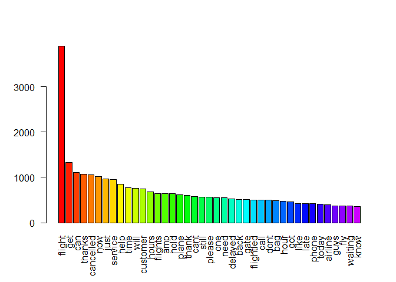<!-- -->


### Sentiment Analysis & Visualization

We can now use the data to perform sentiment analysis. As part of this we will also visualize sentiments using SentiBar.


```r
# we will use our tweet text
twts <- iconv(dt$text, to = 'utf-8') # for windows

# get sentiment main function
score_all <- get_nrc_sentiment(twts)

# check
head(score_all)
```

```
##   anger anticipation disgust fear joy sadness surprise trust negative
## 1     0            0       0    0   0       0        0     0        0
## 2     0            0       0    0   0       0        0     0        0
## 3     0            0       0    0   0       0        1     0        0
## 4     3            1       1    2   1       1        2     1        3
## 5     1            0       1    1   0       1        0     0        1
## 6     1            1       1    2   1       1        0     1        1
##   positive
## 1        0
## 2        0
## 3        0
## 4        1
## 5        0
## 6        2
```

### Bar plot - Senti Bar


```r
# plot all twitter text 
barplot(colSums(score_all), las = 2,
       col = rainbow(10), ylab = 'Count',
       main = 'Overall Sentiment Scores for Tweets across various Airlines')
```

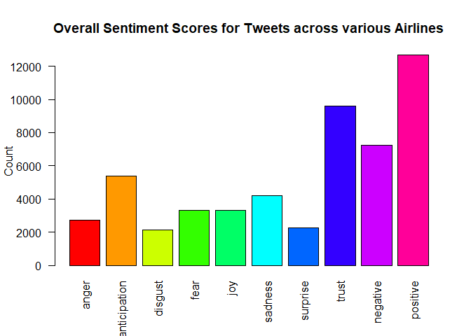<!-- -->

We can see from the sentiment scores that most of the tweets from all airlines' twitter pages are _positive_, with second most being about trust and third most being negative.


# Individual Airlines Analysis

To get a more granular understanding of our tweets we will visualize the dataset for each airlines separately and see how does each airlines stand on its own. Since we have 6 airlines we will create 6 different datasets and visualize them separately.

First it would be interesting to see the distribution of tweets in our dataset.

```r
dt %>%
  group_by(airline) %>%
  summarise(tw_count = n()) %>%
  mutate(pct = prop.table(tw_count) * 100) %>%
  ggplot(aes(x=reorder(airline, -tw_count), y=tw_count))+
    geom_bar(stat = "identity", position = "dodge",
             fill = "#F2AF29") +
    geom_text(aes(y = tw_count + 170, 
                  label = paste0(round(pct,1), '%')),
              position = position_dodge(width = 0.9),
              size = 3) +
    theme_minimal() +
    labs(x="Airlines", y="Twitter Count")
```

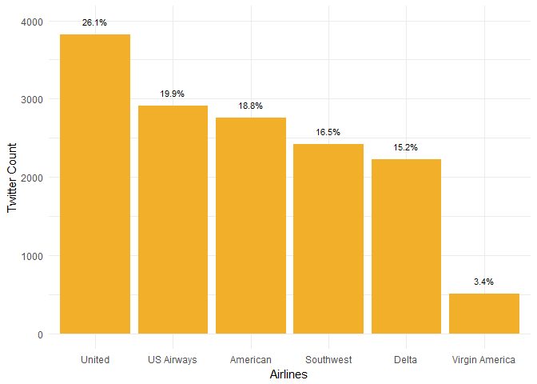<!-- -->

We can see that majority of tweets from United followed by US Airways and American airlines.


```r
# filter dataset for each airline
# first let's only choose airline and tweet columns to avoid extra data processing
dtnew <- select(dt, c("airline", "text"))

# Virgin America tweets
dt_virgin <- filter(dtnew, airline == 'Virgin America')

# United Airlines tweets
dt_united <- filter(dtnew, airline == 'United')

# Southwest tweets
dt_south <- filter(dtnew, airline == 'Southwest')

# Delta tweets
dt_delta <- filter(dtnew, airline == 'Delta')

# US Airways tweets
dt_usair <- filter(dtnew, airline == 'US Airways')

# American airlines tweets
dt_american <- filter(dtnew, airline == 'American')
```

Now that we have all of the tweets for each airline we can visualize wordcloud for each of them and see how different airlines twitter responses look like.

Please note that moving forward the data will be in the following order

1. Virgin America
2. United
3. Southwest
4. Delta
5. US Airways
6. American Air


```r
# create one list of dataframes of airline tweets to make bulk operations easier
l.df <- lapply(ls(pattern="dt_"), function(x) get(x))

# apply process_text to each dataframe, receive list of clean corpuses for each airline
l.dt <- lapply(l.df, process_text)
```

### Visualizations

Let's visualize word clouds for each airline separately and in order to save space, put them in a grid. We will use wordcloud used above due to its simplicity.


```r
# create Term Document Matrices for all of the corpuses
l.c <- sapply(lapply(l.dt, TermDocumentMatrix), as.matrix)

# sort words by number of occurences for each airline in the list of matrices
l.oc <- lapply(lapply(l.c, rowSums), sort, decreasing = TRUE)

# for 1 row, 2 cols
par(mfrow=c(1,1))
```

> Virgin Airlines and United


```r
# wordcloud for Virgin Airlines
wordcloud(words = names(l.oc[[1]]), freq = l.oc[[1]],
          max.words = 150, random.order = F,
          min.freq = 75, colors = brewer.pal(8, 'Dark2'),
          scale = c(5, 0.1), rot.per = 0.3)
```

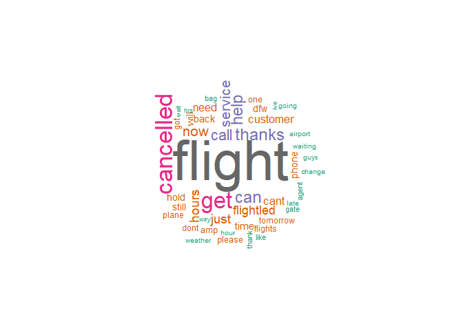<!-- -->

```r
# barplot for Virgin Airlines
barplot(subset(l.oc[[1]], l.oc[[1]]>=100), las = 2, col = rainbow(50))
```

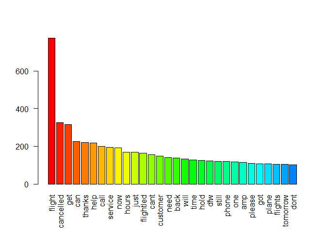<!-- -->

```r
# sentibar for Virgin Airlines
sent <- iconv(dt_virgin$text, to = 'utf-8') # we will use our tweet text for virgin
score <- get_nrc_sentiment(sent) # get sentiment main function
barplot(sort(colSums(score), decreasing = T), las = 2,
        col = rainbow(10), ylab = 'Count',
        main = 'Sentiment Score for Virgin Airlines')
```

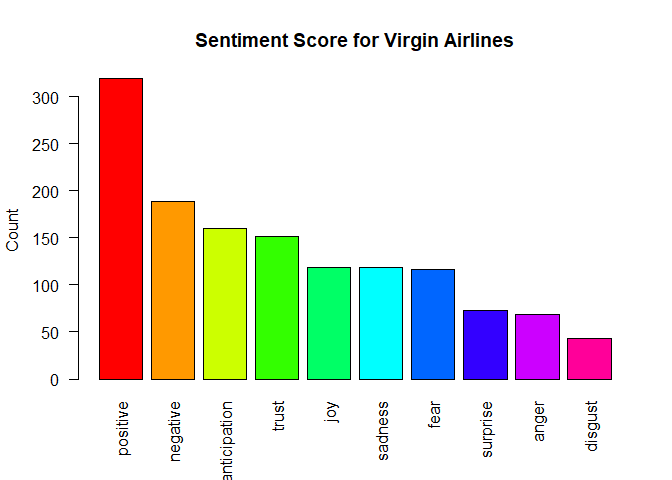<!-- -->

```r
# worcloud for United
wordcloud(words = names(l.oc[[2]]), freq = l.oc[[2]],
          max.words = 150, random.order = F,
          min.freq = 50, colors = brewer.pal(8, 'Dark2'),
          scale = c(5, 0.3), rot.per = 0.1)
```

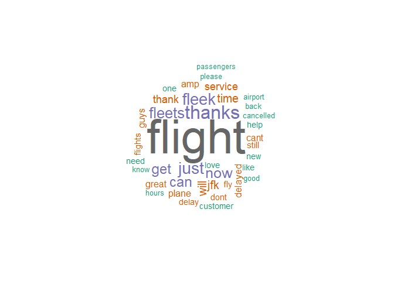<!-- -->

```r
# barplot for United
barplot(subset(l.oc[[2]], l.oc[[2]]>=100), las = 2, col = rainbow(50)) # barplot
```

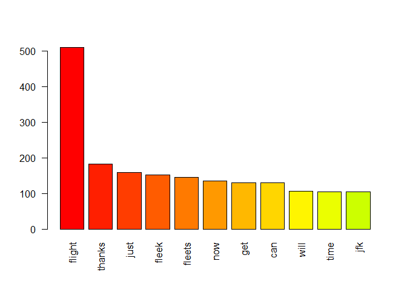<!-- -->

```r
# sentibar for United
sent <- iconv(dt_united$text, to = 'utf-8') # we will use our tweet text for united
score <- get_nrc_sentiment(sent) # get sentiment main function
barplot(sort(colSums(score), decreasing = T), las = 2,
        col = rainbow(10), ylab = 'Count',
        main = 'Sentiment Score for United Airlines')
```

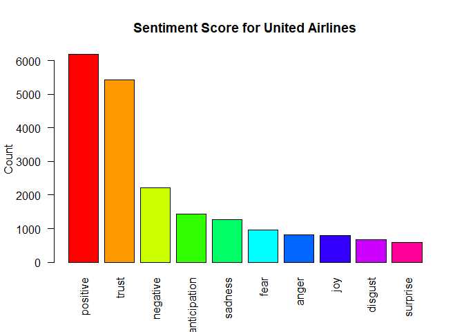<!-- -->

> Southwest Airlines and United Airlines


```r
# worcloud for Southwest
wordcloud(words = names(l.oc[[3]]), freq = l.oc[[3]],
          max.words = 150, random.order = F,
          min.freq = 85, colors = brewer.pal(8, 'Dark2'),
          scale = c(5, 0.3), rot.per = 0.1)
```

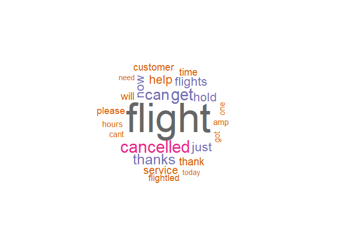<!-- -->

```r
# barplot for Southwest
barplot(subset(l.oc[[3]], l.oc[[3]]>=85), las = 2, col = rainbow(50)) # barplot
```

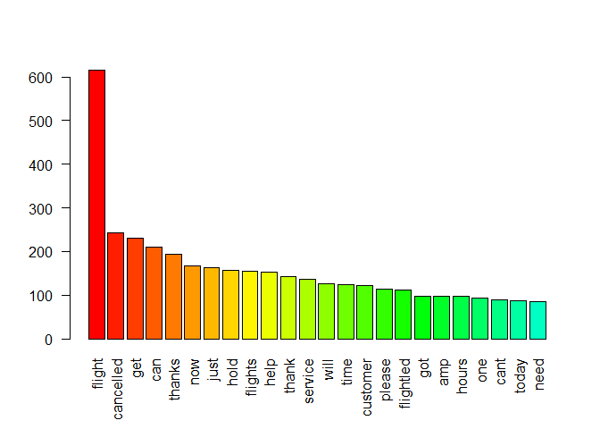<!-- -->

```r
# sentibar for Southwest
sent <- iconv(dt_south$text, to = 'utf-8') # we will use our tweet text for southwest
score <- get_nrc_sentiment(sent) # get sentiment main function
barplot(sort(colSums(score), decreasing = T), las = 2,
        col = rainbow(10), ylab = 'Count',
        main = 'Sentiment Score for Southwest Airlines')
```

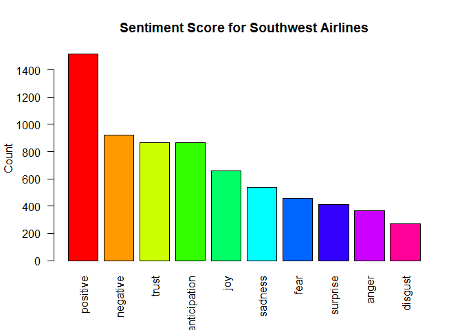<!-- -->

```r
# worcloud for Delta
wordcloud(words = names(l.oc[[4]]), freq = l.oc[[4]],
          max.words = 150, random.order = F,
          min.freq = 90, colors = brewer.pal(8, 'Dark2'),
          scale = c(5, 0.3), rot.per = 0.1)
```

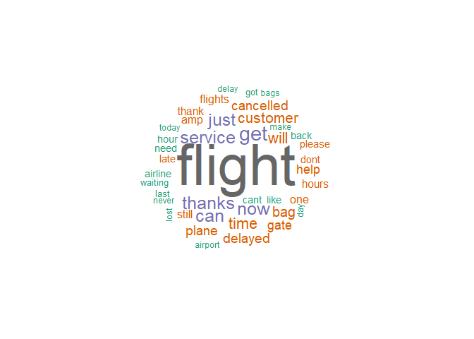<!-- -->

```r
# barplot for Delta
barplot(subset(l.oc[[4]], l.oc[[4]]>=115), las = 2, col = rainbow(50)) # barplot
```

<!-- -->

```r
# sentibar for Delta
sent <- iconv(dt_delta$text, to = 'utf-8') # we will use our tweet text for delta
score <- get_nrc_sentiment(sent) # get sentiment main function
barplot(sort(colSums(score), decreasing = T), las = 2,
        col = rainbow(10), ylab = 'Count',
        main = 'Sentiment Score for Delta Airlines')
```

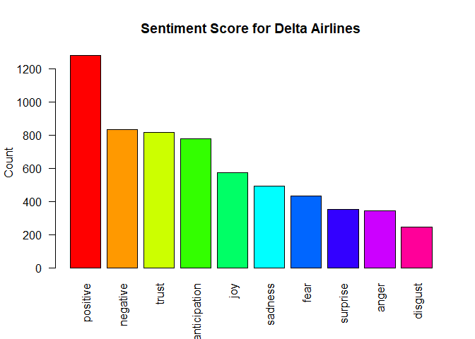<!-- -->

> US Airways and American


```r
# worcloud for US Airways
wordcloud(words = names(l.oc[[5]]), freq = l.oc[[5]],
          max.words = 150, random.order = F,
          min.freq = 75, colors = brewer.pal(8, 'Dark2'),
          scale = c(5, 0.3), rot.per = 0.1)
```

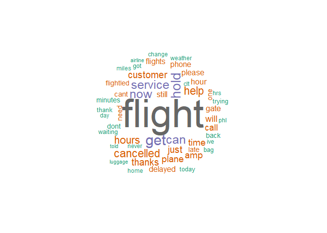<!-- -->

```r
# barplot for US Airways
barplot(subset(l.oc[[5]], l.oc[[5]]>=110), las = 2, col = rainbow(50)) # barplot
```

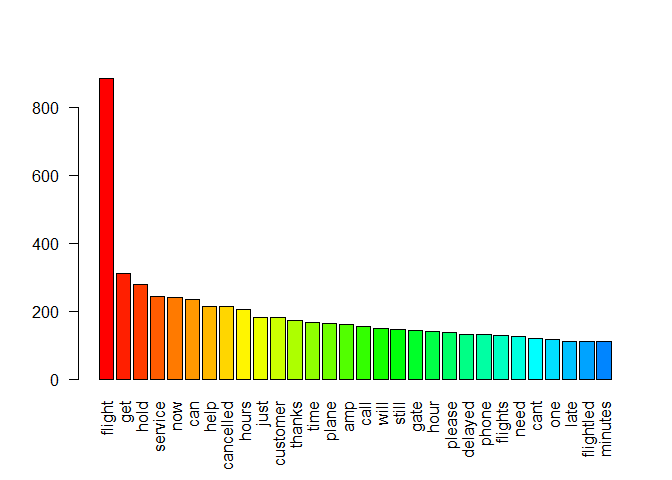<!-- -->

```r
# sentibar for US Airways
sent <- iconv(dt_usair$text, to = 'utf-8') # we will use our tweet text for us airways
score <- get_nrc_sentiment(sent) # get sentiment main function
barplot(sort(colSums(score), decreasing = T), las = 2,
        col = rainbow(10), ylab = 'Count',
        main = 'Sentiment Score for US Airlines')
```

<!-- -->

```r
# worcloud for American
wordcloud(words = names(l.oc[[6]]), freq = l.oc[[6]],
          max.words = 150, random.order = F,
          min.freq = 15, colors = brewer.pal(8, 'Dark2'),
          scale = c(5, 0.3), rot.per = 0.1)
```

<!-- -->

```r
# barplot for American
barplot(subset(l.oc[[6]], l.oc[[6]]>=20), las = 2, col = rainbow(50)) # barplot
```

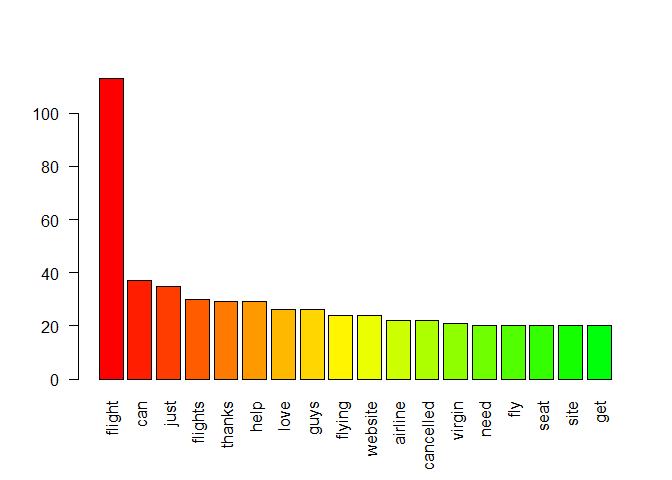<!-- -->

```r
# sentibar for American
sent <- iconv(dt_american$text, to = 'utf-8') # we will use our tweet text for american
score <- get_nrc_sentiment(sent) # get sentiment main function
barplot(sort(colSums(score), decreasing = T), las = 2,
        col = rainbow(10), ylab = 'Count',
        main = 'Sentiment Score for American Airlines')
```

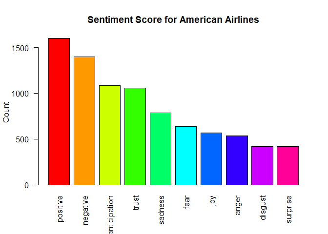<!-- -->

> Summary

According to the above visualization it is seen that overall across airlines with the exception of __US Airlines__ and __American Airlines__, people usually tweeted positive messages about the airlines. In case of __US Airlines__ and __American Airlines__ it seems that number of negaitve and positive tweets are almost the same, indicating that maybe customers feelings towards those two airlines based on our dataset is not that great. For __US Airlines__ this negative feedback seems comes primarily from customers not being able to get hold of the customer support / service since __get__, __hold__, __service__ words seems to come up very often.

Another interesting observation is that despite having quite high number of __cancelled__ words in the tweets, Virgin Airlines customers tweets are mostly positive. This might be due to incorrect sentiment analysis by the package or maybe that the tweets regarding __cancelled__ flights are mostly stating the fact with emoticons.

Customer of __United Airlines__ seem to show trust towards the brand, despite __cancelled__ being a common words used in the tweets.


# GeoMapping of airlines' tweets

There are three airlines tweet data represented in the dataset.


```r
unique(dt$airline)
```

```
## [1] Virgin America United         Southwest      Delta         
## [5] US Airways     American      
## Levels: American Delta Southwest United US Airways Virgin America
```

As it can be seen from below, there are quite a lot of missing coordinate values in our dataset. We will only plot those data points which we have coordinates for. In order to reduce the calculation time we will remove tweets with no coordinates.


```r
# check number of tweets before
nrow(dt)
```

```
## [1] 14640
```

```r
# let's copy our dataset
dt.fil <- dt

# convert coordinates to characters
dt.fil$tweet_coord <- as.character(dt.fil$tweet_coord)

# split the longitude and latitude data into separate column
dt.fil$lon <- sapply(strsplit(dt.fil$tweet_coord, ","), "[", 2)
dt.fil$lat <- sapply(strsplit(dt.fil$tweet_coord, ","), "[", 1)

# remove NA values
dt.fil <- filter(dt.fil, !is.na(lat), !is.na(lon))

# clean lon and lat data and convert to numeric
dt.fil$lon <- as.numeric(substr(dt.fil$lon, 1, nchar(dt.fil$lon)-1))
dt.fil$lat <- as.numeric(substr(dt.fil$lat, 2, nchar(dt.fil$lat)))

# remove 0s from lat and lon
dt.fil <- filter(dt.fil, lon != 0, lat != 0)

# number of tweets with coordinates
nrow(dt.fil)
```

```
## [1] 855
```

```r
# round the decimals of coordinates
dt.fil$lon <- round(dt.fil$lon, 4)
dt.fil$lat <- round(dt.fil$lat, 4)
```

As it turns out there are only 855 tweets with coordinates out of 14640

Let's map the origin of the tweets with each airline having a different color (dot).


```r
# getting the map
map_airlines <- get_map(location = c(lon = mean(dt.fil$lon),
                                     lat = mean(dt.fil$lat)), zoom = 3,
                        maptype = "satellite", scale = 2)
```

```
## Map from URL : http://maps.googleapis.com/maps/api/staticmap?center=36.526645,-85.55328&zoom=3&size=640x640&scale=2&maptype=satellite&language=en-EN&sensor=false
```

```r
# visualze the tweet locations
ggmap(map_airlines) +
  geom_point(data=dt.fil, aes(x=lon, y=lat, fill='red',
                              alpha=0.6, colour=airline)) +
  guides(fill=FALSE, alpha=FALSE)
```

```
## Warning: Removed 33 rows containing missing values (geom_point).
```

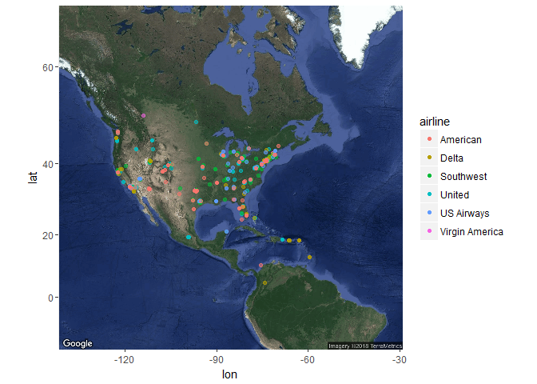<!-- -->

The map is not very helpful but we can see that the primary location of 855 tweets we obtained is mostly from east coast US.

# Modeling - Sentiment Prediction

Up to now we have analyzed and visualized the text of tweets from the dataset. Now we will proceed with sentiment prediction and work with the full dataset as well as the corpuses and term document matrices.

Using the current dataset we can build a model to predict the sentiment for various airlines tweets using the historic data provided to us in the dataset.

## Dataset balance

Before we proceed with predictive modeling, let's check the balancedness of the model.


```r
# check rows where sentiment is positive
np <- nrow(filter(dt, airline_sentiment == 1))
nn <- nrow(filter(dt, airline_sentiment == 0))

paste("Positive feedback tweets: ", np)
```

```
## [1] "Positive feedback tweets:  0"
```

```r
paste("Negative feedback tweets: ", nn)
```

```
## [1] "Negative feedback tweets:  0"
```

We have 2363 (16% of all tweets) positive and 12277 (84% of all tweets) negative tweets. It would be good to try to balance them.

The dataset is quite large, thus we will divide the dataset as well as balance the dataset (perform undersampling).


```r
# filter only positive tweets
dt_positive <- filter(dt, airline_sentiment == "positive")

# filter only negative tweets
dt_negative <- filter(dt, airline_sentiment == "negative")

# get a random sample of 2000 tweets from negatives to reduce the number of observations
n_ids <- sample(nrow(dt_negative), 500)
dt_neg <- dt_negative[n_ids, ]

# get a random sample of 2000 tweets from positives
p_ids <- sample(nrow(dt_positive), 500)
dt_pos <- dt_positive[p_ids, ]

# combine sampled datasets into one final
dt_fin <- rbind(dt_neg, dt_pos)

# clean and process data
cleanset_all <- process_text(dt_fin)
```


## K Nearest Neighbours

Let's first use a knn model to predict sentiment of airlines dataset.

We will stem our cleaned dataset, get Document Term Matrix and convert to dataframe. Then we will sample for train and test sets. We will also try to track the execution time of the model.


```r
set.seed(222)

# stem the cleaned cleanset
docs <- tm_map(cleanset_all, stemDocument, language = "english")

# create Document Term Matrix
dtm <- DocumentTermMatrix(docs)

# convert tdm matrix into dataframe
dtm.df <- as.data.frame(data.matrix(dtm), stringsAsfactors = FALSE)

# bind the airline_sentiment column
dtm.df <- cbind(dtm.df, dt_fin$airline_sentiment)

# change column name to sentiment
colnames(dtm.df)[ncol(dtm.df)] <- "sentiment"

# split data to equal proportions (train and test)
train <- sample(nrow(dtm.df), max(nrow(dtm.df) / 2))
test <- (1:nrow(dtm.df))[- train]

# isolate classifier
cl <- dtm.df[,"sentiment"]

# create model data and remove "sentiment"
modeldata <- dtm.df[,!colnames(dtm.df) %in% "sentiment"]

start_time_knn <- Sys.time() # start time of knn model

# create model: training set, test set, training set classifier
knn.pred <- knn(modeldata[train, ], modeldata[test, ], cl[train], k=1)

end_time_knn <- Sys.time() # end time for knn
time_knn <- end_time_knn - start_time_knn
```

Using 1000 tweets, 50% for test and 50% for train and knn model we have an accuracy of 63% which is not that great.

__KNN Performance Metrics__


```r
# confusion matrix with performance metrics
confusionMatrix(knn.pred, cl[test])
```

```
## Confusion Matrix and Statistics
## 
##           Reference
## Prediction negative positive
##   negative       79       21
##   positive      164      236
##                                          
##                Accuracy : 0.63           
##                  95% CI : (0.586, 0.6724)
##     No Information Rate : 0.514          
##     P-Value [Acc > NIR] : 1.12e-07       
##                                          
##                   Kappa : 0.2474         
##  Mcnemar's Test P-Value : < 2.2e-16      
##                                          
##             Sensitivity : 0.3251         
##             Specificity : 0.9183         
##          Pos Pred Value : 0.7900         
##          Neg Pred Value : 0.5900         
##              Prevalence : 0.4860         
##          Detection Rate : 0.1580         
##    Detection Prevalence : 0.2000         
##       Balanced Accuracy : 0.6217         
##                                          
##        'Positive' Class : negative       
## 
```

* Accuracy is in decimals
* Sensitivity and Recall are same
* Precision and Pos Pred value are same

Let's use other modeling techniques and see their results.


## Decision Trees

When it comes to classification problems decision trees and random forests are good modeling techniques.

Here we will use a decision tree and evaluate our model.


```r
start_time_dct <- Sys.time() # start time of knn model

# create a decision tree model
model_tree <- rpart(sentiment ~ ., data = dtm.df[train, ], method = "class")

end_time_dct <- Sys.time() # end time for knn

time_dct <- end_time_dct - start_time_dct

# summarize the model
summary(model_tree)
```

```
## Call:
## rpart(formula = sentiment ~ ., data = dtm.df[train, ], method = "class")
##   n= 500 
## 
##           CP nsplit rel error    xerror       xstd
## 1 0.38683128      0 1.0000000 1.0000000 0.04599159
## 2 0.03703704      1 0.6131687 0.6131687 0.04208772
## 3 0.03292181      3 0.5390947 0.6213992 0.04224837
## 4 0.01000000      4 0.5061728 0.5637860 0.04104141
## 
## Variable importance
##   thank    best    love   great    much     job appreci   didnt   quick 
##      63       8       8       8       2       2       2       2       2 
## respons  experi    wish 
##       2       2       1 
## 
## Node number 1: 500 observations,    complexity param=0.3868313
##   predicted class=negative  expected loss=0.486  P(node) =1
##     class counts:   257   243
##    probabilities: 0.514 0.486 
##   left son=2 (378 obs) right son=3 (122 obs)
##   Primary splits:
##       thank  < 0.5 to the left,  improve=51.445690, (0 missing)
##       hour   < 0.5 to the right, improve= 9.179203, (0 missing)
##       need   < 0.5 to the right, improve= 7.808132, (0 missing)
##       hold   < 0.5 to the right, improve= 7.305031, (0 missing)
##       cancel < 0.5 to the right, improve= 7.305031, (0 missing)
##   Surrogate splits:
##       much    < 0.5 to the left,  agree=0.764, adj=0.033, (0 split)
##       appreci < 0.5 to the left,  agree=0.762, adj=0.025, (0 split)
##       respons < 0.5 to the left,  agree=0.762, adj=0.025, (0 split)
##       didnt   < 0.5 to the left,  agree=0.762, adj=0.025, (0 split)
##       quick   < 0.5 to the left,  agree=0.762, adj=0.025, (0 split)
## 
## Node number 2: 378 observations,    complexity param=0.03703704
##   predicted class=negative  expected loss=0.3571429  P(node) =0.756
##     class counts:   243   135
##    probabilities: 0.643 0.357 
##   left son=4 (367 obs) right son=5 (11 obs)
##   Primary splits:
##       best  < 0.5 to the left,  improve=6.903111, (0 missing)
##       great < 0.5 to the left,  improve=5.768467, (0 missing)
##       new   < 0.5 to the left,  improve=5.620609, (0 missing)
##       love  < 0.5 to the left,  improve=5.157064, (0 missing)
##       hour  < 0.5 to the right, improve=4.818948, (0 missing)
##   Surrogate splits:
##       experi < 0.5 to the left,  agree=0.976, adj=0.182, (0 split)
## 
## Node number 3: 122 observations
##   predicted class=positive  expected loss=0.1147541  P(node) =0.244
##     class counts:    14   108
##    probabilities: 0.115 0.885 
## 
## Node number 4: 367 observations,    complexity param=0.03703704
##   predicted class=negative  expected loss=0.3405995  P(node) =0.734
##     class counts:   242   125
##    probabilities: 0.659 0.341 
##   left son=8 (348 obs) right son=9 (19 obs)
##   Primary splits:
##       great  < 0.5 to the left,  improve=6.292060, (0 missing)
##       new    < 0.5 to the left,  improve=6.023845, (0 missing)
##       love   < 0.5 to the left,  improve=4.824379, (0 missing)
##       flight < 0.5 to the right, improve=4.764226, (0 missing)
##       hour   < 0.5 to the right, improve=4.332442, (0 missing)
##   Surrogate splits:
##       job    < 0.5 to the left,  agree=0.959, adj=0.211, (0 split)
##       jet    < 0.5 to the left,  agree=0.951, adj=0.053, (0 split)
##       reason < 0.5 to the left,  agree=0.951, adj=0.053, (0 split)
##       staff  < 0.5 to the left,  agree=0.951, adj=0.053, (0 split)
## 
## Node number 5: 11 observations
##   predicted class=positive  expected loss=0.09090909  P(node) =0.022
##     class counts:     1    10
##    probabilities: 0.091 0.909 
## 
## Node number 8: 348 observations,    complexity param=0.03292181
##   predicted class=negative  expected loss=0.3189655  P(node) =0.696
##     class counts:   237   111
##    probabilities: 0.681 0.319 
##   left son=16 (334 obs) right son=17 (14 obs)
##   Primary splits:
##       love   < 0.5 to the left,  improve=6.355609, (0 missing)
##       hour   < 0.5 to the right, improve=4.317704, (0 missing)
##       flight < 0.5 to the right, improve=4.303949, (0 missing)
##       new    < 0.5 to the left,  improve=3.889754, (0 missing)
##       cancel < 0.5 to the right, improve=3.189655, (0 missing)
##   Surrogate splits:
##       wish < 0.5 to the left,  agree=0.963, adj=0.071, (0 split)
## 
## Node number 9: 19 observations
##   predicted class=positive  expected loss=0.2631579  P(node) =0.038
##     class counts:     5    14
##    probabilities: 0.263 0.737 
## 
## Node number 16: 334 observations
##   predicted class=negative  expected loss=0.2994012  P(node) =0.668
##     class counts:   234   100
##    probabilities: 0.701 0.299 
## 
## Node number 17: 14 observations
##   predicted class=positive  expected loss=0.2142857  P(node) =0.028
##     class counts:     3    11
##    probabilities: 0.214 0.786
```

```r
# generate predictions based on test data
dectree.pred <- predict(newdata=dtm.df[test, ],
                        model_tree, type = "class")
```

Decision Trees seem to perform even better with our current dataset.

__Decision Tree Performance Metrics__


```r
# confusion matrix statistics
confusionMatrix(dectree.pred, cl[test])
```

```
## Confusion Matrix and Statistics
## 
##           Reference
## Prediction negative positive
##   negative      224       94
##   positive       19      163
##                                           
##                Accuracy : 0.774           
##                  95% CI : (0.7348, 0.8099)
##     No Information Rate : 0.514           
##     P-Value [Acc > NIR] : < 2.2e-16       
##                                           
##                   Kappa : 0.5514          
##  Mcnemar's Test P-Value : 3.371e-12       
##                                           
##             Sensitivity : 0.9218          
##             Specificity : 0.6342          
##          Pos Pred Value : 0.7044          
##          Neg Pred Value : 0.8956          
##              Prevalence : 0.4860          
##          Detection Rate : 0.4480          
##    Detection Prevalence : 0.6360          
##       Balanced Accuracy : 0.7780          
##                                           
##        'Positive' Class : negative        
## 
```

* Accuracy is in decimals
* Sensitivity and Recall are same
* Precision and Pos Pred value are same

## Random Forests

We will use Random Forests as a last modeling technique to build a predictive model for our twitter data.


```r
# convert to factor
dtm.df$sentiment <- as.factor(dtm.df$sentiment)

# reformat column names for random forest to work
# for some reason some column names random forest was not able to handle
colnames(dtm.df) <- paste(colnames(dtm.df), "_c", sep = "")

start_time_rf <- Sys.time() # start time of knn model

# create a decision tree model
model_rf <- randomForest(formula = sentiment_c ~ . ,
                         data = dtm.df, subset = train)

end_time_rf <- Sys.time() # end time for knn
time_rf <- end_time_rf - start_time_rf # calculate time spent modeling

# predict labels for test dataset
rf_pred <- predict(newdata=dtm.df[test,],
                   model_rf)
```

Random Forest seem to perform almost the same as the Decision Tree.

__Decision Tree Performance Metrics__


```r
# confusion matrix statistics
confusionMatrix(rf_pred, cl[test])
```

```
## Confusion Matrix and Statistics
## 
##           Reference
## Prediction negative positive
##   negative      205       59
##   positive       38      198
##                                           
##                Accuracy : 0.806           
##                  95% CI : (0.7686, 0.8398)
##     No Information Rate : 0.514           
##     P-Value [Acc > NIR] : < 2e-16         
##                                           
##                   Kappa : 0.6126          
##  Mcnemar's Test P-Value : 0.04229         
##                                           
##             Sensitivity : 0.8436          
##             Specificity : 0.7704          
##          Pos Pred Value : 0.7765          
##          Neg Pred Value : 0.8390          
##              Prevalence : 0.4860          
##          Detection Rate : 0.4100          
##    Detection Prevalence : 0.5280          
##       Balanced Accuracy : 0.8070          
##                                           
##        'Positive' Class : negative        
## 
```

* Accuracy is in decimals
* Sensitivity and Recall are same
* Precision and Pos Pred value are same

***

Execution time differences between models

The following are the times it took for each model to perform. Our dataframe had 500 values for training.

1. KNN - approx 11 seconds
2. Decision Trees - approx 3 seconds
3. Random Forest - approx 60 seconds


