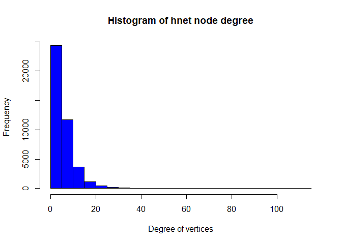

# Business Data Analytics
Kamran Mammadzada  
`r Sys.Date()`  

__Solutions for Homework 4 - Link Analysis__

The notebook contains solutions for Homework 4 - Link Analysis topic in Business Data Analytics Course taught by Rajesh Sharma - University of Tartu.

__Task:__ We will use 3 different datasets representing various networks.

* 1st Network - Hungary
* 2nd Network - Romania
* 3rd Network - Croatia

# Data Preparation


```r
start_time <- Sys.time() # start time
library(igraph)
set.seed(222)
# set working directory the files' path
setwd("C:\\Users\\kamra\\Dropbox\\UT\\2nd\\Business Data Analytics\\Homeworks\\HW4")
```


```r
# load csv files containing networks
hungary_r <- read.csv("../../HW4/Hungary.csv")
romania_r <- read.csv("../../HW4/Romania.csv")
croatia_r <- read.csv("../../HW4/Croatia.csv")

# create networks
hnet <- graph.data.frame(hungary_r, directed = F)
rnet <- graph.data.frame(romania_r, directed = F)
cnet <- graph.data.frame(croatia_r, directed = F)
```

# Network Analysis

# First Question

> Which network has the highest number of nodes and edges (0.5p) ? If each of the network is connected or not (0.5p)?

## Hungary Network

Hungary Network has the following number of nodes

```r
# number of nodes
V(hnet)
```

```
## + 47538/47538 vertices, named, from 55dfe6a:
##     [1] 0     1     2     3     4     5     6     7     8     9     10   
##    [12] 11    12    13    14    23023 16    17    18    19    22    23   
##    [23] 24    34401 25    26    30879 28    29    31    32    33    34   
##    [34] 35    36    37    201   39    41    42    43    44    45    46   
##    [45] 47    48    49    50    52    53    54    55    56    57    58   
##    [56] 17151 60    61    62    63    64    65    66    67    68    69   
##    [67] 70    71    72    73    74    76    46780 77    78    79    80   
##    [78] 81    82    83    84    85    86    87    88    89    90    91   
##    [89] 92    93    94    95    96    97    98    99    100   101   102  
##   [100] 103   40788 104   105   106   107   108   109   110   111   112  
## + ... omitted several vertices
```

Hungary Network has the following number of edges

```r
# number of edges
E(hnet)
```

```
## + 222887/222887 edges from 55dfe6a (vertex names):
##  [1] 0--24208 0--24445 0--18055 0--26575 0--12596 0--28092 0--14484
##  [8] 0--14809 0--47328 0--32542 0--36124 0--35300 0--2570  1--5463 
## [15] 1--14232 1--4833  1--36852 1--37620 2--45548 2--34493 2--7694 
## [22] 2--27683 2--41624 2--21711 2--9769  2--34620 2--44553 2--38102
## [29] 2--34634 2--16672 2--41498 2--25355 2--33700 2--10124 2--26250
## [36] 3--26518 3--39718 3--13713 3--34114 3--19454 3--45114 3--4429 
## [43] 3--2573  3--46000 3--27675 3--28430 3--6627  3--46753 4--45360
## [50] 4--12512 4--39244 4--46144 4--13028 4--1774  4--42738 4--15633
## [57] 4--28266 4--31624 4--13495 4--33403 4--9077  4--2444  4--27914
## [64] 4--7058  4--2385  4--45791 4--43644 4--41120 4--33275 4--25213
## + ... omitted several edges
```

Hungary Network has the following number of components

```r
# count components
count_components(hnet)
```

```
## [1] 1
```


## Romania Network

Romania Network has the following number of nodes

```r
# number of nodes
V(rnet)
```

```
## + 41773/41773 vertices, named, from 56207ca:
##     [1] 0     1     2     3     4     5     6     7     8     9     10   
##    [12] 11    12    14    15    20233 17    18    19    20    21    22   
##    [23] 23    24    25    26    28    29    30    20235 32    174   18876
##    [34] 35    36    37    38    39    39906 41    42    43    44    45   
##    [45] 46    47    48    38267 49    27440 51    52    53    54    20237
##    [56] 56    57    58    59    27441 61    34878 324   64    65    66   
##    [67] 67    68    69    70    71    72    73    74    75    76    77   
##    [78] 78    79    39758 80    81    82    83    84    85    86    87   
##    [89] 88    89    90    91    92    93    94    95    96    97    98   
##   [100] 99    100   101   102   103   104   105   31529 106   107   108  
## + ... omitted several vertices
```

Romania Network has the following number of edges

```r
# number of edges
E(rnet)
```

```
## + 125826/125826 edges from 56207ca (vertex names):
##  [1] 0 --37825 0 --17224 0 --6356  1 --18053 1 --31265 1 --28257 1 --41010
##  [8] 1 --19010 1 --10785 1 --41676 1 --5800  1 --1979  1 --11621 2 --4661 
## [15] 2 --35935 3 --22504 3 --27665 3 --13675 3 --9462  3 --20943 3 --5842 
## [22] 3 --36937 3 --10824 3 --13371 3 --5775  3 --39603 3 --35513 4 --35041
## [29] 4 --16026 5 --17311 5 --886   5 --5112  5 --21465 5 --31989 5 --10076
## [36] 5 --14587 5 --11388 5 --8650  6 --7640  7 --34808 7 --37314 7 --22280
## [43] 7 --14353 7 --6950  7 --2759  7 --27931 7 --38148 7 --19949 7 --39987
## [50] 8 --22889 8 --34909 9 --15747 9 --15691 10--10338 10--26732 10--24103
## [57] 10--31127 10--23917 10--20276 10--39527 10--15609 10--36093 10--5090 
## [64] 10--30778 10--8486  10--18950 10--30882 10--1991  10--29687 10--4360 
## + ... omitted several edges
```

Hungary Network has the following number of components

```r
# count components
count_components(rnet)
```

```
## [1] 1
```


## Croatia

Croatia Network has the following number of nodes

```r
# number of nodes
V(cnet)
```

```
## + 54573/54573 vertices, named, from 56e8d53:
##     [1] 0     1     2     3     4     5     6     7     8     9     10   
##    [12] 11    12    44854 26446 53954 14    15    16    17    18    19   
##    [23] 21    22    23    24    25    26    27    28    29    30    31   
##    [34] 32    33    34    35    36    37    47676 38    39    40    35503
##    [45] 42    43    44    45    46    47    48    49    47248 26455 46761
##    [56] 53    54528 54    55    56    57    58    59    60    44860 62   
##    [67] 63    64    65    66    45208 67    68    69    70    71    72   
##    [78] 73    74    28197 75    76    77    78    79    80    81    82   
##    [89] 83    84    85    86    87    88    89    90    91    17641 93   
##   [100] 94    95    96    97    98    99    100   101   102   40744 104  
## + ... omitted several vertices
```

Croatia Network has the following number of edges

```r
# number of edges
E(cnet)
```

```
## + 498202/498202 edges from 56e8d53 (vertex names):
##  [1] 0--4076  0--29861 0--53717 0--23820 0--39945 0--22224 0--17332
##  [8] 0--22600 0--30409 0--11699 0--48006 0--13275 0--6728  0--8087 
## [15] 0--49668 0--41890 0--4110  0--9441  0--47335 0--37629 0--3591 
## [22] 0--22954 0--6185  1--8670  1--21767 1--41815 1--49744 1--10065
## [29] 1--46613 1--20376 1--203   1--14646 1--84    1--53990 2--42452
## [36] 2--27264 2--43274 2--24848 3--50166 3--47979 3--34959 3--17210
## [43] 3--22144 3--1858  3--45565 3--17353 3--2330  3--42519 3--6587 
## [50] 3--49502 3--52855 3--53721 3--42742 3--52662 3--11044 3--10027
## [57] 3--11451 3--13702 3--22237 4--40648 4--8671  4--34449 4--8991 
## [64] 4--43353 4--44829 4--24133 4--21512 4--26495 4--31863 4--7915 
## + ... omitted several edges
```

Croatia Network has the following number of components

```r
# count components
count_components(cnet)
```

```
## [1] 1
```

## Summary of Networks

The following are the summary stats for nodes and edges for different networks.

* Nodes
  1. Hungary - 47,538
  2. Romania - 41,773
  3. Croatia - 54,573
* Edges
  1. Hungary - 222,887
  2. Romania - 125,826
  3. Croatia - 498,202

It seems that **Croatia** out of the three networks has the highest number of both edges and nodes.

All three networks have one connected components which indicates that all of them are connected in one component.

*** 

# Second question

> Degree Distribution of each network. Plot the results. What do you think if each of the network is long tail or not ?


# Hungary Network

Plot the degree distribution of Hungary network.


```r
# assign labels and degrees accordingly
V(hnet)$label <- V(hnet)$name
V(hnet)$degree <- degree(hnet)

# degree distribution
# draw a histogram
hist(V(hnet)$degree,
     col = 'blue',
     main = 'Histogram of hnet node degree',
     ylab = 'Frequency',
     xlab = 'Degree of vertices')
```

<!-- -->

The histogram plot looks a lot like a chi-squared distribution but it is not really a long tail since there are very few values after 40. Its more like a short tail.

In this distribution we can also see that, there are few nodes that have more than 30 connections and most nodes have up to 5.

# Romania Network

Plot the degree distribution of Romania network.


```r
# assign labels and degrees accordingly
V(rnet)$label <- V(rnet)$name
V(rnet)$degree <- degree(rnet)

# degree distribution
# draw a histogram
hist(V(rnet)$degree,
     col = 'blue',
     main = 'Histogram of hnet node degree',
     ylab = 'Frequency',
     xlab = 'Degree of vertices')
```

<!-- -->

The histogram plot above is similar to Hungary's network as well. Its not really a long tail, more like a short tail. This means that there are many nodes that up to 5 ot 6 connections and very few that have more than 20.


# Croatia Network

Plot the degree distribution of Croatia network.


```r
# assign labels and degrees accordingly
V(cnet)$label <- V(cnet)$name
V(cnet)$degree <- degree(cnet)

# degree distribution
# draw a histogram
hist(V(cnet)$degree,
     col = 'blue',
     main = 'Histogram of hnet node degree',
     ylab = 'Frequency',
     xlab = 'Degree of vertices')
```

<!-- -->

The histogram is similar to the two previous ones. We observe short tail rather than long tail.

***

# Third Question

> Which network is the most stretch out or spread out ?

A good measure of network stretch or spread is network diameter.

Let's check network diameter for each of the networks


```r
# Hungary network diameter
diameter(hnet)
```

```
## [1] 14
```

```r
# Romania network diameter
diameter(rnet)
```

```
## [1] 19
```

```r
# Croatia network diameter
diameter(cnet)
```

```
## [1] 12
```

From the above analysis the most spread out network is Romania with 19, seconds most spread is Hungary with 14 diameter and Croatia being last with 12.

***

# Fourth question

> Which network is most tightly knit ?

Edge density and clustering coefficient are good indicators of network tightness.

Let's check both indicators for all networks.


```r
# edge density for Hungary network
edge_density(hnet)
```

```
## [1] 0.0001972614
```

```r
# cluster coefficient for Hungary network
transitivity(hnet)
```

```
## [1] 0.09292402
```

```r
# edge density for Romania network
edge_density(rnet)
```

```
## [1] 0.000144218
```

```r
# cluster coefficient for Romania network
transitivity(rnet)
```

```
## [1] 0.0752667
```

```r
# edge density for Croatia network
edge_density(cnet)
```

```
## [1] 0.0003345706
```

```r
# cluster coefficient for Croatia network
transitivity(cnet)
```

```
## [1] 0.1146301
```

## Summary

Network densities are as following

1. Hungary - 0.0001972614
2. Romania - 0.000144218
3. Croatia - 0.0003345706

The most dense network based on the analysis is **Croatia**.

Clustering Coefficient provides us with more information on network connectivity. Follwing are the coefficients for each network.

1. Hungary - 0.09292402
2. Romania - 0.0752667
3. Croatia - 0.1146301

**Croatia** has the highest coefficient which supports our claim on it being the most tight network.

***

# Fifth Question

> Calculate the total communities in each network. Use any two community detection (CD) algorithms and report for each network, the total communities being formed using each of the CD algorithms. Each value being reported carries 0.5 p marks.

We will use two Community Detection Algorithms and report number of communities generated by each algorithm:

1. Louvain
2. Walktrap

## Hungary Network


```r
# cluster louvain algorithm
hnet_cl <- cluster_louvain(hnet)

# cluster walktrap
hnet_cw <- cluster_walktrap(hnet)
```

Number of communities found by Louvain for Hungary


```r
# number of communities found by Louvain
length(unique(hnet_cl$membership))
```

```
## [1] 26
```

Number of communities found by Louvain for Hungary

```r
# number of communities found by Walktrap
length(unique(hnet_cw$membership))
```

```
## [1] 910
```


## Romania Network


```r
# cluster louvain algorithm
rnet_cl <- cluster_louvain(rnet)

# cluster walktrap
rnet_cw <- cluster_walktrap(rnet)
```

Number of communities found by louvain algorithm

```r
length(unique(rnet_cl$membership))
```

```
## [1] 49
```

Number of communities found by walktrap algorithm

```r
length(unique(rnet_cw$membership))
```

```
## [1] 2554
```

## Croatia Network


```r
# cluster louvain algorithm
cnet_cl <- cluster_louvain(cnet)

# cluster walktrap
cnet_cw <- cluster_walktrap(cnet)
```

Number of communities found by louvain algorithm

```r
length(unique(cnet_cl$membership))
```

```
## [1] 25
```

Number of communities found by walktrap algorithm

```r
length(unique(cnet_cw$membership))
```

```
## [1] 1073
```

***

# Sixth Question

> In each network report the top 5 central nodes based on degree, closeness and betweennness centrality measures. You get 1p for each network, if you report all the top 5 nodes, using all the 3 central measures.

## Hungary

We will explore degree, closeness and betweenness of nodes in Hungary network.

```r
# degree
dl1 <- degree(hnet)

# show top 5 nodes
head(sort(dl1, decreasing = T), 5)
```

```
## 14900 40491 38301 24218  7471 
##   112    97    92    88    88
```

Top 5 nodes based on closeness

```r
# get closesness measures
cl1 <- closeness(hnet, mode = 'all', weights = NA)

# show top 5 nodes
head(sort(cl1, decreasing = T), 5)
```

```
##        14900        40491        24218        38301        15724 
## 5.491006e-06 5.466542e-06 5.440371e-06 5.343193e-06 5.310844e-06
```

Top 5 nodes based on betweenness

```r
# get betweenness measures
bl1 <- betweenness(hnet)

# show top 5 nodes
head(sort(bl1, decreasing = T), 5)
```

```
##   14900   40491   24218   14597   15724 
## 8877837 7066625 5833603 5663767 4975937
```

Interesting that it seems that nodes 14900 and 40491 are top 2 nodes across 3 parameters.

## Romania Network

We will explore degree, closeness and betweenness of nodes in Romania network.

```r
# degree
dl1 <- degree(rnet)

# show top 5 nodes
head(sort(dl1, decreasing = T), 5)
```

```
##  2003 10426 17205  5112 25358 
##   112   111    91    82    76
```

Top 5 nodes based on closeness

```r
# get closesness measures
cl1 <- closeness(rnet, mode = 'all', weights = NA)

# show top 5 nodes
head(sort(cl1, decreasing = T), 5)
```

```
##        17205        10426         2003         5112        30318 
## 5.432214e-06 5.401085e-06 5.369473e-06 5.329894e-06 5.286083e-06
```

Top 5 nodes based on betweenness

```r
# get betweenness measures
bl1 <- betweenness(rnet)

# show top 5 nodes
head(sort(bl1, decreasing = T), 5)
```

```
##    17205     5112     2003    10426     5434 
## 13130549 11468485 10624724 10515561  9057804
```


## Croatia Network

We will explore degree, closeness and betweenness of nodes in Croatia network.

```r
# degree
dl1 <- degree(cnet)

# show top 5 nodes
head(sort(dl1, decreasing = T), 5)
```

```
## 43244 32083 25352 52793 11612 
##   420   375   326   305   269
```

Top 5 nodes based on closeness

```r
# get closesness measures
cl1 <- closeness(cnet, mode = 'all', weights = NA)

# show top 5 nodes
head(sort(cl1, decreasing = T), 5)
```

```
##        43244        32083        52793        25352        53296 
## 5.983223e-06 5.835429e-06 5.729083e-06 5.664535e-06 5.596535e-06
```

Top 5 nodes based on betweenness

```r
# get betweenness measures
bl1 <- betweenness(cnet)

# show top 5 nodes
head(sort(bl1, decreasing = T), 5)
```

```
##    43244    52793    32083    50480    16773 
## 42257117 26971942 18083859  9818184  9214192
```


***

It is interesting to see how long it took to run through the code.

```r
end_time <- Sys.time() # end time for knn

fin_time <- end_time - start_time

fin_time
```

```
## Time difference of 1.438956 hours
```

